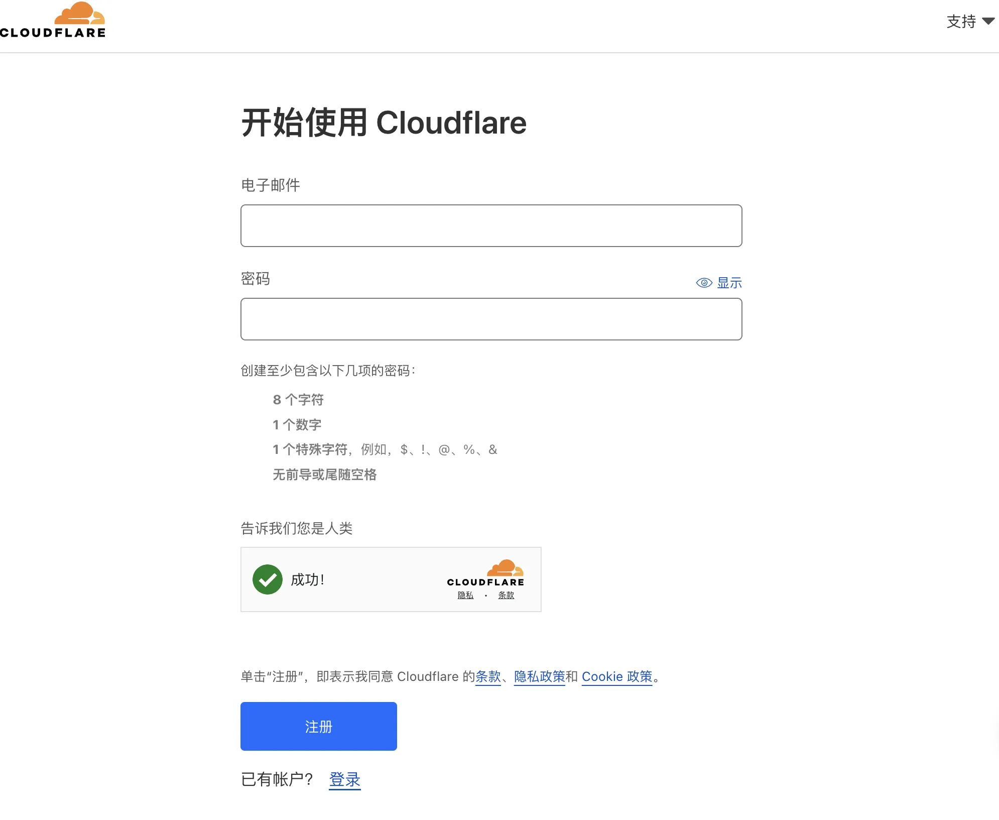

# 📝 域名绑定到Cloudflare面板

## Cloudflare是什么？

Cloudflare是一家提供网站安全性和性能增强服务的公司，它通过其全球分布的服务器网络为用户提供内容分发网络（CDN）、互联网安全服务、分布式域名系统（DNS）服务和反分布式拒绝服务（DDoS）攻击保护。Cloudflare的CDN服务通过缓存网站内容在全球各地的数据中心，加快了网站的加载速度并减少了服务器的负担。其安全服务包括自动检测和抵御网站攻击、提供SSL/TLS加密等，帮助保护网站的数据安全和用户隐私。Cloudflare广泛用于提高网站的访问速度和防止网络攻击，受到许多网站管理员的青睐。

简而言之，就是免费提供许多网络服务的慈善家。

## 配置Cloudflare账户

先在这里注册Cloudflare账户，邮箱密码。(支持简体中文）

填入邮件和密码

切换到网站这一栏目，点击添加。加入你的域名。

随后写入你的域名

点击继续，让你选择计划套餐，下滑选择Free的套餐就行了。

写入你的域名之后会让你添加名称服务器。

也就是这里

然后我们就可以通过我们域名购买商的操作面板（此处以namesilo为例）来添加这两个名称服务器。

还是点击链接（没登录的登录了再点），到达你自己的域名的控制界面。往下翻能翻到这个服务器的添加位置。

然后回到Cloudflare，等待几分钟点击检查，验证通过就行了。

不会立即生效，需要等待几分钟去检查。虽然官方给的是24-48小时，但是实际上挺快的。

## 后续注意事项

**这四种的说明：（需要对https有一定的了解）**

1. **关闭 (Off - not secure)**：此模式下不会加密浏览器和服务器之间的通信。这意味着数据（如密码、信用卡信息等）可能被中间人攻击者截获和查看。这是最不安全的选项，通常不建议使用。
2. **灵活 (Flexible)**：在这种模式下，数据在浏览器和Cloudflare之间加密，但从Cloudflare到网站的原始服务器（Origin Server）的传输可能是未加密的。这意味着在Cloudflare与原始服务器之间的通信仍然有被截获的风险。这比完全不加密安全一些，但仍然不是最佳的安全实践。
3. **完整 (Full)**：在“完整”模式下，数据从浏览器到原始服务器的整个传输路径上都是加密的。然而，这种加密可以使用自签名证书来完成，这意味着加密的确建立了，但是证书的有效性不是由公认的证书颁发机构（CA）验证的。自签名证书提供了加密，但是没有验证服务器的真实性。
4. **严格 (Full strict)**：这是最安全的选项，它要求在浏览器到原始服务器之间的传输过程中使用由受信任的CA或Cloudflare颁发的证书来加密数据。这不仅确保了数据的加密，而且还验证了服务器的身份，从而为用户提供了最高级别的安全保障。

**你也可以在Cloudflare面板查看流量统计**

**也可以配置DNS解析**

更多的功能可以参考Cloudflare官方手册啦

[Overview · Cloudflare Fundamentals docs](https://developers.cloudflare.com/fundamentals/)

<aside>
💡 有关Cloudflare面板使用上的问题，欢迎您在底部评论区留言，一起交流~
</aside>