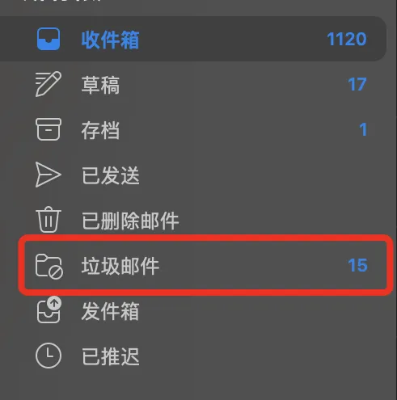

😀 看过《域名简单科普》了吧（建议看完了再来（[https://techleaf.xyz/posts/what-is-domain-name/](https://techleaf.xyz/posts/what-is-domain-name/)）
这篇文章介绍的就是一些获得域名的方式
不建议白嫖，相当麻烦。直接购买即可，最低价10-20元一年

# 📝 如何获得自己的域名

## 一：白嫖的两种方式

> 没有免费的午餐，只是时间换金钱罢了（
不差钱的建议翻到正常购买的指南
> 

### 1.eu.org免费子域名

真正的老牌免费域名了，自从1996年开始运营。被非常多的地方认可。

缺点：注册时长很长，运气不好半年也下不来。

[EU.org: free domain names since 1996](https://nic.eu.org/)

打开eu.org的官方注册网址，你会看到这样的界面。就像上个世纪拨号上网时的网页。

如果做过网页开发的还会惊讶到，是不是CSS没加载出来？
其实官网就是这样的，比较的简约。点击第四行的sign-up注册账户就行了，然后就可以申请域名了。

Ps：注册完了一般要去邮箱验证，邮件会出现在垃圾邮件那里。

接下来完整的教程推荐观看这位作者的bolg：（目前为止，我本人还没有成功的申请下来eu.org的域名。就不乱写误人子弟了）

[免費 EU.ORG 域名申請](https://www.arefly.com/free-domain-eu-org/)

### 2.其它子域名

[Free dynamic DNS service | DNSExit.com](https://dnsexit.com/index.jsp)

关于这个网站其实我了解不多，就简单的介绍一下吧。

先注册账户。（这个就不用教了吧（就正常的注册。

注册链接

[New User Sign UP |  DNSExit.com](https://dnsexit.com/users/signup/)

注册完了点击（免费域名申请链接）

支持work.gd, line.pm, linkpc.net, run.place, publicvm.com

[Get Free Domain Names - Register Custom Domains for Free](https://dnsexit.com/domains/free-second-level-domains/)

 然后你就可以在控制面板里使用你的域名了。

## 二：付费购买

> 付费也分三六九等
> 

先聊聊付费的相关事情吧。

**域名后缀影响价格**

在域名科普那期简单的介绍了各种后缀的域名，购买的时候就会有各种不同的情况。

常见的域名后缀如**`.com`**、**`.net`**、**`.org`**通常价格较高，因为它们非常流行且被广泛认为是最可靠的。相对来说，**`.info`**、**`.xyz`**、**`.club`**这类域名后缀相对不那么流行，它们的价格通常比较便宜。

放几个图供大家参考（实际价格还会不一样）

虽然这个域名是我随便打的，但是大家应该发现了域名定价的不同。

通畅来讲。比较火的后缀都会卖的很贵很贵。比如.com。

但是我们看后面的.xyz , .pro之类的。就非常的便宜了。

**注册商家影响价格**

比如”GoDaddy“的优惠力度相对可能会比较小，”Namesilo“就经常有新用户1美刀的优惠卷可以白嫖到。

> GoDaddy 是一家全球知名的互联网服务公司，专注于提供域名注册和网站托管服务，以其广泛的域名选项和用户友好的网站建设工具而闻名。总部位于美国亚利桑那州，它是世界上最大的域名注册商之一。
> 

> NameSilo 是一家提供域名注册和网络托管服务的公司，以其低成本、无隐藏费用和强大的域名管理功能而受到青睐。总部位于美国亚利桑那州，它是由ICANN认证的域名注册商。
> 

**Tips：Namesilo 有很多优惠卷，油管上可以轻松搜到**

**注册教程**

前面说了一大堆参考因素，相信你也有自己的答案了。我在这里就以Namesoil为例子注册域名。

大家注册的时候可以网上找一找哪家打折优惠了，就可以去薅羊毛。

注册账户的链接

[Sign-In | Website Domain, Hosting, SSL, WordPress and More! | NameSilo](https://www.namesilo.com/login)

还是填入你的名字和邮箱还有你希望的密码就行了。然后你会收到电子验证邮件。

然后就可以用用户名和密码登录了

进入控制面板之后就可以搜索你想要的域名了，这里以购买techleaf.xyz为例

然后你能看到哪些是可以买的（不会显示Try to Buy），加入购物车，点击结账就行。

点完购物车了会出现附加服务，如果仅仅是购买域名的话不用管，直接付款就行。（但先别付款

买之前为什么不用个优惠卷捏？网上一搜索就有。（Startpage！）

写完优惠码了就可以点击checkout了，然后选择支付宝支付

买完了就可以在这里看到自己的域名了，点击Manage,然后就能看见了。

[NameSilo](https://www.namesilo.com/account/)

<aside>
💡 有关域名购买或者使用上的问题，欢迎您在底部评论区留言，一起交流~
</aside> 