>📄 一个搜索用的究极轻量级的页面

# 项目简介

这是一个很简单也很实用的小玩意儿——把常用的搜索引擎都塞到同一个页面里，让你只要打开一次，就能在各大平台一键搜：

- **支持的平台**：Google、B 站（bilibili）、YouTube、ChatGPT、知乎 AI、Z‑Library、维基百科（中/英）
- **怎么用**：
    1. 在顶部输入框输入关键词
    2. 点击对应平台右侧按钮
    3. 会在新标签页里打开该平台的搜索结果
- **个性化**（参考右边侧边栏）：
    - 日/夜模式切换，想白天用就日间，熬夜看就夜间。也有Auto模式。
    - 多种配色主题，一键换肤，随心而变（尾部有预览）

项目开源地址：

[https://github.com/MysteriousMoon/Search-Dashboard](https://github.com/MysteriousMoon/Search-Dashboard)

在线体验（无需翻墙）：

注：Google改为Bing

[Search](https://billy.techleaf.xyz/)

如果你想翻墙也能用官方镜像：

注：此处为Google搜索引擎

[Search](https://mysteriousmoon.github.io/Search-Dashboard/)

# 拓展内容

## 1.保存到本地使其快速加载

- 点击ctrl+s（Windows）或者Commad+s（Mac），将网页保存到本地。
- 在本地找一个地方存储这个文件。
- 复制文件路径。
- 下载该插件（Custom New Tab）
- 在Set New Tab URL中写入你的文件路径（若提示无法访问，请打开插件设置界面开启“允许访问文件网址”）。


[Custom New Tab - Chrome Web Store](https://chromewebstore.google.com/detail/custom-new-tab/lfjnnkckddkopjfgmbcpdiolnmfobflj)

## 2.自定义

- 点击ctrl+s（Windows）或者Commad+s（Mac），将网页保存到本地。
- 使用笔记本/脚本编辑器等编辑工具打开该文件
- 自定义

**1.文案相关修改**

搜索如下内容，找到右边内容。

```jsx
// 主题颜色映射 - 按色轮顺序排列（暖色到冷色）
```

可以更改quote内的内容，便是文案语句。修改完后进行保存即可。

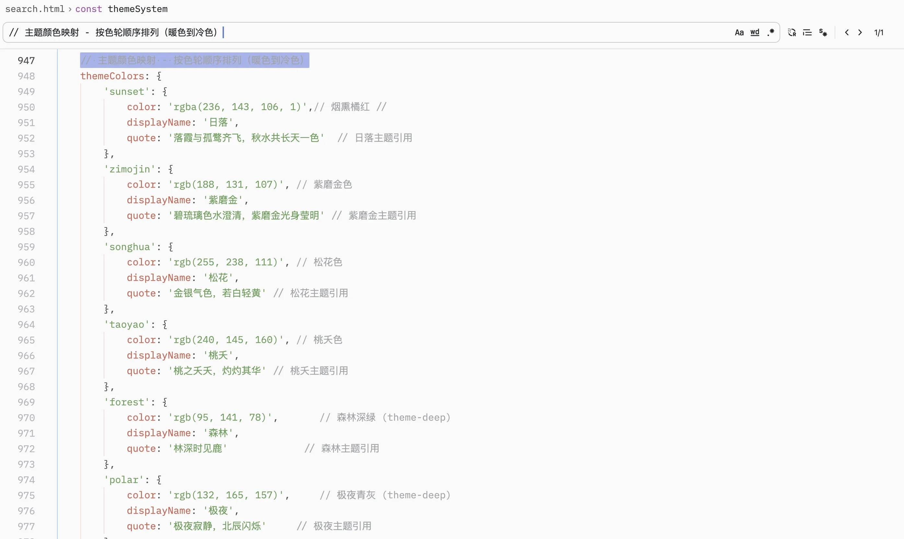

**2.其余元素**

搜索如下内容，找到右边内容

```jsx
<div class="container">
```

此处可修改<div class="title">聚合搜索</div>

placeholder="Bing 搜索”

<button type="submit">哔哩哔哩</button>

这些内容描述的文字。

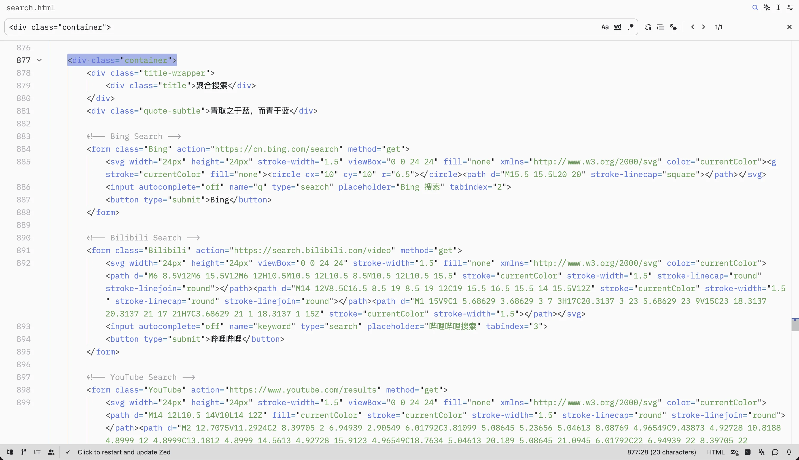

**3.自定义配色**

配色位于开头CSS处，分为亮色暗色，均需添加。使用rgba进行色彩描述。

可自行更改配色（注意自己更改的是哪个主题，然后切换到修改后的主题即可）

添加新的配色比较麻烦（代码架构问题），故不做说明

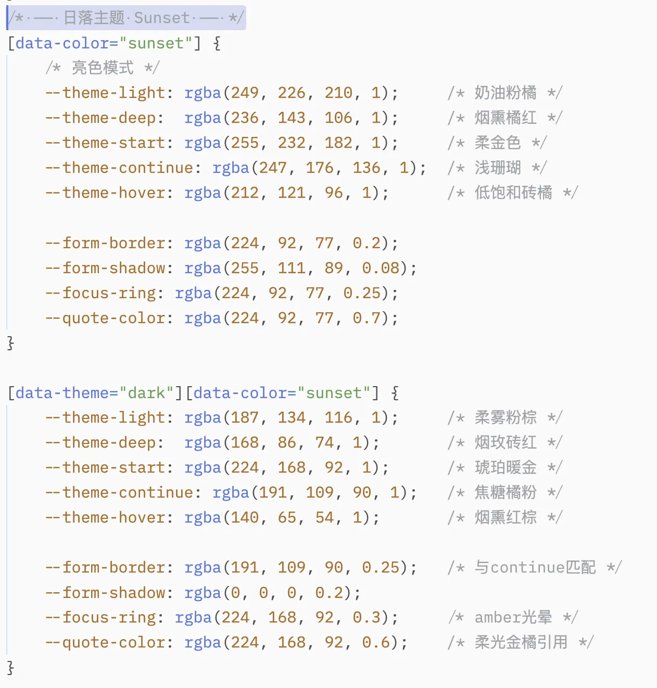

**4.添加搜索框**

这是一条Google的搜索请求，搜索了“你好”这个关键字

```html
https://www.google.com/search?q=你好
```

我们可以将其拆分成https://www.google.com/search?q=和“你好”

然后将https://www.google.com/search?q=隐藏。【你好】改成你要输入的别的文本进行访问。这样就成功搜索了别的东西。本项目也是基于此运行。

若想要添加搜索框，请找到对应的搜索请求。接下来去求助ChatGPT/Deepseek遵循其中一个搜索代码，编写成风格类似的代码，然后复制粘贴到末尾即可。（右图）

例子：

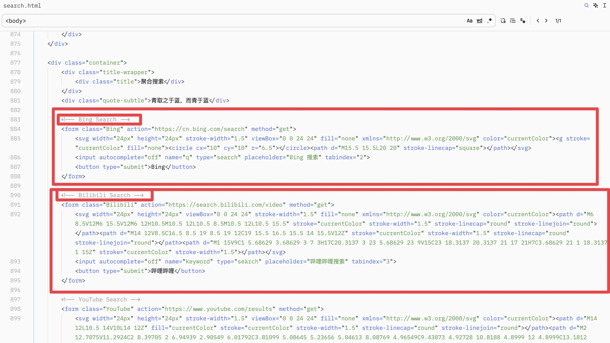

```html
提示词：
任务：根据下面的 Bing 搜索表单，生成一个功能和结构完全一致的 【Google】 搜索表单。
Google的搜索请求是”https://www.google.com/search?q=你好“
要求：
1. 将表单的 action 修改为合适的值 
2. 其余元素视情况修改
3. 输出纯 HTML 代码，不要加多余注释或说明  

—— 输入的 Bing 搜索表单 ——
<form class="Bing" action="https://cn.bing.com/search" method="get">
    <svg width="24px" height="24px" stroke-width="1.5" viewBox="0 0 24 24" fill="none"
         xmlns="http://www.w3.org/2000/svg" color="currentColor">
        <g stroke="currentColor" fill="none">
            <circle cx="10" cy="10" r="6.5"></circle>
            <path d="M15.5 15.5L20 20" stroke-linecap="square"></path>
        </g>
    </svg>
    <input autocomplete="off" name="q" type="search" placeholder="Bing 搜索" tabindex="2">
    <button type="submit">Bing</button>
</form>
```

当它成功输出后，可以粘贴至此：

```html
【粘贴到开头】
    <!-- Bing Search -->
    <form class="Bing" action="<https://cn.bing.com/search>" method="get">
        <svg width="24px" height="24px" stroke-width="1.5" viewBox="0 0 24 24" fill="none" xmlns="<http://www.w3.org/2000/svg>" color="currentColor"><g stroke="currentColor" fill="none"><circle cx="10" cy="10" r="6.5"></circle><path d="M15.5 15.5L20 20" stroke-linecap="square"></path></svg>
        <input autocomplete="off" name="q" type="search" placeholder="Bing 搜索" tabindex="2">
        <button type="submit">Bing</button>
    </form>

【或者中间】

    <!-- Bilibili Search -->
    <form class="Bilibili" action="<https://search.bilibili.com/video>" method="get">
        <svg width="24px" height="24px" viewBox="0 0 24 24" stroke-width="1.5" fill="none" xmlns="<http://www.w3.org/2000/svg>" color="currentColor"><path d="M6 8.5V12M6 15.5V12M6 12H10.5M10.5 12L10.5 8.5M10.5 12L10.5 15.5" stroke="currentColor" stroke-width="1.5" stroke-linecap="round" stroke-linejoin="round"></path><path d="M14 12V8.5C16.5 8.5 19 8.5 19 12C19 15.5 16.5 15.5 14 15.5V12Z" stroke="currentColor" stroke-width="1.5" stroke-linecap="round" stroke-linejoin="round"></path><path d="M1 15V9C1 5.68629 3.68629 3 7 3H17C20.3137 3 23 5.68629 23 9V15C23 18.3137 20.3137 21 17 21H7C3.68629 21 1 18.3137 1 15Z" stroke="currentColor" stroke-width="1.5"></path></svg>
        <input autocomplete="off" name="keyword" type="search" placeholder="哔哩哔哩搜索" tabindex="3">
        <button type="submit">哔哩哔哩</button>
    </form>
【或者末尾】
```

## 3.配色选搭

- 大部分配色来自于ChatGPT/Claude提供的配色
- 小部分参考了

[中国传统色 - 故宫色彩美学与传统颜色体系](https://chinacolor.org/)

## 4.简谈信息检索

简单来说，信息检索能力是我们**从信息海洋中辨别、筛选、整合并理解有用信息**的能力。它包括搜索技巧、判断信息真实性的能力、理解上下文的能力，甚至还包括我们意识到“哪些是我不知道的”的能力。

并在数字化日常中，它几乎渗透到所有行为：

- 买一件商品前，我们查评价、看视频测评
- 和朋友争论某个观点，我们立刻拿出手机查证
- 工作中写报告、做决策，必须依赖数据和参考资料

可以说，信息检索能力已经成为一种**生存能力**，而不仅仅是认知工具。

但若一切问题均可通过搜索来得到答案，那些答案也无形中塑造着我们的认知。我们以为在找信息，其实是在建构我们认知世界的方式——碎片化、即时性、工具理性。有时会出现“明明搜到很多信息，却越看越不确定”的感觉。此时更应该去思考搜索到的信息，将其串联起来。过度依赖搜索，也可能让我们退化为“答案的接受者”，而非问题的提出者。

总结一下——“它既是通向知识的门径，也可能是远离智慧的通道。”

## 5.早期黑历史

当初随手搓了个「一页多搜」的小玩意，本来就没想着自己会用这么久，界面又丑又简陋——知乎搜索也是直接靠 site:zhihu.com 的搜索语法凑活着。

这次更新主要做了三件事：

1. **重做配色**，多套主题；
2. **补强知乎搜索**；
3. **新增 ChatGPT** 按钮，直接一键搜索直达AI。

早期的样子（不是auto切换，蓝色是版本1,灰色是版本2）：当时被蓝色晃瞎了，两分钟该了一个背景色


现在的样子（亮色/暗色）：


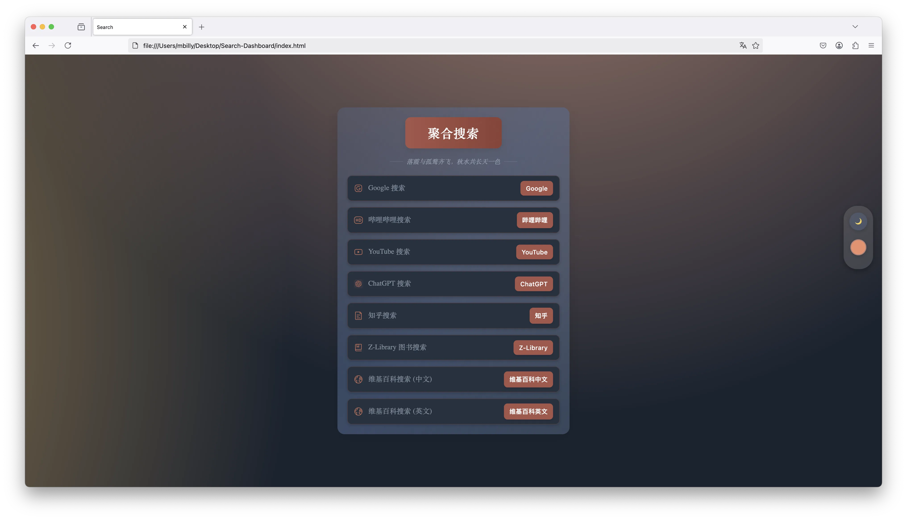


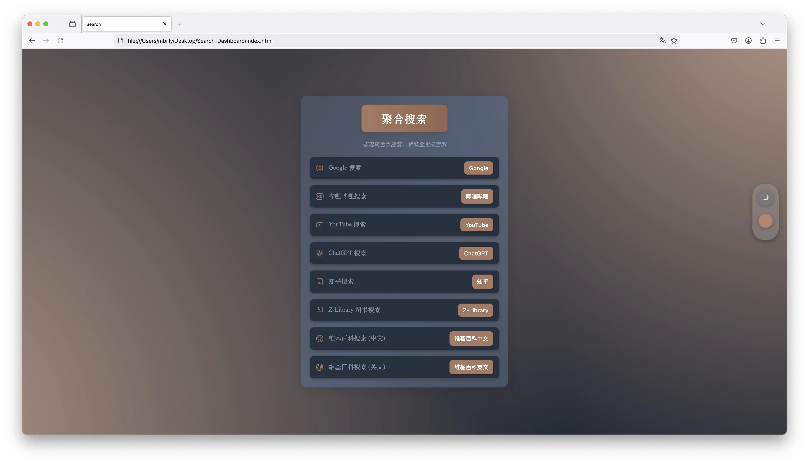


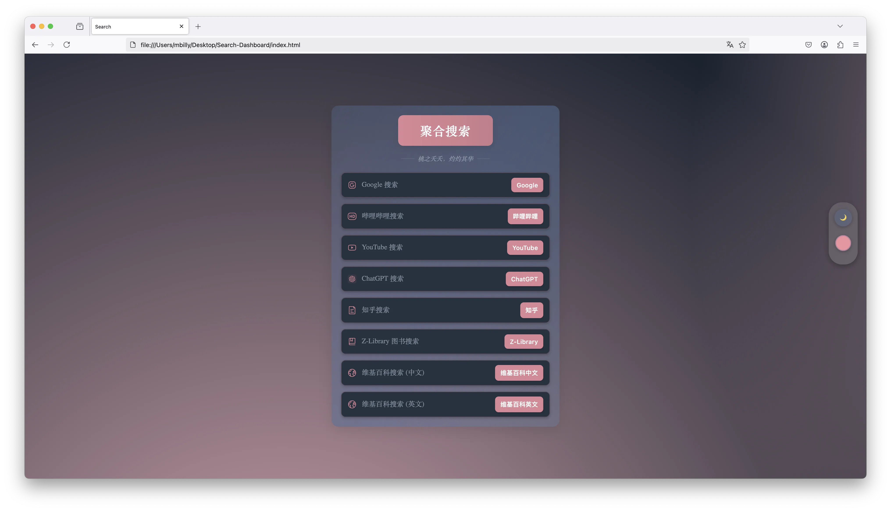


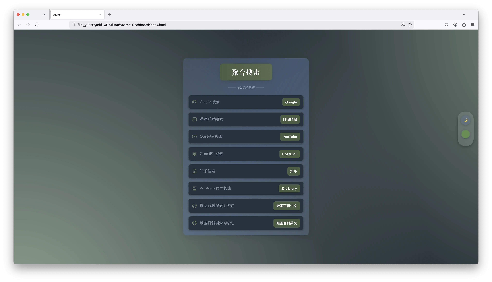


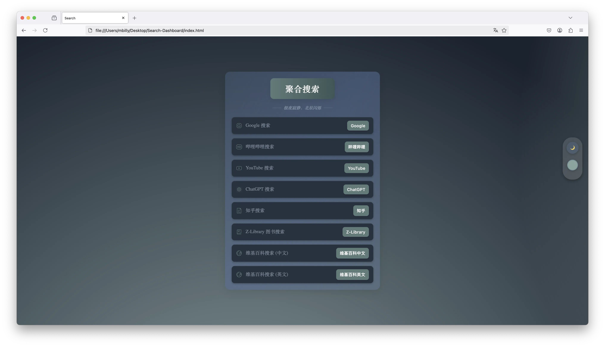


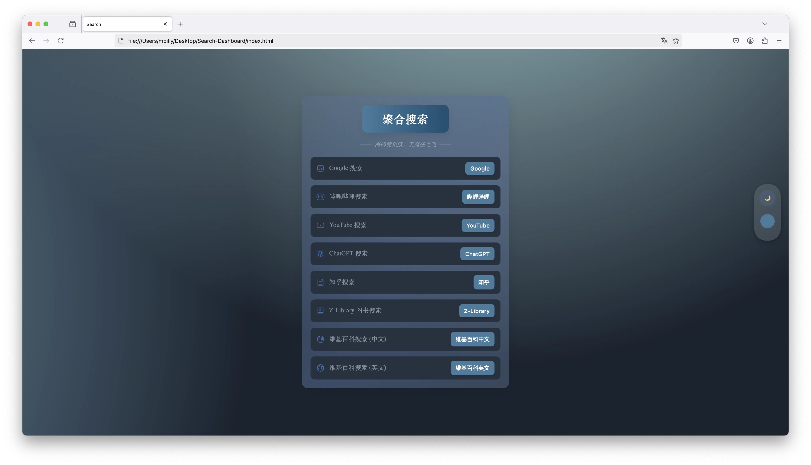


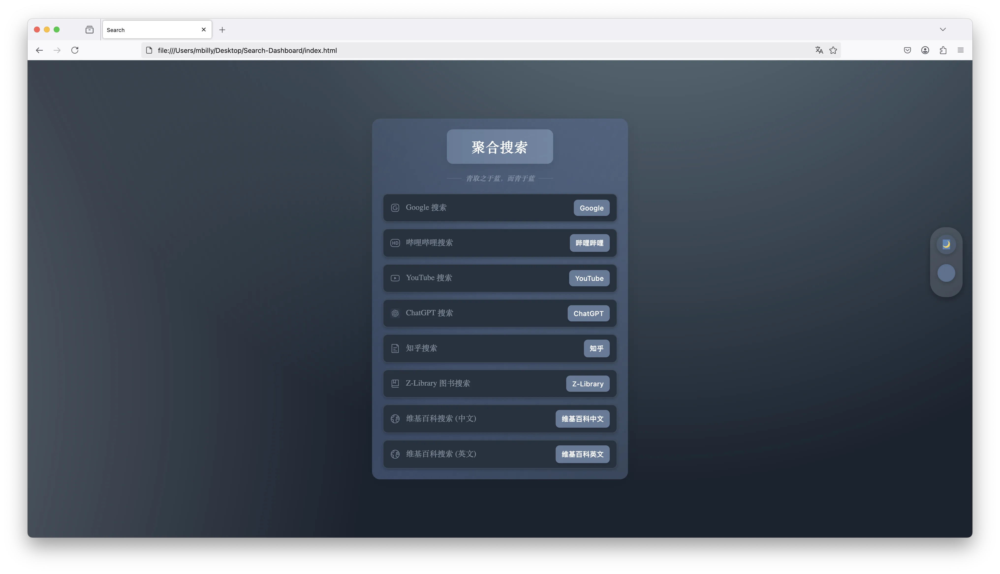