>**建议阅读：**
>**4.基础操作：发送、接收、回复、转发邮件；附件与抄送/密送**
>**5.邮件管理：标签、文件夹、星标、搜索**
>**8.常见问题与故障排除建议——如何应对“广告”邮件**

## **1. 邮箱基础知识与工作原理**

> 电子邮件就像数字时代的信件，通过服务器中转完成传递。
> 

电子邮箱（Email）是一种通过互联网发送和接收数字信息的通信方式，每个邮箱账户都有一个唯一的地址，格式通常为“用户名@域名”。例如，`example@gmail.com` 就是一个邮箱地址，其中“example”是用户名，`gmail.com` 是提供邮箱服务的域名。这个地址就好比您在网络世界的“邮政编码”，确保电子邮件能够准确投递到您的收件箱中。

邮件地址的结构遵循 `用户名@域名` 的形式，其中用户名由您自行设定（通常由字母、数字组成），@ 后面的域名则由邮箱服务提供商提供。例如，上文中的 `gmail.com` 代表谷歌的邮箱域名。发送邮件时，系统会根据您输入的地址，将邮件通过互联网**路由**到对应域名的服务器，再投递到收件人邮箱里。

## **2. 注册与设置（以 Gmail 和 Outlook 为例）**

> 大多数邮箱服务注册都是免费的，而且过程相对类似。下面以 **Gmail**（谷歌邮箱）和 **Outlook**（微软邮箱）为例，介绍如何注册账号并进行初始设置。
> 

注：大陆用户首推Outlook。

**2.1 注册 Gmail 账号：**要创建 Gmail 邮箱，您需要先申请一个 Google 账户（谷歌账户）。进入 Google 帐号登录页面后，点击“创建账号”，按照提示填写基本信息（姓名、用户名、密码等）并完成验证即可开户。

[创建 Gmail 账号 - Gmail帮助](https://support.google.com/mail/answer/56256?hl=zh-hans)

**2.2 注册 Outlook 邮箱：**Outlook 邮箱属于微软的 **Microsoft Account**（微软账号）体系。打开 Outlook注册页面（如 outlook.live.com），选择“创建免费账户”。首先挑选您的邮箱地址（可以选择 @outlook.com 或 @hotmail.com 结尾的地址），按照提示填写基本信息（姓名、用户名、密码等）并完成验证即可开户。

[Microsoft Outlook（以前称为 Hotmail）：免费的电子邮件和日历 | Microsoft 365](https://www.microsoft.com/zh-cn/microsoft-365/outlook/email-and-calendar-software-microsoft-outlook)

**2.3 安全设置：**无论是 Gmail 还是 Outlook，在初次登录邮箱后都建议完善安全选项。例如，绑定备用邮箱和手机号码，以便在忘记密码时用来找回账户；开启“两步验证”（双重验证），为登录增加一道短信验证码或手机通知的安全检查。

关于安全设置等事物请参考Blog下另一篇文章：

[多因素认证MFA-身份验证方式全景解析 | TechLeaf Blog](https://techleaf.xyz/article/MFA-security)

## **3.移动端和电脑端登录：**

> 注册好邮箱后，需要在任意客户端上使用它（Gmail默认跳转到Gmail客户端，outlook默认跳转到outlook；**多数邮箱都有默认客户端，但你可以选择其它客户端**，功能与外观上会有不同）
> 

**3.1 邮箱和邮箱客户端的区别：**

- **邮箱（一串号码）**：指的是您在 Gmail、Outlook、QQ 等服务商注册的**邮箱账号本身**（左侧）
- **邮箱服务端（服务器）：**虽然我们通常是在网页或App中使用邮箱，但其实所有邮件、规则（如自动回复、黑名单）等都**保存在邮箱服务商的“服务端”服务器中**。客户端只是一个访问窗口。
- **邮箱客户端（APP/网页）**：指的是您**用来访问和操作邮箱的工具**，可以是网页、APP，也可以是电脑上的软件。（例如Apple Mail, Spark, Thunderbird, Gmail, Outlook)（右侧）

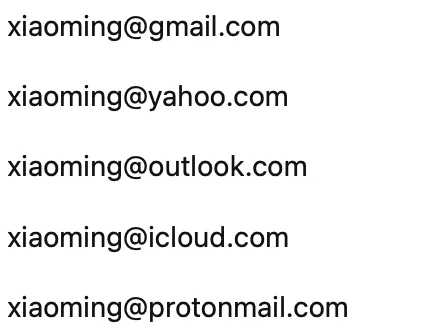

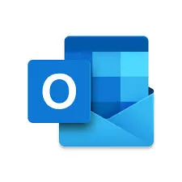

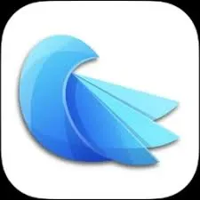

**用类比区分邮箱、邮箱客户端、邮箱服务端：**

邮箱和邮箱客户端是两个东西，配套使用。你可以在Gmail里使用.outlook的邮箱，或者.edu的邮箱。可以将其类比为手机号（邮箱）和手机（客户端）来理解——你可以把你的手机卡（邮箱）装在任何手机（客户端）里使用，并且必须装在手机（客户端）里使用。——但不管在哪里登录（插卡），用的都是同一个账户（电话号）。当然，现在都是多卡手机。一个客户端可以登录很多邮箱账户。卡也可以分身，登录到多个手机上（消息会自动同步）。

**服务端**（Server）：就像**运营商后台系统**，是处理来电、短信、网络的核心基础设施。可以在此对手机号进行一定的操作（比如来电铃声，自动回复。这不是手机的功能）

**3.2 客户端类别：**

如无必要，建议使用默认客户端（可以换成本地版）

客户端分网页和本地两种，前者无须安装APP，相对不那么灵活。后者需要安装APP，操作相对流畅。

- 网页版客户端：例如 [mail.google.com](http://mail.google.com)，或 [outlook.com](http://outlook.com)。
- 本地客户端：也可以使用电脑上的邮件客户端软件（Apple Mail, Spark, Thunderbird, Gmail, Outlook)

**注：部分邮箱的权限会被限制，可能无法使用第三方客户端。**多数学校处于安全考虑都开启了此限制，需要像邮箱管理员申请开放权限。

## **4. 基础操作：发送、接收、回复、转发邮件；附件与抄送/密送**

> 客户端登录邮箱账号后，您就可以开始收发电子邮件了。本节介绍最基本的邮箱操作，包括如何发送邮件、查看收件、回复他人以及使用附件、抄送（CC）和密送（BCC）等功能。
> 

**4.1 发送新邮件：**进入邮箱收件箱页面后，找到“新邮件”或“撰写”按钮（Gmail 中为「写邮件」，Outlook网页版中为「新建邮件」）。点击后会打开一个邮件撰写窗口。在收件人栏填写对方的邮箱地址；如有多个收件人，使用逗号分隔多个地址。然后填写邮件的主题（标题）和正文内容。如果需要，可以点击“附件”按钮（回形针图标）选择文件上传作为邮件附件（如图片、文档等）。完成内容输入后，点击**发送**按钮即可将邮件发出。

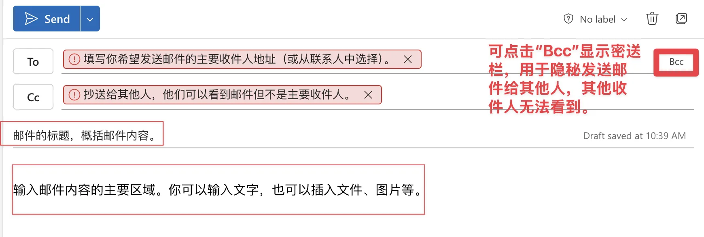

Outlook网页版的发送

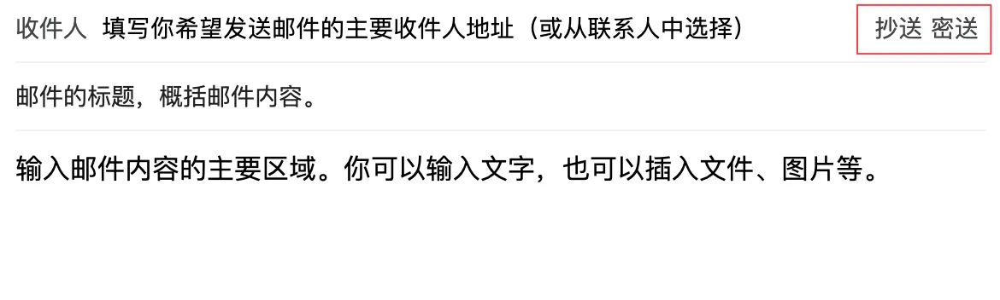

Gmail网页版的发送

- *附件提示：*发送附件时请注意单个邮件的附件总大小限制。大部分邮箱服务允许发送的附件总容量上限约为 **25MB**。如果附件超过25MB，Gmail等会自动将文件上传到云盘并以链接形式发送。超过限制的情况也可以通过压缩文件或使用云盘分享链接来解决。另请注意，不同邮箱可能会**拦截某些类型的附件**（例如可执行文件 `.exe`）出于安全考虑。
- *抄送和密送 (CC/BCC)：* 在撰写邮件时，您会看到“抄送/CC”和“密送/BCC”字段。
    - **抄送**用于发送副本给除主收件人外的其他相关人员，所有收件人都能看到被抄送者的地址，从而知晓谁同样收到了邮件。
    - **密送**则与抄送相似，但具有保密性——被密送的收件人地址对其他收件人是隐藏的。

**4.2 接收和阅读邮件：**他人发送的邮件会根据地址自动投递到您的收件箱(Inbox)。大部分邮箱服务会定时自动检查新邮件；您也可以手动点击“刷新”或“同步”按钮立即获取新邮件。如果发件人在邮件中附加了文件，您会在邮件中看到附件名称及预览，点击即可下载或查看。

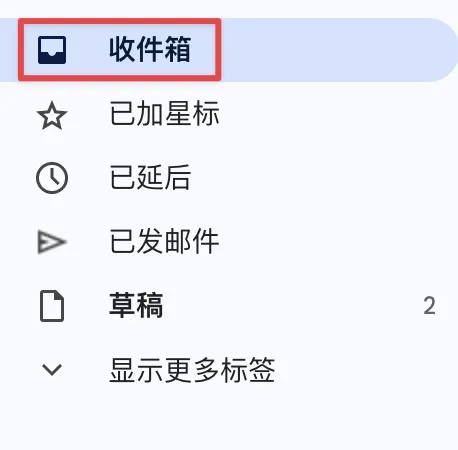

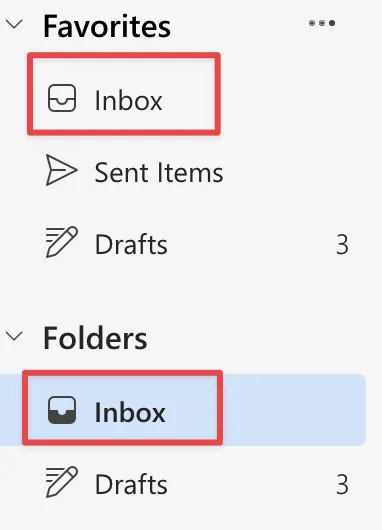

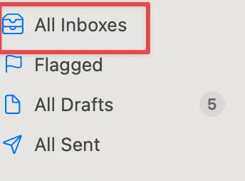

**4.3 回复邮件：**收到邮件后，您可以**回复**发件人。点击“回复”按钮，系统会自动填入对方地址并沿用原邮件的主题（通常会在前面加上“Re:”标识）。您只需要编写回复内容，然后发送即可。如果这封邮件同时发给了**多人**（存在抄送/群发），您可以选择“回复所有”来让每个原收件人都收到回复。一般回复不会包含对方原邮件中的附件，邮件系统会省略附件以节省空间。而转发（Forward）则是将收到的邮件直接发送给第三方，新邮件中会保留原邮件的附件。因此，若要把**别人发来的带附件的邮件传给另外的人**，请使用“**转发**”，这样附件也会一并转交；而简单回复发件人则无需附带原附件。

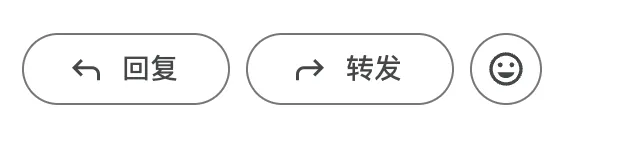

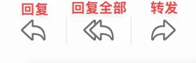

## **5 邮件管理：标签、文件夹、星标、搜索**

> 随着使用时间增加，您的收件箱可能会积累大量邮件。良好的管理习惯能帮助您高效定位重要信息、保持邮箱整洁。本节介绍常用的邮箱整理工具：标签/文件夹、星标以及搜索功能。
> 

**5.1 标签与文件夹：**多数邮箱提供“文件夹”或“标签”来分类邮件。在Gmail中，常见的系统标签有“收件箱”、“星标”、“已发送”等，您也可以创建自定义标签（例如“工作”、“网购账单”、“重要”）。Outlook和多数其他邮箱沿用传统“文件夹”结构，您可以在收件箱下新建子文件夹，然后通过移动邮件的方式进行归档分类。

此外还有**“星标”**或**“重要”**标记功能：在邮件列表中，您可以点一下星形符号 ⭐ 给某封邮件加星（Gmail），或者在Outlook中将邮件标记为重要/旗标，这样这些邮件会被突出显示或汇总到星标/重要类别中。

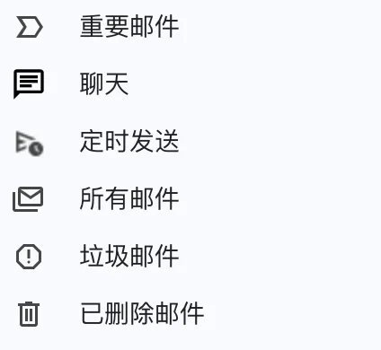

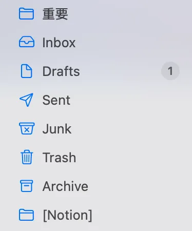

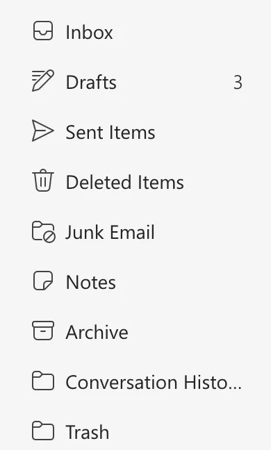

**5.2 邮件搜索：**邮件搜索是管理大量邮件的利器。现代多数客户端都内置了强大的搜索引擎。除去常规的搜索外，我们还可以：

- 按发件人：例如输入`from:alice@example.com` 来找Alice发来的邮件。
- 按收件人：`to:lihua@company.com` 可找出发给lihua的所有邮件。
- 按主题关键词：如搜索`subject:会议` 找到主题包含“会议”的邮件。
- 按日期范围： `after:2023/01/01 before:2023/12/31` 来限定时间。
- 按是否有附件：输入`has:attachment` 可以筛选出带附件的邮件。

注：通过**界面的筛选按钮**我们同样可以做到(见右侧），不一定要背这些搜索方法。

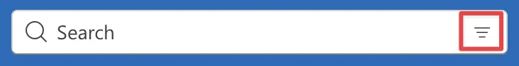

Outlook

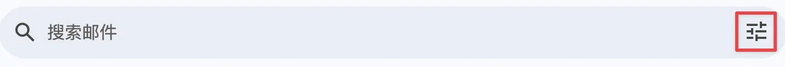

Gmail

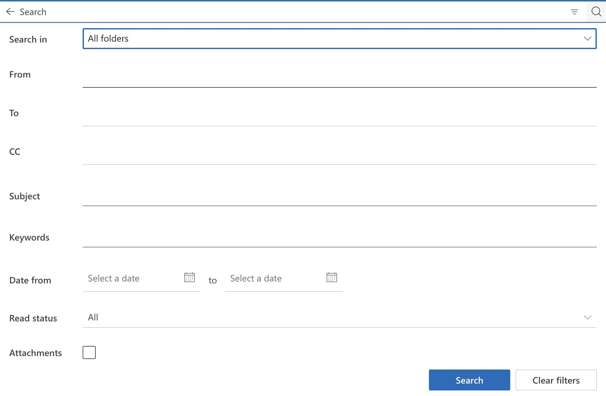

Outlook

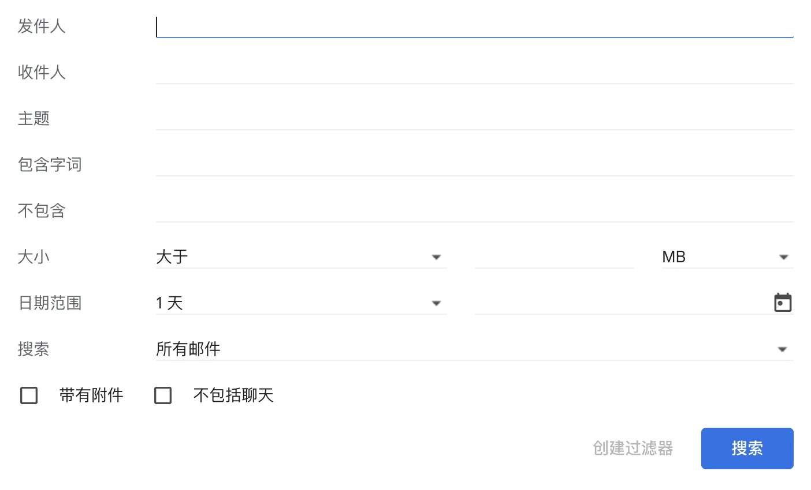

Gmail

**5.3 其他管理技巧：**合理利用邮箱的**自动分类功能**

如 Gmail 默认会将邮件分成“主要”、“社交”、“推广”等标签页自动归类（可在设置中开启/关闭）。Outlook.com 则有“重点收件箱”功能，会智能识别重要邮件放入“Focused”标签，其余邮件放入“其他”标签，以减少干扰。

更多技巧请见下一节。

## **6. 设置规则与过滤器：自动分拣邮件、黑名单白名单、自动转发**

> 如果您希望邮件收发能“更聪明”一些，邮箱的**过滤器**和**规则**功能可以帮大忙。通过预先设定条件，邮箱可对新收到的邮件自动执行某些操作，例如分类存放、标记已读、甚至拒收或转发。下面介绍如何用好这些高级设置：
> 

**6.1 邮件过滤器（规则）的作用：**以 Gmail 为例，过滤器可以根据邮件的发件人、收件人、主题关键词、包含的文字等条件，匹配符合条件的邮件，并自动为这些邮件执行您指定的操作。例如，您可以设置一个过滤器：“如果邮件来自`news@example.com`，则自动标记为已读并移至‘新闻’文件夹”，这样订阅的新闻邮件就不会挤占收件箱。

[创建用于过滤电子邮件的规则 - Gmail帮助](https://support.google.com/mail/answer/6579?hl=zh-Hans)

[使用 Outlook 中的规则管理电子邮件 - Microsoft 支持](https://support.microsoft.com/zh-cn/office/%E4%BD%BF%E7%94%A8-outlook-%E4%B8%AD%E7%9A%84%E8%A7%84%E5%88%99%E7%AE%A1%E7%90%86%E7%94%B5%E5%AD%90%E9%82%AE%E4%BB%B6-c24f5dea-9465-4df4-ad17-a50704d66c59)

**6.2 黑名单和白名单：**黑名单指的是您明确**阻止**的发件人列表，白名单则是明确**信任**的发件人列表。许多邮箱支持用户自定义这些列表。

[许可名单、拒绝名单和批准的发件人 - Google Workspace 管理员帮助](https://support.google.com/a/answer/60752?hl=zh-Hans)

[将我的电子邮件收件人添加到“安全发件人列表”中 - Microsoft 支持](https://support.microsoft.com/zh-cn/office/%E5%B0%86%E6%88%91%E7%9A%84%E7%94%B5%E5%AD%90%E9%82%AE%E4%BB%B6%E6%94%B6%E4%BB%B6%E4%BA%BA%E6%B7%BB%E5%8A%A0%E5%88%B0-%E5%AE%89%E5%85%A8%E5%8F%91%E4%BB%B6%E4%BA%BA%E5%88%97%E8%A1%A8-%E4%B8%AD-be1baea0-beab-4a30-b968-9004332336ce)

[在 Outlook 中阻止或取消阻止发件人  - Microsoft 支持](https://support.microsoft.com/zh-cn/office/%E5%9C%A8-outlook-%E4%B8%AD%E9%98%BB%E6%AD%A2%E6%88%96%E5%8F%96%E6%B6%88%E9%98%BB%E6%AD%A2%E5%8F%91%E4%BB%B6%E4%BA%BA-9bf812d4-6995-4d19-901a-76d6e26939b0)

**6.3 自动转发（邮箱服务端功能，非客户端）：**如果您有多个邮箱，希望集中处理邮件，可以设置自动转发规则。Gmail和Outlook都支持将收到的邮件自动转发到另一个地址。

[自动向其他账号转发 Gmail 邮件 - Gmail帮助](https://support.google.com/mail/answer/10957?hl=zh-Hans#:~:text=%E5%9C%A8%E8%AE%A1%E7%AE%97%E6%9C%BA%E4%B8%8A%E6%89%93%E5%BC%80Gmail%E3%80%82%20%C2%B7%20%E7%99%BB%E5%BD%95%E8%A6%81%E8%BD%AC%E5%8F%91%E9%82%AE%E4%BB%B6%E7%9A%84%E6%BA%90%E8%B4%A6%E5%8F%B7%E3%80%82%20%C2%B7%20%E7%82%B9%E5%87%BB%E5%8F%B3%E4%B8%8A%E8%A7%92%E7%9A%84%E2%80%9C%E8%AE%BE%E7%BD%AE%E2%80%9D%E5%9B%BE%E6%A0%87,%E7%82%B9%E5%87%BB%E8%BD%AC%E5%8F%91%E5%92%8CPOP%2FIMAP%20%E6%88%96%E8%BD%AC%E5%8F%91%E6%A0%87%E7%AD%BE%E9%A1%B5%E3%80%82%20%C2%B7%20%E5%9C%A8%E2%80%9C%E8%BD%AC%E5%8F%91%E2%80%9D%E9%83%A8%E5%88%86%EF%BC%8C%E7%82%B9%E5%87%BB%E6%B7%BB%E5%8A%A0%E8%BD%AC%E5%8F%91)

[在 Outlook.com 中打开或关闭自动转发 - Microsoft 支持](https://support.microsoft.com/zh-cn/office/%E5%9C%A8-outlook-com-%E4%B8%AD%E6%89%93%E5%BC%80%E6%88%96%E5%85%B3%E9%97%AD%E8%87%AA%E5%8A%A8%E8%BD%AC%E5%8F%91-6246987c-6c8f-4144-b255-14fc07007dad?utm_source=chatgpt.com)

## **7. 进阶功能：自动回复、签名、日历整合、第三方插件、邮箱自动化**

当您掌握基本的收发邮件后，可以尝试利用邮箱的一些**高级功能**，让沟通更高效，并与您的日常工作流程进一步集成。

**7.1 自动回复（假期/外出回复）——（邮箱服务端功能，非客户端）：**在您不在期间，每个发信给您的人会自动收到这段您预先写好的回复，以告知对方您暂时无法及时回复。例如，您可以写道：“您好，我目前外出，将于X日返工，期间邮件可能回复较慢。” Gmail称其为“休假回复”（Vacation Responder），Outlook则称之为“自动答复”或“外出邮件”。可设定一个时间区间以及回复内容。

[Send an automatic reply when you're out of office - Computer - Gmail Help](https://support.google.com/mail/answer/25922)

[从 Outlook (外出) 发送自动答复 - Microsoft 支持](https://support.microsoft.com/zh-cn/office/%E4%BB%8E-outlook-%E5%A4%96%E5%87%BA-%E5%8F%91%E9%80%81%E8%87%AA%E5%8A%A8%E7%AD%94%E5%A4%8D-9742f476-5348-4f9f-997f-5e208513bd67)

**7.2 个性签名（Signature）：**签名是附加在每封您发出的邮件末尾的**固定文本（不是手写签名）**，一般用于注明发件人信息和联系方式。您可以在邮箱设置中添加签名模版。在签名中，您可以写上自己的姓名、职务、公司名、电话等。

[创建 Gmail 签名 - 计算机 - Gmail帮助](https://support.google.com/mail/answer/8395?hl=zh-Hans)

[在 Outlook.com 或 Outlook 网页版 中创建和添加电子邮件签名 - Microsoft 支持](https://support.microsoft.com/zh-cn/topic/%E5%9C%A8-outlook-com-%E6%88%96-outlook-%E7%BD%91%E9%A1%B5%E7%89%88-%E4%B8%AD%E5%88%9B%E5%BB%BA%E5%92%8C%E6%B7%BB%E5%8A%A0%E7%94%B5%E5%AD%90%E9%82%AE%E4%BB%B6%E7%AD%BE%E5%90%8D-776d9006-abdf-444e-b5b7-a61821dff034)

**7.3 日历整合：**电子邮件常常与日程安排联系紧密，比如会议邀请邮件、行程确认邮件等。像 Gmail 与 Google 日历就是联动的：当您收到航班、酒店预订等包含日期的信息时，Gmail会智能地将它们添加到您的 Google 日历中（仅您本人可见）作为提醒。同样，Outlook 邮箱与微软的日历（Outlook Calendar）也是深度集成的。

[在 Gmail 中管理日历活动的提示 - Google Workspace 学习中心](https://support.google.com/a/users/answer/11387073?hl=zh-Hans)

[在电子邮件中创建“添加到日历”链接 - Microsoft 支持](https://support.microsoft.com/zh-cn/office/%E5%9C%A8%E7%94%B5%E5%AD%90%E9%82%AE%E4%BB%B6%E4%B8%AD%E5%88%9B%E5%BB%BA-%E6%B7%BB%E5%8A%A0%E5%88%B0%E6%97%A5%E5%8E%86-%E9%93%BE%E6%8E%A5-34f8ea28-322a-4867-b423-2998f9634e59)

同样可在第三方日历APP中登录你的邮箱账户，然后看到你的日程。

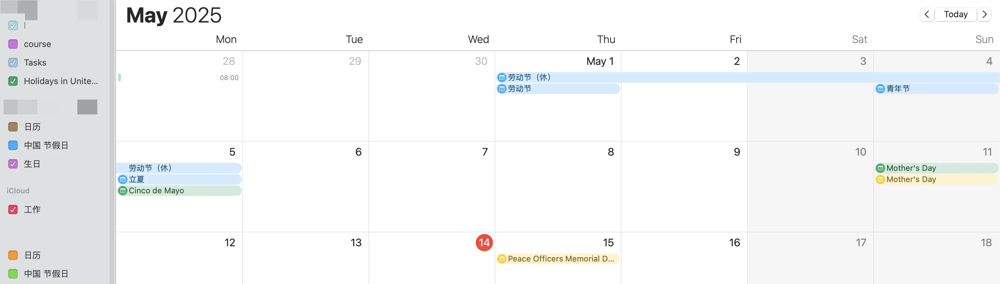

**7.4 第三方插件扩展：**例如 Boomerang 是 Gmail 的一款著名插件，它提供了邮件定时发送、邮件跟踪和自动提醒功能。当您希望邮件在指定时间发送（比如下周一早上）时，Boomerang可以帮您安排。此外，Boomerang还有“收件箱暂停”“AI写作辅助”等实用功能。Notion 最近推出了“Notion Mail”功能，支持直接集成 Gmail 等账号，打通笔记与邮件。再比如，一些项目管理工具（如 Trello、Asana）提供邮箱插件，允许您直接把邮件转换为任务卡片。

[Boomerang for Gmail: Scheduled sending and email reminders](https://www.boomeranggmail.com/)

**7.5 邮件自动化（脚本）：**对于高级用户和开发者，像 Google Apps Script 提供了对 Gmail 的编程接口，或者Outlook 提供的 VBA 脚本支持。可以实现一些定制的自动化操作。

## **8. 常见问题与故障排除建议**

即使熟练使用邮箱，**新手**仍可能遇到一些疑惑或问题。下面列出几条常见问题和相应的解决思路：

- **无法登录/忘记密码：**如果密码忘记，最简单的办法是使用邮箱登录页面的“忘记密码”功能。Gmail 和 Outlook 会通过备用邮箱或手机号验证码来重设密码。平时务必确保您的账号绑定了有效的恢复选项。

再次提到MFA，建议启用MFA，指纹总不可能忘带吧：

[多因素认证MFA-身份验证方式全景解析 | TechLeaf Blog](https://techleaf.xyz/posts/email-guide-for-beginners/)

- **收不到邮件：**首先检查是否网络连接正常。像微信一样，没有网络当然收不到。除此之外可能是1）对方邮箱地址拼写错误；2）您的邮箱存储已满（多数情况发件人也会收到退信）；3）邮件被误判为垃圾，去了垃圾邮件文件夹；4）发件人被您不慎拉入黑名单。……
- **邮件发送不出去：**首先检查是否网络连接正常。除此之外可能是1）收件人地址无效；2）您在邮件中附带的附件过大超出限制；3）您的邮箱当天发送量过大被暂时限制。……
- **收到大量垃圾邮件：**几乎每个邮箱都会收到广告、钓鱼等垃圾邮件。一般将其标记为垃圾即可，智能客户端一般就能记住。对于反复收到的广告邮件，可以尝试在邮件末尾寻找合法的“退订”链接进行退订（正规订阅源通常提供退订）。很多时候不自觉的就会订阅很多东西。

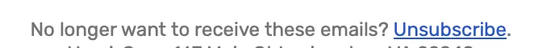

最后，如果在使用邮箱过程中有任何疑问，Gmail 和 Outlook 官方都有详尽的在线帮助中心[support.google.com](https://support.google.com/mail/answer/56256?hl=zh-Hans#:~:text=,16)、[support.microsoft.com](https://support.microsoft.com/zh-cn/office/%E6%AC%A2%E8%BF%8E%E4%BD%BF%E7%94%A8%E7%94%B5%E5%AD%90%E9%82%AE%E4%BB%B6-c6c261e3-d50a-43a6-816f-35fe1e53acc6#:~:text=,11)覆盖常见问题。