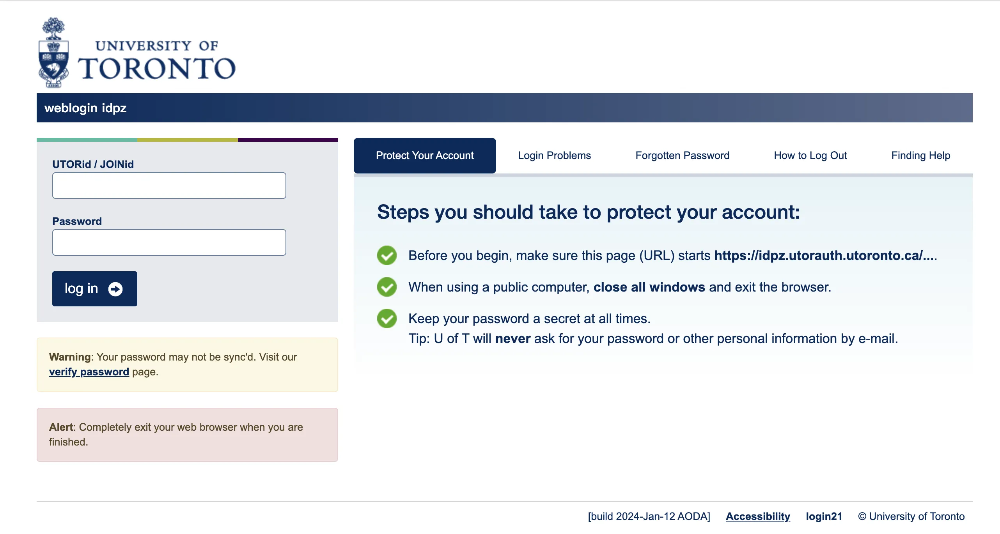
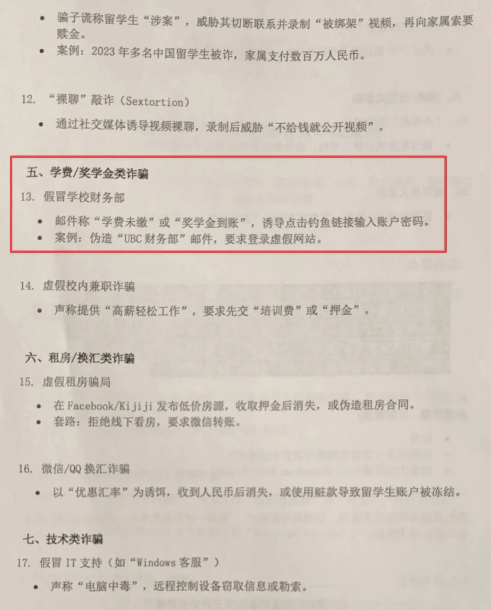
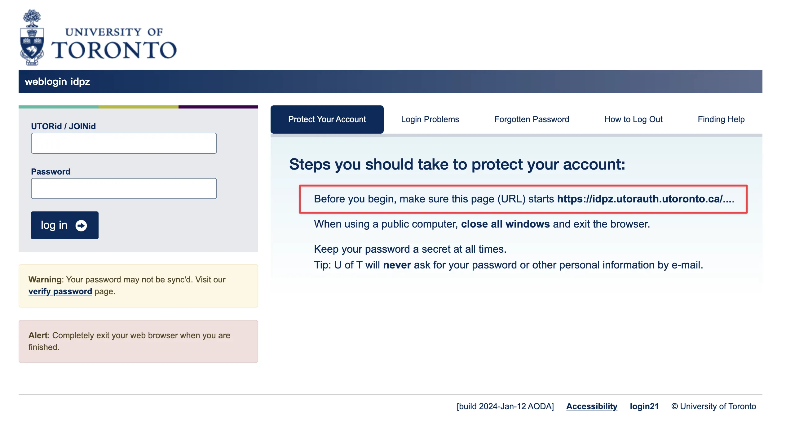
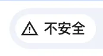
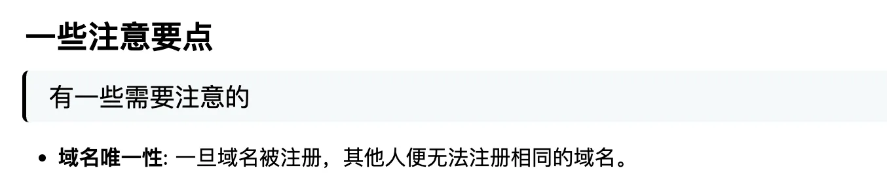

# 事件经过：

下午开设了安全讲座，同学们手中还拿着列有详尽诈骗类型清单的纸质材料。老师还带领同学们过了一整遍。于此情景，我自然是想测试一下讲座的效果。

大约两小时后，我在新生群里发送了一个模拟的诈骗网页链接：

https://university.techleaf.xyz

(注：此链接为测试使用，目前并未开放)

链接发出后，有几位同学几乎是“秒填”了信息。他们提交的密码格式惊人地相似，“姓名缩写+生日+特殊符号”。

如此情况，无疑敲响了警钟。想来有必要重述一下信息安全相关事宜。特别是如何从技术层面简单有效地甄别诈骗网站（其实很简单，就一句话），不必因此**“诈骗网站”**草木皆兵。

# 防护手段

**验证官方域名——简单有效的一句话**

## 1.防护手段-**验证官方域名**

我相信很多人可能没有仔细阅读或未能完全理解官方登录页面通常会有的提示：

Before you begin, make sure this page （URL） starts https://idpz.utorauth.utoronto.ca....

因此，最根本的防护方法就是：**请务必确认登录页面的网址（URL）是否以 `https://idpz.utorauth.utoronto.ca` 开头**。

只要以此域名开头，即可认定为官方网站。但请注意仔细辨别，例如 `https://idpz.utorauth.utoronto.caa`（结尾是 `caa` 而非 `ca`）则属于仿冒网站。这次的测试相对容易识别，因为我并未注册一个高度相似的域名来进行“钓鱼”（注册域名要花钱的！！）。

（注：**还有另一种情况**，那就是显示为“不安全”的时候（见右图），此时请勿填入任何信息。此处与网站SSL证书之类有关，有需求可以自己了解，此处不做过多原理解析。）

## 2.原理-验证域名

此处可参考我之前在《域名简单科普》（收录于“建站合集”）中提到的：**域名具有全球唯一性**

[域名简单科普 | TechLeaf Blog](https://techleaf.xyz/article/domains-what)

是的，域名具有唯一性。我可以创建无数个看起来与多伦多大学官网一模一样的网页，但是无法拿下多大的域名（除非多大愿意出让给我）。

因此，验证域名是否为官方的 `https://idpz.utorauth.utoronto.ca` 是最直接有效的甄别方法。

（也有更高级的攻击手段，如DNS劫持等（见文末），故此处仅保障99%的情况。那很难遇到的1%）

## 3.更多安全建议

本次事件中，几位同学的密码格式（姓名+生日+特殊符号）高度统一，这极有可能是他们的通用密码。虽然多伦多大学的账户在新设备登录时有Duo Mobile进行两步验证（2FA）防护，但其他许多网站并没有强制2FA。

一旦这个通用密码在安全性较低的网站泄露，或者如本次事件一般泄露出去。攻击者便可能利用它尝试登录你的其他重要账户（如Google账户等），造成更大损失。因此，**强烈警示不要使用通用密码**。

- 建议使用密码管理器，例如bitwarden。
- 或者根据二八定律来分配你的密码——为你最重要的20%的账户（如网银、主要邮箱、社交媒体大号等）设置强度高且绝不重复的密码。

## 4.点击URL不输入信息是否绝对安全？-来看看乐子

先前某软件爆出过漏洞（路径穿越），一旦点击链接。会在你的电脑“开机自启”文件夹下新建一个木马，从而在下次开机后操控你的电脑。

# 总结

**上网时，验证官方域名能防住99%的钓鱼网站了（以及“不安全”弹出后别输入信息）。其余的攻击手段（如[0day](https://en.wikipedia.org/wiki/Zero-day_vulnerability)漏洞、高级持续性威胁APT等）对于普通用户而言更难防御，也相对少见。**

**所以我们普通用户需要做的，就是学习20%的基本安全指南，防住99%的常见安全问题。**

**当然，保持系统和软件更新、使用安全软件等也是重要的补充措施（**展开讲就太复杂啦，不过Windows和Mac每次更新的时候都会有写——修复了xx漏洞**）。**

---

**本次活动收集到的4位同学的密码已删除，也并无进行更多测试。**

求学校放过。

保命声明：本人纯电脑小白，啥也不会。