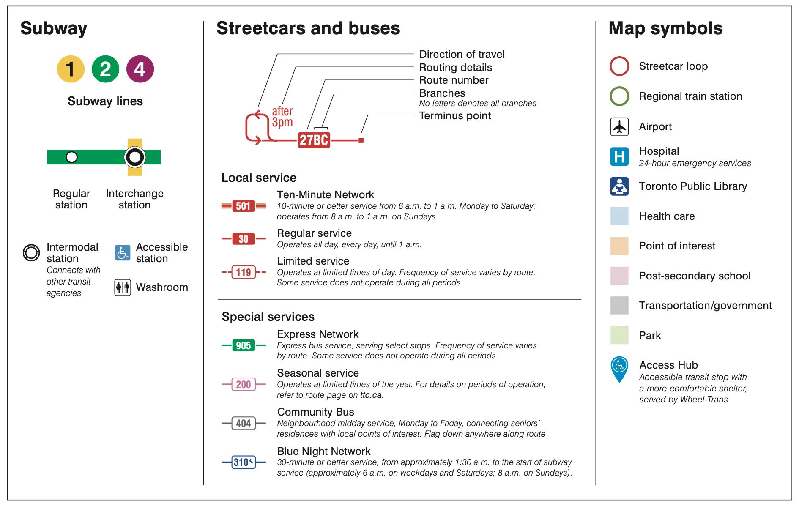
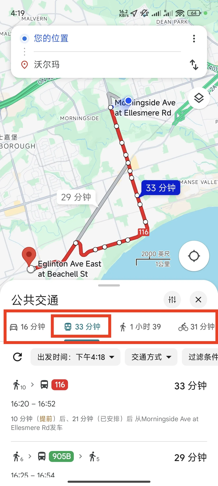
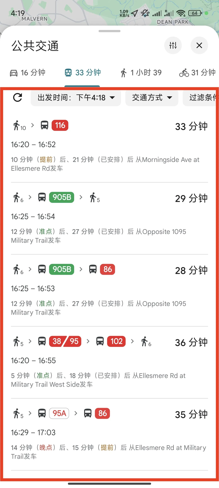
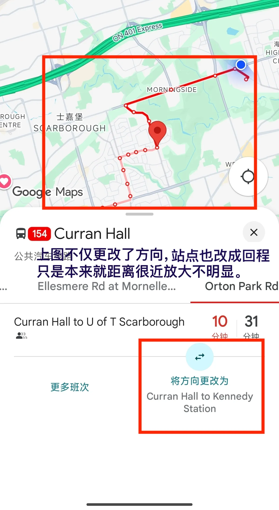

**利用好换乘政策和青年票省钱**

# 1.地图纵览：

[TTC_SystemMap_2024-03.pdf](https://cdn.ttc.ca/-/media/Project/TTC/DevProto/Images/Home/Routes-and-Schedules/Landing-page-pdfs/TTC_SystemMap_2024-03.pdf?rev=5ef7733ea15f4f64a47de76a412951ba)

## 一分钟通过图例熟悉公交车：

**地铁 (Subway)**

- **地铁线路 (Subway lines)**
    - [1 2 4 图标] 地铁线路
    - [绿色圆圈] 常规车站 (Regular station)
    - [绿色圆圈带黄色方块] 换乘车站 (Interchange station)

## 这边的公交车有多个种类，以及分支（同样取自图例）：

**有轨电车和公共汽车 (Streetcars and buses)**

- **分支 (Branches) - 无字母表示所有分支 (No letters denotes all branches)**
    - 是的，多伦多公交车有分支。如12A、12B、12C。当然，多数公交车无分支。
- **公交车种类（前面的标号为图例示例）**
    - **501 - 十分钟网络 (Ten-Minute Network)**
        - 从上午6点到凌晨1点，平均10min一班；周日上午8点到凌晨1点运营。
    - **30 - 常规服务 (Regular service)**
        - 周一-周日，凌晨1点下班。
    - **119 - 有限服务 (Limited service)**
        - 在特定时间段内运营。服务频率因路线而异。有些服务并非在所有时间段内都运营。
    - **905 - 快速网络 (Express Network)**
        - 快速公交服务，选择性停靠。服务频率因路线而异。有些服务并非在所有时间段内都运营。
    - **200 - 季节性服务 (Seasonal service)**
        - 在一年中的特定时间段内运营。有关运营时间段的详细信息，请参阅 ttc.ca 上的路线页面。
    - **404 - 社区巴士 (Community Bus)**
        - 周一至周五提供社区午间服务，连接高级居民和当地名胜。沿途可招手停车。
    - **310 - 蓝夜网络 (Blue Night Network)**
        - 从大约凌晨1:30开始到地铁服务开始（大约工作日和周六上午6点，周日上午8点）平均30min一班。

## 注：公交每站会有正反两个乘车点。

# 2.常用APP

## Google Map

### 1.通过公共交通前往目的地

搜索目的地（图示“沃尔玛”）然后选择公共交通出行。

多种路线中选择一个，图中绿色就是**Express Network**

选择路线后可以点进看更详细的发车时间。

根据发车时间计划出行即可。（最好导航到乘车点，小心坐反。）

<table style="width:100%; border: none; border-collapse: collapse;">
  <tr style="border: none;">
    <td style="width:25%; padding:5px; border: none;">
      
    </td>
    <td style="width:25%; padding:5px; border: none;">
      
    </td>
    <td style="width:25%; padding:5px; border: none;">
      
    </td>
    <td style="width:25%; padding:5px; border: none;">
      
    </td>
  </tr>
</table>

### 2.单独查找公交路线

搜索公交路线（如154）

红框处切换更多站点

切记乘车点位置，以及方向选择。

<table style="width:100%; border: none; border-collapse: collapse;">
  <tr style="border: none;">
    <td style="width:33.33%; padding:5px; border: none;">
      
    </td>
    <td style="width:33.33%; padding:5px; border: none;">
      
    </td>
    <td style="width:33.33%; padding:5px; border: none;">
      
    </td>
  </tr>
</table>

## 其余APP：

Transit（与Google Map功能基本相同，不过为公共交通专用）。

# 3.如何乘车

## 3.1付钱

- 学校发给每个学生一个[PRESTO](https://www.prestocard.ca/)公交卡，可用于乘车。
    - 可以使用网页或者APP进行充值，也可在车站，地铁站以及部分有充值机器的机器上通过银行卡或者现金充值。
    - 可以将卡录入手机，录入之后那张实体卡就会被系统永久性地取消和失效。即使将数字卡从手机中移除，实体卡也无法再被重新激活使用。
    - 注：Google Play下载APP失败的话（国产安卓可能会出现），可以寻找APK进行安装。
- 可以使用信用卡（credit card）或者借记卡（debit card）进行乘车，费用一致。
- 准备好$3.35现金，无法找零。

## 3.2乘车有效期-转乘（Transfer）政策

注：现金需要申请纸质换乘票。

TTC（多伦多交通局）的转乘（Transfer）政策旨在让乘客在**两小时内**，使用同一张支付凭证（如 PRESTO 卡、信用卡、借记卡或一次性代币/现金支付后获得的换乘票）在TTC系统内换乘不同的线路，而无需再次付费。

注：从上车的刷卡时间开始计时，直到最后一次上车。

## 3.3示意上下车

- 示意停车 (Hailing/Flagging Down for Pick-up)
    - 在**有明确站牌**的指定车站（无论是公交还是有轨电车），通常**不需要特别示意**，司机在看到有人在站牌处等待时会停车。
    - **有轨电车通常只在指定站点停靠**。
    - **蓝夜网络 (Blue Night Network) 的公交车**（深夜运营的线路）通常允许在任何安全的路口或街角停车上下客，这时您就需要示意。
- 示意下车 (Requesting a Stop/Bell Pull)
    - 当车辆接近您要下车的车站时，您需要**按下车内的“Stop”按钮**（通常是红色或黄色的按钮）或者**拉动车窗旁边的拉绳**。
    - 按下或拉动后，车内会响起“叮”的一声或有“Stop Requested”的提示音/灯亮起，告诉司机下一站有人要下车。
    - **重要提示：不示意可能不停靠。**

# 4.一些优惠

（青年票）

- **年龄范围：** PRESTO卡通常将13到19岁的乘客定义为“青年”（Youth）。只要你还没有到20岁生日，都符合青少年票价的资格。
- **如何申请青少年票价：**
    - 你需要带着你的PRESTO卡和**有效的身份证明**（如护照）前往相应地点：
        - 部分GO Transit车站
        - 部分Shoppers Drug Mart或其他参与PRESTO销售的零售点
    - 工作人员会帮你将你的PRESTO卡的票价类型设置为“青年”，且会持续到你20岁生日。
- **优惠幅度：**
    - **TTC（多伦多）：** PRESTO的青年票价为\$2.35，而成人票价为\$3.30。