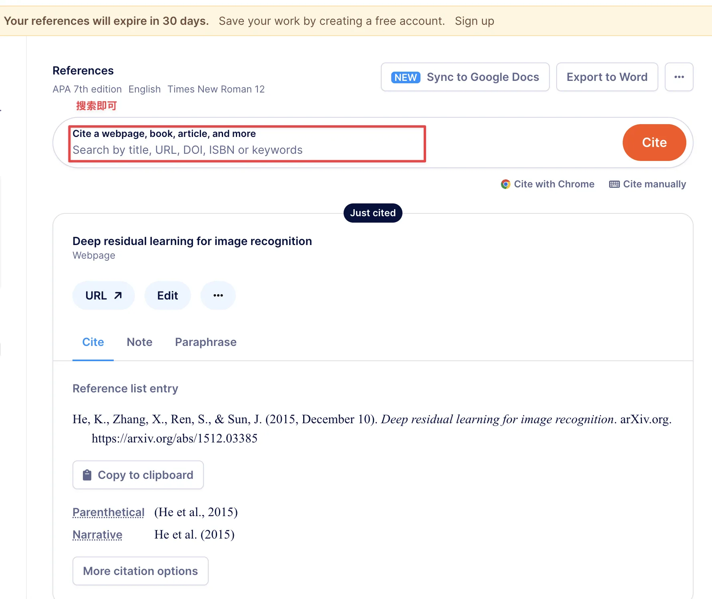
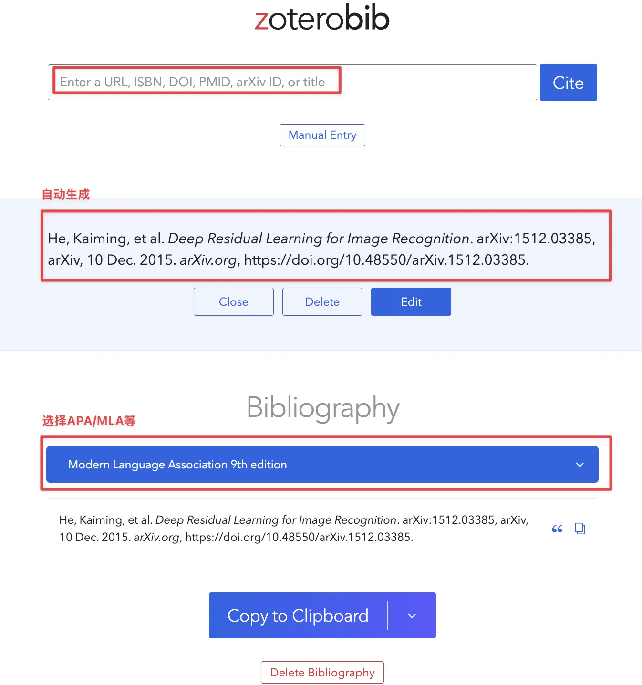
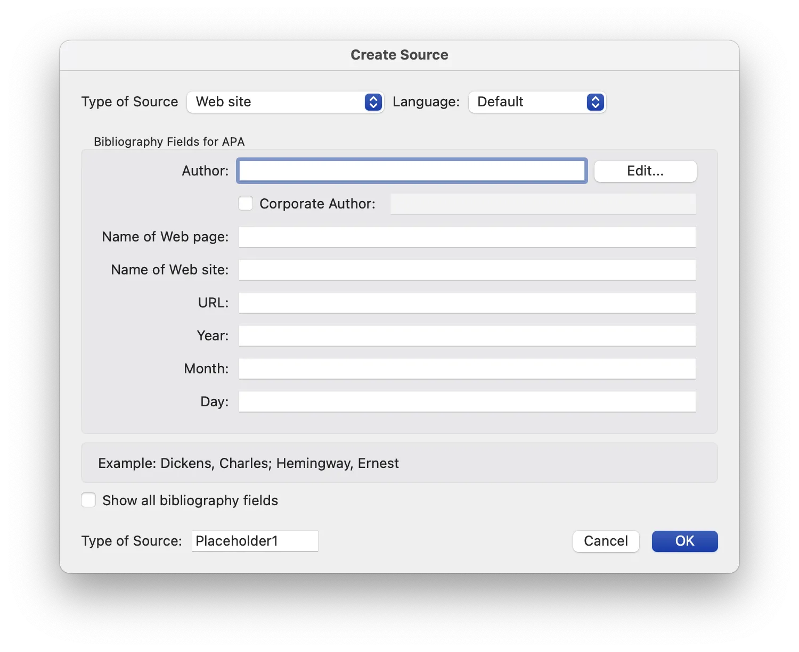
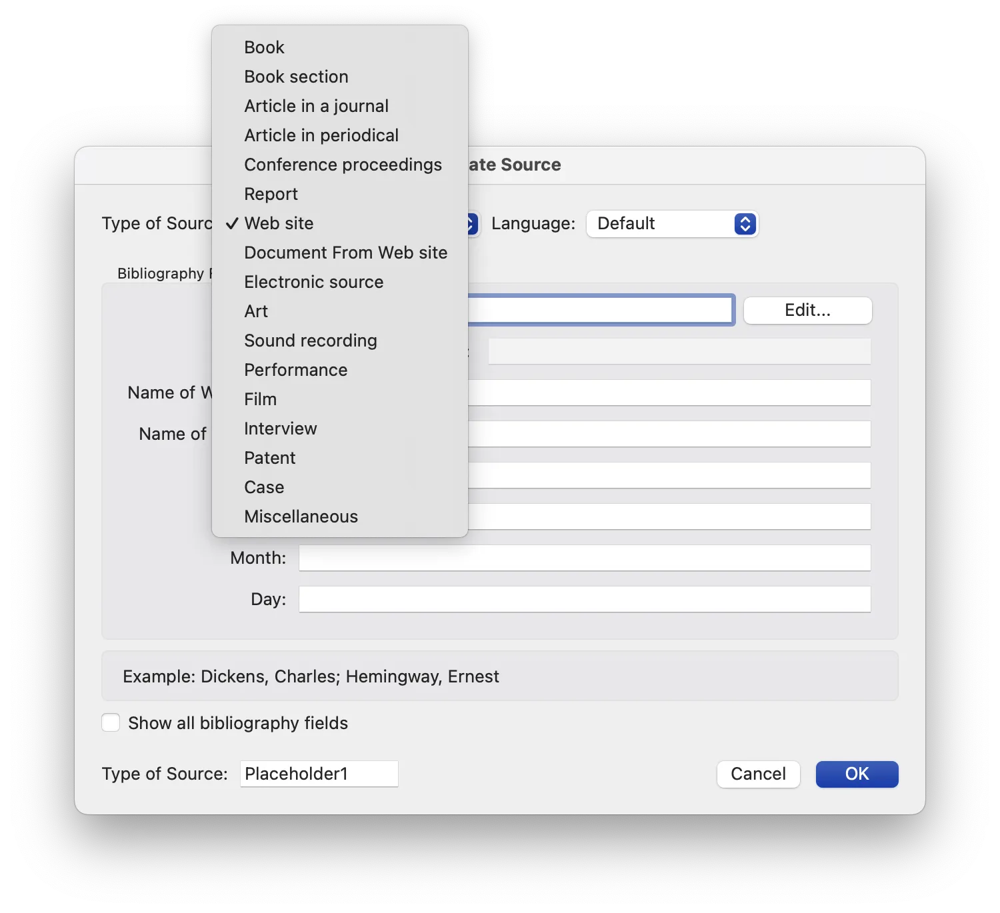
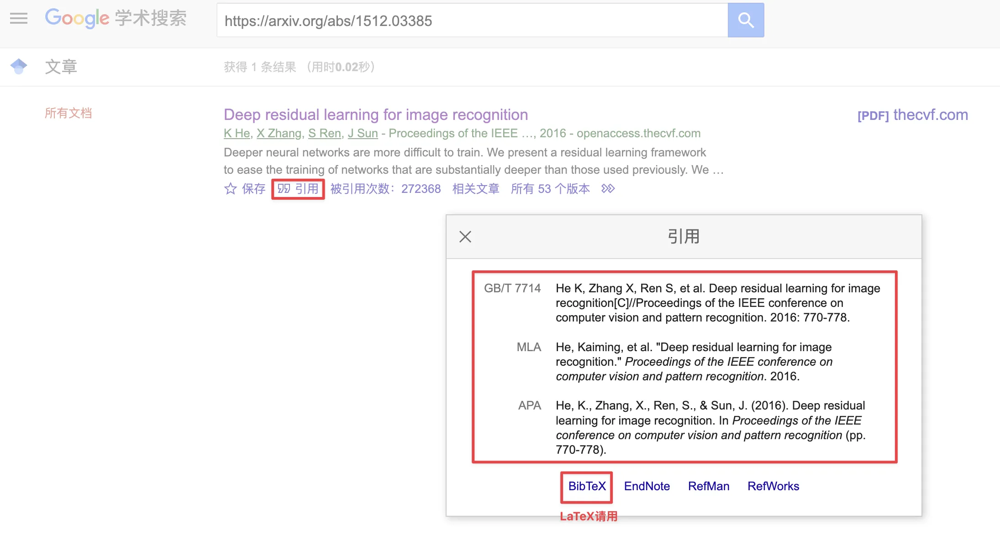
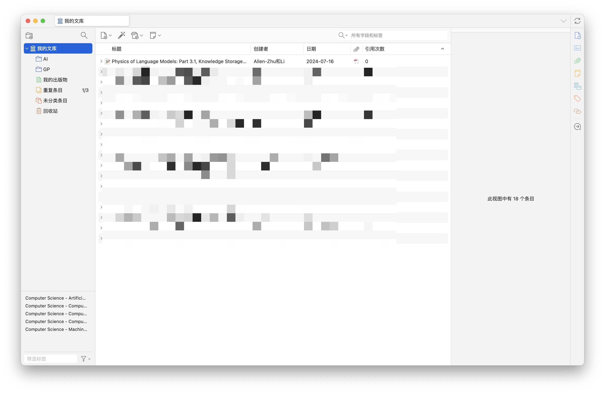

> 我感觉自己不是在进行学术探索，而是在为一个有洁癖和强迫症的魔鬼填税表。每一个斜体、每一个缩进，都是对思想自由的无情嘲弄。福柯要是看到他的《词与物》被这么折腾，估计得爬起来再写一本《规训与惩罚：引用格式的诞生》。
> 

MLA 和 APA 是什么？

MLA 和 APA 都是指导学术写作的“**引用格式（Citation Styles）**”，它们规定了论文的整体格式（比如页边距、字体、标题等），更重要的是，它们详细说明了如何在论文中引用他人的作品，包括文内引用（in-text citations）和文末的参考书目（bibliography/reference list）。

# 如何快速生成对应的引用格式

> 面对这个对细节有着病态追求的“魔鬼”，我们这些凡人唯一的反抗手段就是——“外包”。将这项苦差事交给无怨无悔的数字仆人。
> 

### 1. 在线引用生成器 (Online Citation Generators)

[ZoteroBib: Fast, free bibliography generator - MLA, APA, Chicago, Harvard citations](https://zbib.org/)

[Citation Generator](https://www.scribbr.com/citation/generator/)

- **优点**: 极度方便，速度快，大多数是免费的。像[**ZoteroBib](https://zbib.org/)和[Scribbr](https://www.scribbr.com/citation/generator/)**都是非常受欢迎的选择。你只需选择MLA或APA格式，填入信息，然后复制粘贴即可。
  
    
    

### 2. 文字处理软件的内置工具 (Built-in Word Processor Tools)

你可能没有意识到**Microsoft Word**本身就内置了引用管理功能。

- **在Word中**: 前往“引用” (References) 选项卡，你可以“插入引文” (Insert Citation)，添加新的源 (Add New Source)，并选择你需要的格式。Word会为你管理所有的源，并在文末一键生成完整的参考文献列表。
- （需要你自己填入相关信息）

### 3. 学术数据库的“一键引用” (The "Cite" Button in Academic Databases)

当你访问 **JSTOR, ProQuest, Scopus, Google Scholar** 等学术数据库时，几乎每一篇文章旁边都会有一个**“引用” (Cite)** 或 **“导出” (Export)** 按钮。

- 这些引用信息是由数据库和出版商直接提供的，极少出错。

[Google Scholar](https://scholar.google.com/)

## 4.Zotero等软件自动导出

[Zotero](https://www.zotero.org/)是一个开源的文献管理应用，也支持自动识别论文数据+一件导出引用格式。

[Zotero | Your personal research assistant](https://www.zotero.org/)

- 某些小作坊的论文会识别不到数据，需要人工进行补充

## 最后的警告：不要完全信任机器

无论你使用哪种“魔法”，请记住福柯的教诲：规训无处不在。那个有洁癖的魔鬼不会因为你用了自动生成器就对你网开一面。**自动生成的引用是你的初稿，而不是终稿。**

**你必须、必须、必须亲自校对每一个细节：**

- **大小写**：APA的标题大小写规则是机器最常搞错的地方。
- **作者格式**：所有作者是否都列出了？顺序是否正确？
- **标点符号**：那个该死的斜体、逗号和句号是否在它们绝对正确的位置上？
- **DOI/URL**：链接是否完整且格式正确？