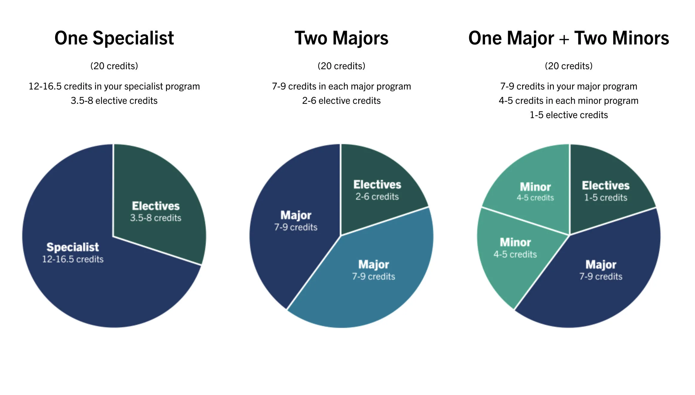
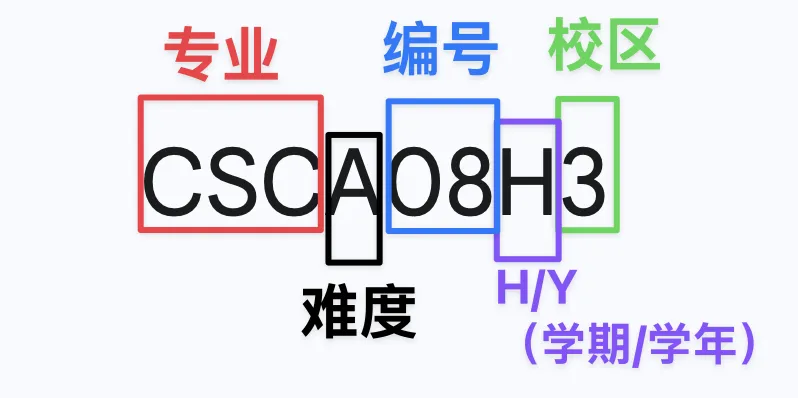
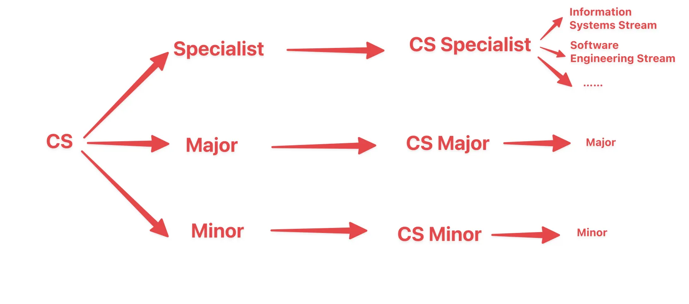
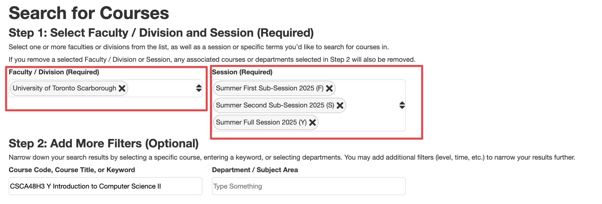
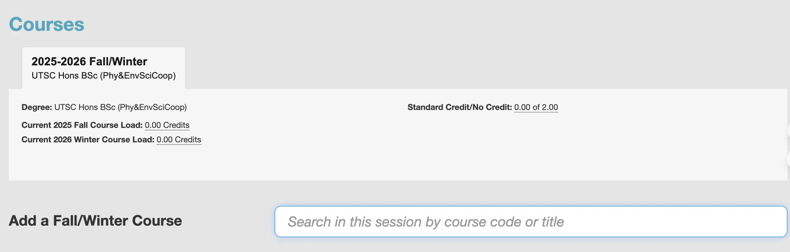
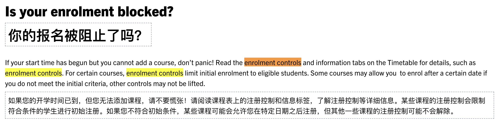
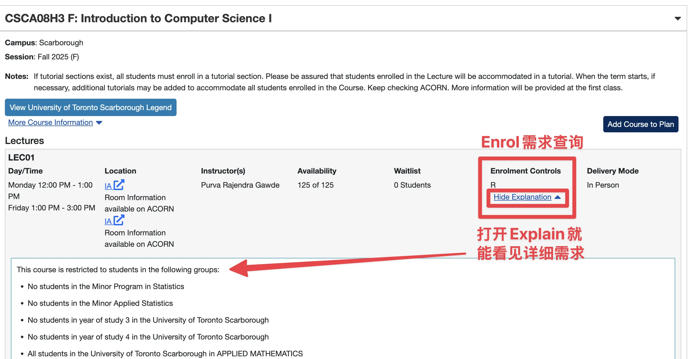
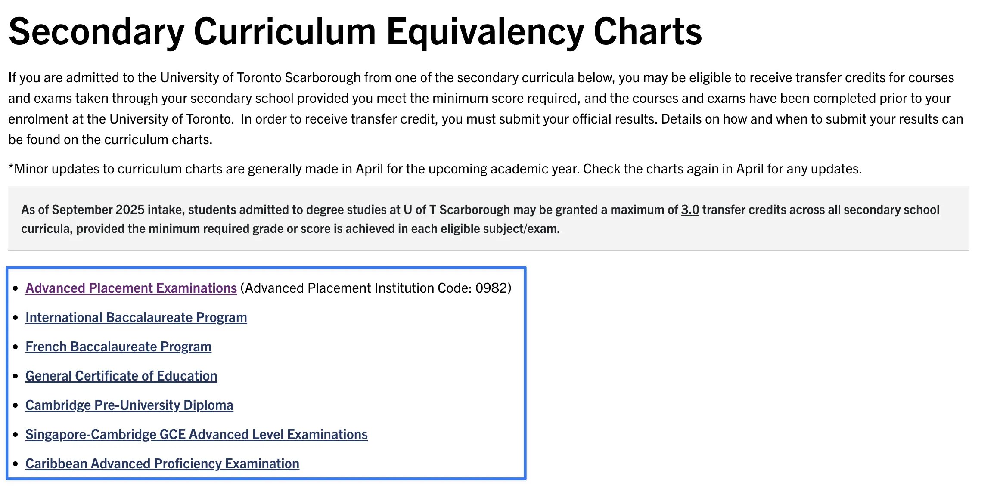
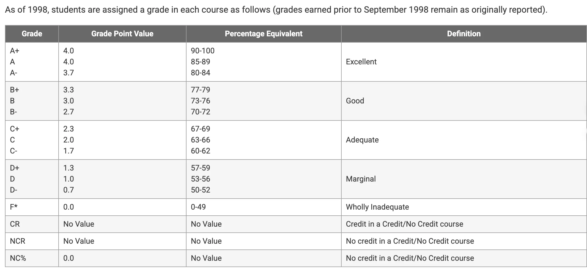
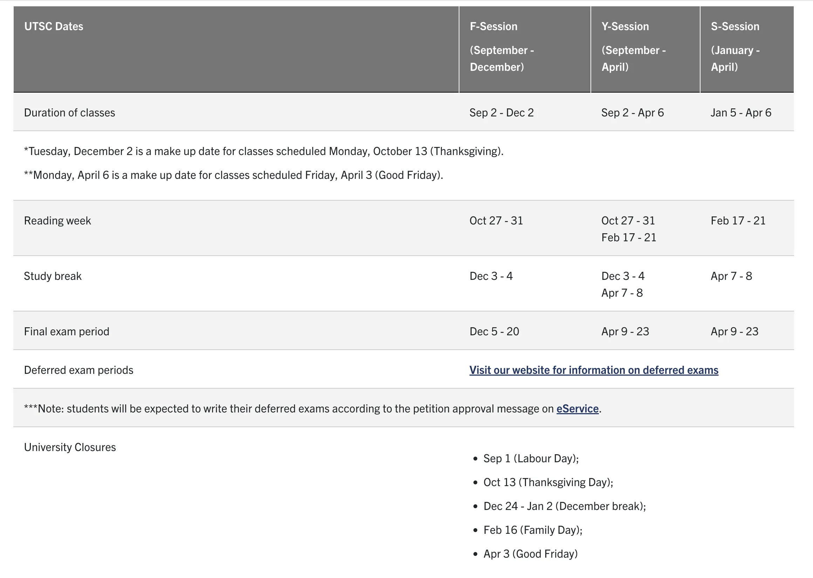

于20250605撰写，请注意撰写日期与阅读日期，日期不同规则可能有些许变动。

于20250618新增专业选择/课程选择板块。

于20250621新增【五：其它学分获得机制（转学分/ 交换项目等）】

于20250627新增【四：转专业须知/Enrolment Blocked】

## **前言：按需求索**

本篇指南的行文逻辑略微不同，但愿可以更好的帮助大家理解多伦多大学的课程制度。

- 基础制度
- 善用规则

<aside>

也写个小前言哈？

读大学，就是用钱换文凭。若梦想为自由职业，大可自学……

文凭也没那么重要了：

此处引述我自己的文章[觉察当下，逃离应试幻觉 | 未来属于创作者 | TechLeaf Blog](https://techleaf.xyz/posts/future-for-creators/)，我曾在这里写到“在招聘中，面试者的技能水平往往不是他们最看重的。你只需要达到一个差不多合格的水平，通过笔试即可。大部分公司会对招入的新员工进行二次培训（岗位培训制度）。”所以也不必过于焦虑自己的绩点。如今AI的蓬勃发展又进一步注定了文凭的持续贬值——或许学校即将消失，我们发展出全新的方式来获取文凭。

掌握真正有用的技能：

如此看来，我们应当合理安排时间，灵活利用规则，既要取得一纸实用的文凭，也要掌握切实可行的技能，并不断更新自己的认知观念——唯有如此，才能跟上甚至跑赢科技飞速发展的步伐。这就像是一场大型的真人游戏，每一步都需要策略与坚持。

在这场游戏中，我们不妨选择自己真正热爱的专业，并日复一日地投入其中。只要方向明确，持之以恒，时间终将带来回报——就像“复利效应”所揭示的那样，哪怕是微小的进步，持续累积，也会产生巨大的变化。

</aside>

## **一.毕业要求学分&课程代码&课程特性**

### **1.学分制**

[一般信息 | UTSC 日历 --- General Information | UTSC Calendar](https://utsc.calendar.utoronto.ca/general-information)

多伦多大学的学习中我们需要修满20个学分，之后即可毕业。其中学期课是0.5个学分，学年课是1个学分。

20个学分可分为**专业需求课程**、**通识教育所要求的课程**和**兴趣选修课程**。

【本科学位最终将由以下几种专业组合方式之一构成：】

- 一个专修项目(Specialist)；12.0-16.0学分（Specialist）
- 两个主修项目 (Double Major)；7.0-9.0学分（Major）
- 一个主修项目加上两个辅修项目 (Major and two Minor)； 4.0-5.0学分（Minor）
- **专业需求课程**(required courses for prospective programs)

图片来自：

[UTSC Program Options | Academic Advising & Career Centre](https://utsc.utoronto.ca/aacc/utsc-program-options)

- **通识教育要求** (Breadth Requirements)
  
    【这项要求规定，学生必须在以下五个不同的知识领域中，每个领域至少成功修读0.5个学分的课程：】
    
    1. 文学与艺术 (Arts, Literature & Language)
    2. 历史、哲学与文化研究 (History, Philosophy & Cultural Studies)
    3. 社会与行为科学 (Social & Behavioural Sciences)
    4. 自然科学 (Natural Sciences)
    5. 量化推理 (Quantitative Reasoning)
- **兴趣选修课程**(Electives)
    - 水学分，凑GPA。

综上，凑够20个学分即可。可注意的一点是多伦多大学并不限制你的专业数量，>2major同样可以毕业。

### **2.课程代码解析**

[课程 | UTSC 日历 --- Courses | UTSC Calendar](https://utsc.calendar.utoronto.ca/courses)

如图所示：

- 前三位字母代表课程所属专业。如CSC、MAT、STA。
- 第四位字母代表难度，会有A、B、C、D四个类别（对应大一-大四的难度）。
- 5-6位是编号数字，仅仅是一个数字。
- 第七位字母仅有两种情况，H&Y。H代表学期课，Y代表学年课。
- 最后一位数字代表所在校区。1是 UTSG；3是UTSC；5是UTM。

（所以图中的课就是一门CS的A难度学期课程，位于士嘉堡校区。）

### **3.前置课程（课程特性），以及防刷GPA的机制**

课程介绍中会出现如下三种描述：

[词汇表 | UTSC 日历 --- Glossary | UTSC Calendar](https://utsc.calendar.utoronto.ca/glossary)

- 前置课程
    - Perequisite（先修课程）这是一门学生在学习另一门课程**之前必须已经通过（passed）**的课程。
    - Corequisite（并修课程）这是一门学生**必须与另一门课程在同一个学期内一起上**，或者**已经提前通过**的课程。
- 防刷GPA机制
    - Exclusion（互斥课程）如果学生已经通过了一门被列为“互斥”的课程（或者通过转学分获得了这门课的学分），那么他们**无法再通过注册当前这门课程来获得学分（for credit）**。

## **二.保GPA/退课/重修**

> 明确学分要求和课程代码后，已经可以开始在ACORN里选择课程了。本文不是ACORN教程，故不叙述过多ACORN中的操作。下面的内容讲述一些常见的可被利用的规则。
> 

### **1.CR/NCR - ”GPA保护制度“**

[Credit / No Credit Courses | Office of the Registrar](https://www.utsc.utoronto.ca/registrar/credit-no-credit-courses)

- UTSC允许学生选择最多2.0个学分的课程以“通过/不通过”(Credit/No Credit, CR/NCR) 的方式进行评估
    - 如果你在这门课的最终成绩达到或超过 **50%**，你的成绩单上就会显示“CR”，你将**成功获得**这门课的学分，计入你的毕业总学分。**低于50%**，你的成绩单上就会显示“NCR”，且你**不会**获得这门课的学分。
    - 这门课的原始分数**不会**被计入你的CGPA（累积平均绩点）计算中。
- 一些限制
    - **课程类型限制：**CR/NCR**只能**用于**选修课（Elective Courses）**。**绝对不能**用于满足你**专业（Specialist/Major）**或**辅修（Minor）**要求的课程。
    - **学分数量限制：**在整个大学期间，你最多可以对 **2.0个学分**（相当于4门单学期课程）使用CR/NCR选项。
    - **操作时间限制：**你必须在学校规定的截止日期（Deadline）之前，通过学生系统 **ACORN** 来添加或移除课程的CR/NCR标记。

### **2.开学退课&中途退课&结课退课**

> 在学期期间，您有两次机会从成绩单中删除课程，之后才需要申请。
> 

[退课 | 注册处 --- Dropping Courses | Office of the Registrar](https://www.utsc.utoronto.ca/registrar/dropping-courses)

[退出课程 | 注册处 --- Withdrawal from a Course | Office of the Registrar](https://www.utsc.utoronto.ca/registrar/withdrawal-course)

- 常规退课 (Drop without academic penalty)
    - 退课有一个截止日期，教师会在退课的截止日期前公布至少20%的课程总成绩。——此时你可以看到你的成绩，然后再做决定是否退掉课程。
    - 在截止日期前退课且不会受到学术处罚。也不会有任何记录。
- 延迟退课（Late withdrawal requests）
    - Late Withdrawal (LWD) 允许你在常规的退课截止日期之后、但在期末考试开始之前，从一门课程中退出。
        - 不会受到学术惩罚（即不会得F不及格）。
        - 不接受重新添加该课程的请求。
        - 不会退款。
        - LWD的课程**不会**影响你的GPA。不拉低分数，不计入学分。**但是会记录在你的成绩单上**，以“LWD”符号代替数字成绩。
    - LWD也有**学分上限**。在整个学位期间，你最多可以LWD**3.0个学分**。
- 逾期退课申请 (WDR)
    - 有超出控制范围的特殊情况导致无法完成课程，您可以提交申请。此类申请很少会被批准。

### **3.Course Repetition / Second Attempt for Credit - “重修课程”**

[课程规定 | UTSC 校历 --- Course Regulations | UTSC Calendar](https://utsc.calendar.utoronto.ca/course-regulations#repeating)

- 重修未通过的课程 (Repeating Failed Courses)
    - 如果你一门课没过（挂科了），你可以重新注册并修读这门课。
    - 你的成绩单上会显示**两次**注册记录，并且两次的成绩**都会**计入你的累计平均绩点（CGPA）中。
- 两种方式重修已通过的课程 (Repeating Passed Courses)
    - 重修已通过课程和使用SAC政策都需要通过注册办公室（Office of the Registrar）申请。
    - 第二次尝试以获得学分 (Second Attempt for Credit - SAC)
        - 学生最多可以重修**1.0个学分**的已通过课程。
        - 当你申请并获批使用SAC政策重修某门课程后，你第一次修读的成绩会被标记为“额外”(EXT)，并且**不会**被计入CGPA和毕业要求的总学分中。第二次修读的成绩则会被正常计入学分和CGPA。
        - 之前的学术评级（Academic standing）不会因为你使用了SAC政策而重新评估。
    - 将重修课程记为“额外” (Repeating courses as “Extra” - EXT)
        - 当学生重修已通过课程超过了SAC政策允许的1.0个学分，或者选择不使用SAC政策时，重修的课程将被记为“额外”(EXT)。
        - 这门课和成绩会出现在你的成绩单上（并被标记为EXT），但成绩**不会**计入CGPA，学分也**不会**计入毕业总学分。
        - 尽管不计入CGPA和总学分，在某些情况下，这门课的成绩可能可以用来满足特定专业项目的入学要求。

---

# 三.专业要求及选课具体操作

---

**重要章节前言：**

**使用[Calendar](https://utsc.calendar.utoronto.ca/)查询资料，再使用[Timetable](https://ttb.utoronto.ca/)排课即可。最后在[Acorn](https://acorn.utoronto.ca/sws/#/)里完成抢课。**

！！！在本章节，你需要找到自己的**Enrolment Requirements和水课来构成大一课表。！！！**

**Enrolment Requirements：**

**水课：**

---

## 1.大一必修课程安排（**Enrolment Requirements）**

[2025-2026 Calendar | UTSC Calendar](https://utsc.calendar.utoronto.ca/)

Program Search：

搜索某个专业，里面会列出具体的要求。

Course Search：

搜索某个课程，里面会有简单的课程介绍。（比如先修需求）

**先讲Program Search，重点讲述这几个Type：**

> 注意基础须知-学分制（请确认自己打算**Specialist还是2Major还是1+2**）
> 

如果是1Specialist,大一只需要关注该Specialist的先修需求。

如果是2Major,需要关注两个Major各自的先修需求（Major跨度大，大一会很累（可能会要求两位数的先修课）。但CS和统计的2Major就是基本上重复的）。

- **Specialist Programs**
- **Major Programs**
- **Minor Programs**

如右图。大部分学科下仅有Specialist有细分专业。

点击搜索框与筛选栏，选到自己想进的Specialist/Major/Minor。此处以统计的Major为例（右侧链接），点开后信息大概展示如下：

[Program Search | UTSC Calendar](https://utsc.calendar.utoronto.ca/search-programs)

**统计学Major (Statistics Major) 信息概览：**

- **1. 学业主管 (Supervisor of Studies)**
- **2. 推荐写作课程 (Recommended Writing Course)**
- **3. 入学要求 (Enrolment Requirements)-【如果大二进专业，大一要读的】**
    - 详细说明了申请进入统计学专业的主要要求，分为两种情况：
        - **已录取至UTSC一年级统计学招生类别的学生：** 明确了需要通过的CSC和MAT课程以及相应的最低累计平均绩点（CGPA）要求。
        - **录取至UTSC其他一年级招生类别的学生：** 解释了他们申请统计学专业POSt的资格，并强调录取竞争激烈且不保证录取，建议学生制定备选方案。
- **4. 项目要求 (Program Requirements)-【进专业之后要读的】**
    - 概述了统计学专业总共需要修读的学分数量。
    - 将课程要求细分为以下几个级别：
        - **A-level 课程：** 列出了基础必修课程，如线性代数、计算机科学导论和微积分课程，并提供了推荐的课程序列。
        - **B-level 课程：** 列出了进阶必修课程，包括线性代数II、多元微积分技术以及概率论和统计学导论。
        - **高级课程 (Upper-level courses)：** 规定了回归分析为必修课，并列出了可选择的C-或D-级STA课程以满足学分要求，同时明确了部分课程的排除项。
        - **选修课 (Electives)：** 提供了可以用来满足学分要求的选修课程列表，包括STAA、STAB、MATB系列课程以及其他C-或D-级CSC、MAT或STA课程。

注：

大一新生仅需要根据“入学要求”来进行选课。入学要求中会明确此科目的大一必修课程。

项目要求为后续需求，例如统计的Major中写到：This program requires 8.0 credits。那么该major就需要你在下面列出的课程中修8.0个学分。

## 2.大一必修课程安排（有coop）（**Enrolment Requirements）**

- **Co-operative Programs——如果是coop项目才需要看这个**

COOP需要在搜索完正常课程后，额外搜索带有【CO-OPERATIVE】词条的专业。

还是以统计的为例，打开coop词条后会看到：

**Co-op Preparation Courses (Completed in First Year):**

- [**COPB50H3**](https://utsc.calendar.utoronto.ca/course/COPB50H3)
- [**COPB56H3](https://utsc.calendar.utoronto.ca/course/COPB56H3)/(COPB51H3)**

需要把这两门课程加入你的First Year 课表，才可满足COOP的要求。

## 3.大一水课安排（水课**）**

**注意，需要在第一年修满4个学分才能进入第二年的课程。所以会报水课凑学分。**

水课的来源一般是问学长学姐，当然也可以根据兴趣选择。此处会用到的是Course Search。

也请参考我前面写的通识教育要求，毕业需要在其它领域修课。

**以ACMB10H3这门课为例，点开后会看到：**

- 课程主题
- 课程内容
- 先决条件（Prerequisite）： 您需要修满任何4.0个学分才能选修这门课。
- 排除课程（Exclusion）： 如果您已经修过VPAB07H3这门课，就不能再选修这门课程了，因为它们内容相似或重复。
- 广度要求（Breadth Requirements）： 这门课程符合“社会和行为科学”的广度要求。
- 优先级（Note）： 艺术、文化与媒体系的专业（Specialist）和主修（Major）学生在选课时将获得优先权。其他学生则根据名额情况择优录取。
- 链接（Link to UTSC Timetable）

注意先决条件和Exclusion，然后选择即可。

## 4.Timetable使用指南（编排所有课程的时间）

[2025-2026 Calendar | UTSC Calendar](https://utsc.calendar.utoronto.ca/)

打开后完成Step1就可以开始Add course了。

每个Course都有Lectures，部分Lectures是online（想啥时候看啥时候看）。

部分Course有Tutorials，是个必选项。

一门一门的加到Timetable里就好了：

最后记得保存

建议选择“Get Shareable Link”

通过link再次打开即可继续调整。

分享一下我调的CS专业link（可以基于这个继续编辑）：

[Timetable Builder](https://ttb.utoronto.ca/#!/?t=684f3894ced334480f1528c5)

## 5.Acorn抢课

上面的步骤都是为了让你选择好自己的课程。在最终排好Timetable后，就要进入Acorn把自己选择的课加入购物车了：

[weblogin idpz | University of Toronto](https://acorn.utoronto.ca/sws/#/)

点击左边的Enrol & Manage——Courses

就可以在Add a Fall/Winter Course这里输入课程代码，选择对应LECTURE和TUTOR了

注：据说今年CS和BBA已经预置了必修课，无法自行更改，但仍需加上兴趣课来凑够大一的4.0个学分。

注：学生选择本专业课程具有优先权。

---

# 四：转专业须知-Enrolment Blocked

（请各位结合【章节三】观看，其【大一必修课程安排】中明确了转专业的同学应该选哪些课。见【章节三】-**入学要求 (Enrolment Requirements)-录取至UTSC其他一年级招生类别的学生**）

> 转专业不是有实力就能转的，还需要能报上那门课。若Enrolment Blocked……
退学吧
> 

2025-2026届学生的课程，就是如此。今年CMS缩紧了课程政策，导致social science的学生无法选择CSCA08H3等先修课。故转专业成为不可能的事情。

## 1.Block的两种类型：

[Timetable | Office of the Registrar](https://www.utsc.utoronto.ca/registrar/timetable)

[Course Enrolment | Office of the Registrar](https://www.utsc.utoronto.ca/registrar/course-enrolment-1)

**故Block有两种**

1. **临时的Block**
2. **永久的Block（只对本学年该门课生效，明年或许会移除Block）**

**需要参考Timetable去确认自己的block类型**

## 2.确认自己的Blocked类型

### （1）一个例子：

接下来，让我们以CSCA08H3（秋季课程）为例，来看跨专业选课的限制：

[CSCA08H3 | UTSC Calendar](https://utsc.calendar.utoronto.ca/course/csca08h3)

打开Calendar的链接后，滑倒任意lecture，点开**Enrolment Controls。**

Calendar已在该【三.专业要求及选课具体操作】章节有介绍，故不反复介绍。

**Enrolment Controls = R（Restricted「受限制的」）**

This course is restricted to students in the following groups:**（具体限制）**

仅有这些列出的专业的学生可以报名该课程。其余学生会被**永久的block【Block的两种类型】**

在2025-2026年，Social Science是没有这个权限的【被永久Block】。据说2024-2025是可以的。

### （2）详解：

同样来自官方，**Enrolment Controls**有四种类型**：**

- **P** = Priority.【优先事项-常说的本专业有优先权】
- **R** = Restricted.【受限-拼尽全力无法抵达】
- **RP = 不仅受限还优先——官网并未解释，但是在今年选课中出现了。**
- **B = 无要求，常见于online课程——官网并未解释，但是在今年选课中出现了。**
- **A** = Approval.【不常见，字面意义上猜可能是要批准】
- **E** = Enrolment on ACORN is disabled.【不常见，ACORN上选不了的】

[Timetable | Office of the Registrar](https://www.utsc.utoronto.ca/registrar/timetable#enrolmentcontrols)

如果课程是R，那么今年就与转专业无缘了。

## 3.更多例子：

### 此门课为CSCA08H3的春季课程（RP）：

**Enrolment Controls：**RP

Priority is given to certain groups of students until 10am on July 23, 2025, then the course will become available to an additional group of students. Currently, students in the following programs can enroll:

直到2025年7月23日上午10点，将优先级给予某些学生，然后该课程将为其他一组学生提供。目前，以下课程中的学生可以注册：

（即CMS大类学生先报，后续开放给生命科学/物理等专业的学生。但social science之类的仍旧不可报名）

[Timetable Builder](https://ttb.utoronto.ca/?source=cp&courseCode=CSCA08H3&divisions=SCAR&divisions=SCAR&courseTitle=Introduction%20to%20Computer%20Science%20I&sessions=20259&sessions=20261)

### 此门课为PSYA02H3的春季课程（P&None）：

**LEC01:**

Enrolment Controls：P

至2025年7月23日上午10点前，本专业优先。之后任何人可选。

[Timetable Builder](https://ttb.utoronto.ca/?source=cp&courseCode=PSYA02H3&divisions=SCAR&divisions=SCAR&courseTitle=Introduction%20to%20Clinical,%20Developmental,%20Personality%20and%20Social%20Psychology&sessions=20261)

**LEC02（online）:**

Enrolment Controls：None（任何人都可选）

# 五：其它学分获得机制（转学分/交换项目等）

## 1.AP/IB/……转学分：

打开后去查对应的表就行：

[High School & Secondary Curriculums | Admissions & Student Recruitment](https://www.utsc.utoronto.ca/admissions/high-school-secondary-curriculums)

Tips（AP）：

- AP达到4即可转学分。
- AP送分后会自动转学分。
- Calculus BC转不了，不用看了（笑）。

## 2.Official Exchange & Summer Abroad 交换学习

- **交换项目 (Exchange Program):** 通常为期一个学期或一整个学年，您将作为交换生前往多大的合作院校进行学习，并支付多大的学费。
- **海外暑期课程 (Summer Abroad):** 这是在暑假期间进行的短期（通常为3-6周）学习项目，您可以获得一个完整的多大学分。

[CIE UOFT Programs & Events - Centre for International Experience](https://internationalexperience.utoronto.ca/programs-events)

# 六：一些其它可能有用的图片：

## 1.分数与GPA

[2025-2026 Calendar | UTSC Calendar](https://utsc.calendar.utoronto.ca/)

## 2.重要日期

[Fall 2025 - Winter 2026 Academic Dates | Office of the Registrar](https://www.utsc.utoronto.ca/registrar/fall-2025-winter-2026-academic-dates)

---

敬请期待更多板块……