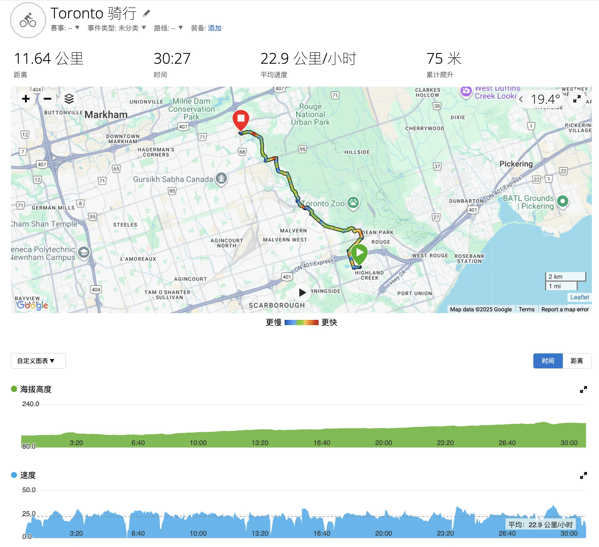

创建时间: 2025年10月5日 14:17
起点&终点: Harmony Commons
跑步距离: 20
配速: 20
难度指数: 0

[Value Village · 3701 Lawrence Ave E #1, Scarborough, ON M1G 1P7, Canada](https://maps.app.goo.gl/7iu2DptHnHKTnXy97)

来回的均速都破20了，很平坦的一条路线。是目前为止最好骑的一条。

周末骑车顺便锻炼了。