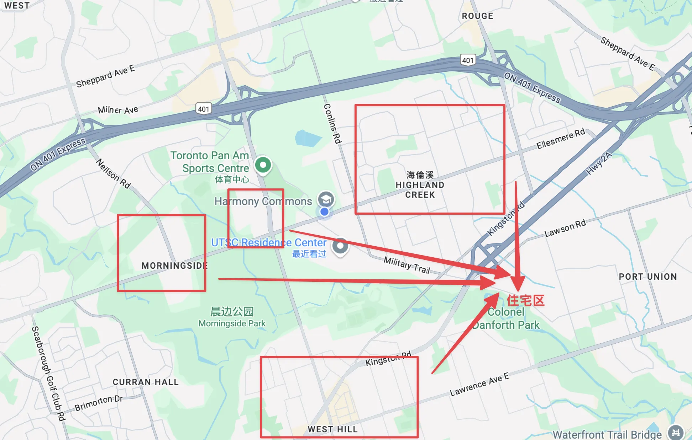
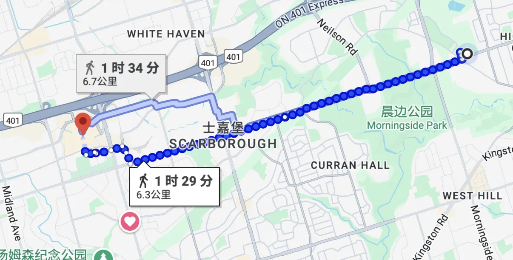

> 租房很容易（x
此版本大量内容由AI撰写
本人大一已经润去租房了

# 1.校外租房最简步骤指南

- 先去各种网站上找房子（详细见后面《**第二部分：掌握搜索技巧：如何及何处寻找房源》）**
- 找到之后联系房东线下看房（一般提前2天）
- 看房后签合同，入住

整个流程大概1week。

# 2.校外租房 - 价格优势

注：大一新生强制缴纳7天的meal plan

## 多伦多大学士嘉堡校区住宿与餐食月度费用明细

| 住宿类型 (Residence Type) | 房间类型 (Room Type) | 每月房间费用 (Monthly Room Fee) | 每月餐食计划费用 (Monthly Meal Plan Fee) | 每月总计 (Estimated Monthly Total) |
| --- | --- | --- | --- | --- |
| **Harmony Commons** | Single (单人间) | $1,805.50 | $826.25 | $2,631.75 |
|  | Double (双人间) | $1,547.50 | $826.25 | $2,373.75 |
|  | Super Single (超级单人间) | $2,145.38 | $826.25 | $2,971.63 |
| **Townhouse (联排别墅)** | Single (Standard) (标准单人间) | $1,477.63 | $826.25 | $2,303.88 |
|  | Single (Small) (小单人间) | $1,306.50 | $826.25 | $2,132.75 |
|  | Double (Upper Level) (上层双人间) | $1,127.38 | $826.25 | $1,953.63 |
|  | Double (Lower Level) (下层双人间) | $1,015.38 | $826.25 | $1,841.63 |

**计算方式说明：**

- **每月房间费用** = 年度房间费用 / 8个月
- **每月餐食计划费用** = $6,610 / 8个月 = $826.25
- **每月总计** = 每月房间费用 + 每月餐食计划费用

## 多伦多大学士嘉堡校区周边校外住宿价格估算

| 住宿类型 (Accommodation Type) | 价格范围 (Price Range) | 人均成本 (Per Person Cost) | 简介 (Description) |
| --- | --- | --- | --- |
| **合租房中的单个房间** | $850 - $1,200 /月 | $850 - $1,200 /月 | 最常见的学生租房形式。拥有独立卧室，与2-4名室友共享厨房、卫生间等公共区域。 |
| **地下室公寓** | $1,600 - $2,200 /月 | $800 - $1,100 /月 | 与同学合租一个两室地下室的人均成本。提供比合租房更大的私密性。 |
| **公寓/楼房单位 (Condo)** | $2,100 - $2,500 /月 | $2,100 - $2,500 /月 | 一室一厅（1-Bedroom）的价格。通常有更好的安保和设施（如健身房）。 |
| **公寓/楼房单位 (Condo)** | $2,500 - $3,000 /月 | $1,250 - $1,500 /月 | 两室一厅（2-Bedroom）的价格，此为人均成本。租金更高，但设施更好。 |
| **公寓/楼房单位 (Condo)** | $2,500 - $3,000 /月 | $800 - $1000 /月 | 三/四室一厅（3/4-Bedroom）的价格，也相当好。但是都这样了为啥不住house？ |
| 整租house | $3000+（3人，4人，5人，6人） | $800 - $1,200 /月 | 整租一个house，如果能找到朋友合租这一定是最佳选择
（也是本人大一的方案） |

## 价格对比：

综上，根据**$1,100/月**的校外大致人均住宿成本，与所有校内住宿选项进行一次精确的成本对比。

**核心前提:**

- **校外住宿月租成本:** $1,100
- **强制性餐食计划 (Meal Plan):** $826.25/月
- 假设校外住宿的食品开销等同于Meal Plan（实际上会低很多很多，还会吃的很好）
- **校外住宿每月总开销:** $1,100 (房租) + $826.25 (餐食) = **$1,926.25**

| 住宿选项 (校内) | 每月总开销 (校内) | **对比校外 ($1,926.25) 每月可节省金额** | **对比校外 (8个月) 学年总节省金额** |
| --- | --- | --- | --- |
| **Townhouse (下层双人)** | $1,841.63 | **-$84.62** (此选项下，住校更便宜) | **-$676.96** (住校8个月更便宜) |
| **Townhouse (上层双人)** | $1,953.63 | **$27.38** | **$219.04** |
| **Townhouse (小单人)** | $2,132.75 | **$206.50** | **$1,652.00** |
| **Townhouse (标准单人)** | $2,303.88 | **$377.63** | **$3,021.04** |
| **Harmony Commons (双人)** | $2,373.75 | **$447.50** | **$3,580.00** |
| **Harmony Commons (单人)** | $2,631.75 | **$705.50** | **$5,644.00** |
| **Harmony Commons (超级单人)** | $2,971.63 | **$1,045.38** | **$8,363.04** |

**结论分析:**

1. **校外住宿性价比极高**：如果您的校外人均房租能控制在$1,100，那么与除了“最便宜的双人间”之外的所有校内住宿相比，选择校外都更省钱。
2. **节省金额非常可观**：与主流的校内单人间（Townhouse或Harmony Commons）相比，住在校外一个学年（8个月）可以轻松节省 **1,600到8,300多加元**。
3. **决策关键点**：唯一的例外是Townhouse的下层双人间，它的总成本比您设定的1,100房租的校外方案还要便宜约85/月。因此，如果您的首要目标是**极限省钱**，并且不介意和室友共享一个房间，那么Townhouse下层双人间是唯一比校外$1,100租房更经济的选择。

对于追求独立空间（单人间）的学生来说，校外租房的经济优势是压倒性的。

# 3.校外租房地段一览

详见《**第五部分：社区深度探索：UTSC周边居住地选择》**

说白了有很近的房子，就在400m以内。当然还是以1-2km的为主。据说有很多大二大三的学生住在Highland Creek。

当然也有住在STC的，去downtown玩和旁边STC购物都很方便。

公交10min多一点，38和95都能到达。STC附近的房子选择性还要更多一点。

# 4.本人为数不多的经验，以及对HarmoryCommons（学校宿舍）的小小吐槽

[Harmony Commons (First Year Residence) | Student Housing & Residence Life](https://www.utsc.utoronto.ca/residences/first-year-building)

离开HC的原因主要是因为HC太贵了，并且禁止做饭（学校食堂很难吃，并且因为甜点的诱惑导致的不健康。甜点区总是忍不住去拿一块Cookie）。且据说HC宿舍里有人抽大麻，并且味道会顺着通风管道飘进别人宿舍。我的某个朋友就因此在1:00多的时候被大麻熏醒了。这也是一个劝退的点吧。还有一个不得不提的就是洗衣机，洗衣机完全不够用-至少会遇到很多次下去之后发现洗衣机没有空位，要不然就是洗完了没拿走。

综上，本人在交完1500加币的宿舍申请押金后还是决定离开了HC（退不掉了），找朋友一起去校外整租了一个house。7月底开始找的房子，学校附近1km已经不剩下多少了（整租的house，但是单独的房间还有很多），但是还是找到了几个房子。目前来看最晚的找房时间是在8.15，据说往后剩下的会越来越少了。人均大约在800-1100加币一个月，水电以及各种杂项加起来据说是100/人。当然也遇到了一些问题，比如房子布局对于学生租房来说稍微有点问题，通常是一个主卧，几个次卧。主卧特别大还带有独立卫浴，在这个点上比较容易引起争议。然后就是找中介，签合同，付款（后面AI文档里会提到，有租赁法的保障不会被坑，且这边行业相当规范，当然前提是找中介签署正规合同）。

# 5.租房网站使用流程

1. 确定位置（比如以当前位置为主）
2. 筛选房型，比如卧室数量/卫生间数量
3. 确认房型，联系房东/中介

本人让Claude使用MCP控制浏览器帮忙找了很多（x

# **6.AI-多伦多大学士嘉堡校区(UTSC)学生校外租房不完全指南**

## **第一部分：了解多伦多租赁市场概况**

对于多伦多大学士嘉堡校区(UTSC)的学生而言，开启校外租房之旅既是迈向独立生活的重要一步，也充满了挑战。多伦多是加拿大租房市场最昂贵的城市之一，对于初次租房者，尤其是国际学生来说，了解本地的租赁环境、住房类型和基本法规至关重要。本部分旨在为学生提供一个坚实的基础，阐明在做出关键住房决策前需要了解的基本概念和术语。

### **1.1 校外住房类型详解**

在士嘉堡地区，学生可选择的校外住房类型多种多样。了解每种类型的特点、优缺点及其法律含义，是做出正确选择的第一步。

**公寓——大房子里的小单元：**

- **Apartment：**
    - **单间套房（Studio/Bachelor Apartment）**：这是一种自给自足的居住空间，通常将卧室、小厨房和独立卫生间整合在一个开放式房间内，非常适合单人居住 7。"Bachelor"是较老的说法，通常指面积更小、设施更基础的单位；而"Studio"则可能指代更现代化、设计感更强的开放式公寓。
    - **公寓（Apartment - 1/2/3-Bedroom）**：位于大型公寓楼内的独立单元，包含独立的卧室、客厅、完整的厨房以及一个或多个卫生间 7。这类公寓通常由专业的物业管理公司进行统一管理，维护和沟通流程较为规范化。
- **Condo：**
    - **共管公寓（Condominium - Condo）**：在结构上与普通公寓相似，但产权归个人业主所有。这意味着租客的房东是个人，而非大型公司。Condo通常装修更现代，并配备健身房、游泳池、派对室等公共设施 4。租住Condo的一个重要特点是，租客不仅要遵守租约，还必须遵守大楼的共管公寓法规（condominium declaration, bylaws, and rules）9。
- **Townhouse：**
    - **联排别墅（Townhouse）**：一种多层住宅，与相邻的单位共享一至两面墙体。它比公寓提供更多的空间，通常还带有一个小型的户外区域 8。

**House-独栋别墅：**

- **House：**
    - **合租房屋/分租房间（Shared House / Room in a House）**：这是学生中最常见的租房形式。租客租用一个私人房间，并与其他租客共享厨房、卫生间、客厅等公共区域 4。房东可能居住在同一栋房屋内，也可能不住在里面。
        - 整租house的话大概率是要负责除草和除雪的
        - 整租house请注意卫生间和房间数量，常说的xBxB房型指的就是bedroom和bathroom的数量。
    - **地下室公寓（Basement Apartment）**：位于独立屋地下室的独立居住单元 4。这通常是性价比较高的选择，但看房时必须格外仔细。需要检查其是否为合法单位（legal basement），包括是否有独立的出口、天花板高度是否达标、采光和通风情况，以及是否存在潮湿、发霉或来自楼上的噪音等问题。

### **1.2房东-租客关系的光谱与法律适用性**

选择不同的住房类型，从根本上定义了租客与房东之间的关系性质，以及安大略省租客保护法（*Residential Tenancies Act*, RTA）的适用范围。这是初次租房者最容易忽视、也最关键的一点。

1. **专业化物业管理**：当租住在一个大型公寓楼或由专业公司管理的Condo时，租客面对的是一个公司实体。这种关系是正式的、非个人化的，所有沟通和维修请求都有标准流程。在这种情况下，租客的权利完全受到RTA的保护 8。
2. **个人房东**：当从个人业主那里租用一个Condo或整套房屋时，关系变得更加个人化。虽然RTA仍然完全适用，但沟通方式可能不那么正式，房东的响应速度和专业程度也因人而异 4。
3. **法律盲区：与房东共享空间**：这是一个至关重要的法律区别。如果学生租用一个房间，并且需要与房东或其直系亲属（配偶、子女、父母）**共享厨房或卫生间**，那么根据安大略省的法律，该租客**不受《住宅租赁法》（RTA）的保护** 12。这意味着租客的权利仅限于与房东签订的书面或口头协议，房东可以更容易地终止租约，而租客无法向房东与租客委员会（LTB）寻求帮助。
4. **合法分租：房东不在场**：如果学生租住在一个“寄宿屋”（Rooming House）中，即多个房间被分别出租给不同租客，而房东本人并不居住在该物业里，那么所有租客都受到RTA的保护 4。

因此，在看房时，学生必须学会提出一个关键问题：“我是否需要与房东或其家人共用厨房或卫生间？”这个问题的答案直接决定了他们的法律地位。这一认知将住房类型的选择从一个简单的描述性列表，提升到了一个关乎法律自我保护的关键决策层面。

### **1.3 专业学生公寓（PBSA）**

除了传统的租赁选项，市场上还存在一种专门为学生设计的住房模式——专业学生公寓（Purpose-Built Student Accommodations, PBSA）。这些公寓由独立公司拥有和运营，旨在提供一种介于校内宿舍和传统租房之间的混合体验 11。士嘉堡百年理工学院（Centennial College）旁的Centennial Place就是一个典型的本地例子 13。

- **特点**：这类建筑完全为学生生活而设计，通常提供带家具的房间、个人责任租约（individual liability leases，即租客只需为自己的租金负责，不受室友影响）、室友匹配服务，以及健身房、学习室、社交活动等丰富的配套设施 11。
- **优点**：提供“类似宿舍的校外体验”，简化了租房流程（租金通常全包），并提供了一个现成的学生社区。
- **缺点**：费用通常高于传统的私人租赁，且可能有比普通公寓更严格的规定。

### **混合模式的价值**

PBSA模式试图融合校内住宿和校外租房各自的优点。它提供了私人租约的独立性，同时又保留了大学宿舍的社区感和便利设施。对于那些既渴望独立又担心租房市场复杂性（如寻找室友、与房东打交道、规避诈骗）的学生来说，这是一个极具吸引力的选择。

特别是对于国际学生及其家长而言，PBSA提供了一种更安心的解决方案。他们可以在抵达加拿大之前就预订一个有保障的、设施齐全的住处，其可靠性远高于在分类广告网站上寻找的未知房源。尽管价格可能更高，但这种为“安心”和“便利”支付的溢价，对于许多家庭来说是值得的投资。

---

## **第二部分：掌握搜索技巧：如何及何处寻找房源**

本部分将深入探讨寻找房源的实际操作，从最安全可靠的官方渠道，到范围更广但风险也更高的公开市场，为学生提供一套战略性的搜索方法。

### **2.1 大学官方渠道：最安全的第一站**

开始寻找校外住房时，最明智的第一步是从大学官方或其附属机构提供的资源入手。这些渠道的信息最权威，风险最低。

多伦多大学官方提供校外租房网站（需要学生ID登陆）：

[Student Apartments for Rent Near University of Toronto - Scarborough Off-Campus Housing | University of Toronto](https://offcampushousing.utoronto.ca/housing/campus-Scarborough_n8s2x3m?bounds=43.79628,43.77556,-79.16726,-79.19971)

打开之后大概这个样子，可以直接点进去找房。

官方网站理论上来说更有保障罢

**另可参考多伦多大学学生会 (UTSU) 住房指南**：

[www.utsu.ca](https://www.utsu.ca/wp-content/uploads/2022/08/UTSU-Housing-Guide-2022.pdf)

### **2.2 专业租赁平台：比较分析**

在互联网时代，在线租赁平台是寻找房源的主要工具。然而，不同平台各有侧重，了解它们的特点能极大提高搜索效率。

### **表 2.2.1: 在线租赁平台对比分析**

下表旨在帮助学生根据自身情况（如国际学生身份、预算、住房偏好）选择最合适的搜索工具，避免在不相关的平台上浪费时间。

- 也可以让中介帮自己找

| 平台 | 目标用户 | 对学生的主要特点 |
| --- | --- | --- |
| [**uhomes.com**](http://uhomes.com/) | 国际学生 | 经过审查的房源，无服务费，提供详细信息（照片/视频），有专业顾问协助，可按预算、房型等筛选，支持在线预订。专注于学生公寓，如单间、合租房。 |
| [**University Living**](https://www.universityliving.com/canada/city/toronto) | 国际学生 | 提供带家具的房源，设施齐全，价格透明，提供24/7客户支持，房源靠近校园，部分房源有“未获签证全额退款”（No Visa No Pay）政策。 |
| [**Amberstudent**](https://amberstudent.com/) | 国际学生 | 提供“未获签证全额退款”和“分期付款”选项，支持即时预订，专注于PBSA和专业管理的公寓楼，设施列表详细。 |
| [**Rentals.ca**](http://rentals.ca/) | 普通大众 (学生群体庞大) | 房源数量巨大，类型多样（公寓、Condo、独立屋、地下室），高级筛选功能（可带宠物、带家具、包水电等），是寻找各类住房的综合性平台。 |
| [**Zumper](https://www.zumper.com/) / [Padmapper](https://www.padmapper.com/)** | 普通大众 (年轻人中流行) | 基于地图的搜索界面，聚合来自多个网站的房源，可筛选“无中介费”公寓，提供发布室友和转租信息的功能。 |
| [**RentSeeker.ca**](http://rentseeker.ca/) | 普通大众 / 学生 | 提供按学校名称/位置搜索的特色功能，房源类型包括公寓、Condo、独立屋等。 |
| [**Viewit.ca**](http://viewit.ca/) | 普通大众 | 加拿大老牌租赁网站，以个人房东和小型公寓楼的房源著称。 |
| [**Kijiji**](https://www.kijiji.ca/) | 个人对个人 (P2P) | 房源数量多，可直接与房东联系，是寻找合租房间或地下室的好地方。**（小心被坑，最好有中介介入）** |

选择平台应具备战略性。例如，一个没有加拿大信用记录的国际学生，应优先考虑uhomes或University Living这类平台，因为它们的服务模式就是为解决这类问题而设计的。而一群有本地担保人的本地学生想合租一整栋房子，那么Rentals.ca或Zolo会是更高效的选择。

- 虽然但是感觉AI说了这么多也没啥用，真正找的时候还是每个网站都看一眼。

### **2.3 房地产经纪人（Realtor）的角色**

虽然并非所有租房都需要经纪人，但在多伦多这样竞争激烈的市场，尤其是在寻找整套Condo或独立屋时，聘请一位房地产经纪人会非常有帮助 4。

- **优势**：经纪人可以访问MLS（多重上市服务系统），这是一个不对公众开放的、最全面的房源数据库。他们拥有专业的谈判技巧，能帮助租客争取更有利的租赁条款，并能简化看房和申请流程。
- **费用**：对于租客来说，经纪人的服务通常是**免费**的，他们的佣金由房东支付。
- **何时考虑**：当寻找较高价值的房产（如整套Condo或独立屋）、时间紧迫，或者感觉租房过程过于复杂时，可以考虑寻求经纪人的帮助。
- 建议寻找可靠的学长学姐推荐可靠的中介

### **信任-风险连续体：制定战略性搜索计划**

不同的搜索渠道可以被看作是分布在一个“信任-风险连续体”上。理解这个连续体是制定有效搜索策略的关键。

- **高信任，低风险**：位于连续体的一端是大学官方的Housing Finder 11。这里的房东目标明确，平台受大学监管，最为安全。
- **中等信任，中等风险**：中间地带是经过策划的商业平台，如uhomes、Rentals.ca等 7。它们有自己的审核流程和商业信誉，但本质上仍是商业公司，需要租客自行判断。
- **低信任，高风险**：另一端则是完全开放的个人对个人平台，如Kijiji和Facebook Marketplace 27。这些平台缺乏监管，信息鱼龙混杂，是诈骗的重灾区。

---

## **第三部分：租赁流程实战：分步指南**

本部分将按时间顺序，详细拆解从看房到提交申请的每一个实际步骤，为学生提供一份可操作的行动手册。

### **3.1 实地看房**

这是整个租房过程中最关键的亲身实践环节。必须强调的是，**绝对不要在未亲自看房的情况下租任何房子。因为照片大概率会骗人，把有问题的房子掩盖掉。**

### **3.2 与房东沟通：需要提出的关键问题**

在看房期间与房东或其代理人的有效沟通，能帮助你获取租约中未明示的重要信息。以下问题列表综合了多个来源的建议 37。

- **关于租约与付款**：
    - “租期是多长？（How long is the lease term?）”
        - 一般来说有按月/按年，就本人经验来看按年较多，不过可以协商
    - “接受哪些租金支付方式？（e-transfer, post-dated cheques?）” 37
        - 一般是e-transfer/写支票
- **关于成本与费用**：
    - “租金中包含了哪些公共事业费（水电暖）？（What utilities are included in the rent?）” 37
        - 有含的有不含的，据说加起来200加元/月（一整栋）。后续大一会更新我的实际经验
    - “是否有其他费用，如停车费、洗衣费、储物柜费等？（Are there any other fees?）” 37
        - 一般来说不会有
- **关于居住规定**：
    - “关于宠物的政策是什么？（What is the pet policy?）”
        - 宠物虽然可以被限制，但是如果是整租house的话限制了也无效（见后文租赁法）。
    - “关于访客（特别是过夜访客）的规定是什么？（What are the rules for guests?）”
        - 整租的话也是可以带访客过夜的，但是不能长期过夜（见后文租赁法）
    - “我是否可以进行装饰，比如粉刷墙壁、挂画？（Can I decorate?）”

### **3.3 国际学生租房指南：克服障碍**

注：大一新生没有足够的信用，又找不到担保人的话可以通过一些方式跳过该步骤，例如提前交半年的租金。（见应对策略2）

国际学生在租房时面临着独特的挑战，主要是由于缺乏本地信用记录和担保人。

- **核心挑战**：“无信用记录/无担保人”是最大的障碍，因为这是本地房东评估风险的主要依据。
- **应对策略**：
    1. **利用专业平台**：如第二部分所述，uhomes、University Living等平台的服务模式正是为解决国际学生的这些痛点而设计的。
    2. **主动提供更多资金证明**：虽然法律规定房东只能要求“首一尾一”（第一个月和最后一个月的租金），但学生可以**自愿**提出预付数月租金，以证明自己的财务实力。这一行为必须在租约中明确记录，以保障双方权益。
    3. **寻找本地室友**：与拥有良好信用记录或本地担保人的加拿大本地学生合作，可以大大增强申请的竞争力。
    4. **提供替代性文件**：提供大学的录取通知书、在读证明、奖学金证明，以及显示有充足资金的银行对账单，都有助于建立房东的信任。

---

## **第四部分：法律基石：安大略省标准租约与您的权利**

本部分旨在揭开安大略省租赁法律的神秘面纱，通过清晰解读法律文件和核心法规，赋予学生租客自我保护的能力，防止他们因信息不对称而受到剥削。

### **4.1 解读《安大略省标准租约》**

自2018年4月30日起，安大略省绝大多数住宅租赁都**必须**使用这份由政府制定的标准租约表格（Residential Tenancy Agreement - Standard Form of Lease）。这份文件的强制性使用，旨在保护租客免受不公平或非法条款的侵害。

- **重要性**：如果房东使用了自制的租约，租客有权要求房东提供标准租约。房东必须在租客提出要求后的21天内提供 43。学生可以从安大略省政府官方网站下载这份表格的最新版本 42。

[Residential Tenancy Agreement (Standard Form of Lease) - Central Forms Repository (CFR)](https://forms.mgcs.gov.on.ca/en/dataset/047-2229)

- **核心作用**：标准租约的价值在于它为租客提供了一个法律盾牌。它将租赁关系中的关键条款标准化，使得任何与《住宅租赁法》（RTA）相抵触的附加条款都自动失效。租客不再需要成为法律专家，只需理解一个核心原则：“任何试图剥夺我在RTA下享有的权利或强加给我非法责任的条款都是无效的。”

### **表 4.1.1: 《安大略省标准租约》速览**

这份长达17个部分的法律文件可能令人望而生畏 9。下表旨在将其核心内容提炼出来，作为一个快速参考指南，帮助学生在签署前迅速把握关键点。

| 章节号 | 章节标题 | 对学生的核心提示 |
| --- | --- | --- |
| 1-3 | 协议方、租赁单位、联系信息 | 确保所有姓名和地址正确，以便接收法律通知。可在此处同意通过电子邮件接收通知。 |
| 4 | 租赁期限 | 明确起租日期和租期长度（如12个月）。**租期结束后，租约自动转为按月租赁，租客无需搬出或签署新租约。** |
| 5 | 租金 | 规定了“合法总租金”（包括基础租金、停车费等）。未来的租金上涨将以此为基数。列明了支付日期和方式。 |
| 6 | 服务与公共事业费 | 清晰列出租金中包含（如水费）和不包含（如电费、网费）的项目。 |
| 7-9 | 押金（租金与钥匙） | 租金押金**不得超过一个月租金**，且**只能用作最后一个月的租金**。钥匙押金必须合理（相当于重配成本）。**损坏押金（Damage Deposit）是非法的。** |
| 10 | 吸烟 | 房东可在此规定**单元内**的吸烟规则。法律禁止在所有室内公共区域吸烟。 |
| 11 | 租客保险 | 房东可以要求租客购买责任保险（liability insurance）。如果被要求，租客必须提供证明。 |
| 13 | 维护与维修 | **房东必须保持物业处于良好维修状态。** 租客负责日常清洁，并需修理由自己或访客造成的非正常损坏。 |
| 14 | 转租与分租 | 租客有权请求转租（Assign）或分租（Sublet）其单位。房东不能无理拒绝。 |
| 15 | 附加条款 | 房东可在此添加额外条款（如访客规定），但**任何与RTA相抵触的条款均属无效**（如“禁止养宠物”条款）。 |
| 17 | 签名 | 所有列在租约上的租客都需承担“连带责任”，即每个人都对**全部租金**负责，而不仅仅是自己的“那一份”。 |

### **4.2 作为安大略省租客的权利：RTA简明指南**

《住宅租赁法》（Residential Tenancies Act, RTA）是安大略省管理大多数住宅租赁关系的根本大法 12。它设立了房东与租客委员会（Landlord and Tenant Board, LTB），这是一个类似于法庭的机构，专门解决房东与租客之间的纠纷 44。

- **租客的核心权利包括**：
    - **居住在安全且维护良好的家中**：房东有法定义务确保出租单位符合健康、安全和维护标准。
    - **隐私权**：除紧急情况外，房东必须提前24小时书面通知才能进入租客的单位 44。
    - **免受非法驱逐的权利**：房东必须遵循严格的法律程序才能驱逐租客。
    - **饲养宠物的权利**：租约中的“禁止宠物”条款通常是无效的。但如果宠物对他人造成危险、严重干扰他人生活，或违反了Condo的规定，房东可以向LTB申请驱逐 47。

### **4.3 关键问题详解**

- **租金押金 vs. 损坏押金**：再次强调，房东只能收取相当于最后一个月租金的押金（Last Month's Rent Deposit）。任何形式的“损坏押金”或“宠物押金”都是**非法**的。此外，房东必须每年向租客支付租金押金的利息，利率与年度租金上涨指导线相同。
- **合法租金上涨**：房东每年只能涨租一次，涨幅不能超过省政府当年公布的指导线（Guideline）。并且，必须提前90天以书面形式通知租客。一个重要的例外是：
  
    **2018年11月15日之后首次用于居住的新建单位（包括大多数新Condo和新建的地下室公寓）不受此租金涨幅限制**，房东可以任意涨租。租住新单位的学生需要特别注意这一点。
    
- **房东进入权**：房东必须给出24小时书面通知，并说明进入的理由（如维修、检查、带新租客看房等）。通知必须指明一个合理的时间段。
- **维护与维修**：房东负责所有必要的维修，以保持房屋处于良好状态。如果房东不履行维修义务，租客**不能**擅自拒付租金，正确的做法是向LTB提出申请，由LTB下令维修或进行租金减免。
- **驱逐程序**：房东发出的驱逐通知（如N4表格，因未付租金）**不是驱逐令**。它只是启动法律程序的第一步。租客收到通知后不必立即搬走。房东必须向LTB申请听证会，只有LTB的裁决官才有权下达具有法律效力的驱逐令。了解这一点至关重要，可以防止学生被房东的恐吓策略非法逼走。

---

## **第五部分：社区深度探索：UTSC周边居住地选择**

本部分将对UTSC学生最常选择的几个社区进行详细、实用的分析，帮助他们根据预算、生活方式和交通需求，选择最适合自己的居住区域。

### **表 5.0.1: UTSC周边社区对比**

在深入了解每个社区之前，下表提供了一个高层次的快速比较，帮助学生在通勤、成本和便利性之间做出初步的权衡。

| 社区 | 主要住房类型 | 大约月租金（单间） | 到UTSC的大约通勤时间 | 氛围/主要特点 | 来源参考 |
| --- | --- | --- | --- | --- | --- |
| **Highland Creek** | 独立屋（分租房间/地下室） | 900 - 1,500+ 加元 | 5-15分钟步行/公交 | 安静，郊区化，家庭友好，紧邻校园。 | 50 |
| **Morningside** | 公寓，独立屋（分租房间/地下室） | 850 - 1,400+ 加元 | 10-25分钟公交 | 交通枢纽，生活设施多样，住宅与商业混合。 | 56 |
| **West Hill** | 公寓，联排别墅，独立屋 | 800 - 1,300+ 加元 | 20-35分钟公交 | 租金更实惠，住房类型多样，靠近Kingston路主干道。 | 62 |

### **5.1 Highland Creek：与校园为邻**

- **概览**：这是一个紧邻UTSC校园的安静、家庭友好的郊区社区 50。社区沿Old Kingston Road有一条具有“小镇风情”的主街，保留了历史感 53。
- **住房存量**：该区以独立屋为主，其中80%的住宅是独立式房屋，大部分建于1970年代之后 51。学生的租赁选择通常是这些家庭住宅中的分租房间或地下室公寓。
- **租赁成本**：虽然整个社区的租金中位数约为2,100加元，但这通常指整租独立屋。学生租用的单个房间价格会低得多 54。
- **设施与生活方式**：社区拥有丰富的绿地，如Highland Creek Park和Morningside Park，非常适合户外活动 50。购物和餐饮主要集中在Old Kingston Road。这里不是夜生活丰富的区域，但非常安全，社区联系紧密 50。
- **到UTSC的通勤**：这是Highland Creek最大的优势。许多地方都在步行可达的范围内。多伦多公车局（TTC）的**38路Highland Creek**公交车直接穿过该社区，并进入UTSC校园内的公交总站，极为方便 66。

### **5.2 Morningside：设施与交通的枢纽**

- **概览**：位于Highland Creek以西，由Morningside Avenue和Lawrence Avenue East两条主干道交汇而成。这里的设施密度和公寓楼数量都更高。
- **住房存量**：混合了公寓楼（如205 Morningside Ave 58）、提供分租房间和地下室套房的独立屋。
- **设施与生活方式**：生活极为便利，拥有大型购物广场（Morningside Crossing）、超市（No Frills）和各式餐厅 59。紧邻广阔的Morningside Park，提供了绝佳的休闲空间 56。百年理工学院的Morningside校区也位于此地，为该区增添了更多的学生服务设施和年轻氛围 57。该区域的“步行指数”（Walk Score）很高，意味着日常所需大多可以步行解决 60。
- **到UTSC的通勤**：拥有极佳的公交连接。
    - **TTC 905路 Eglinton East Express**：这是一条快速公交线路，沿Morningside Ave直接驶入UTSC校园公交总站，是通勤的理想选择 69。
    - **TTC 38路 Highland Creek**：沿Ellesmere Rd行驶，在Morningside Ave设有站点，随后前往UTSC 68。
    - **TTC 154路 Curran Hall**：同样沿Ellesmere Rd行驶，连接Morningside Ave区域 70。
    - **TTC 54路 Lawrence East**：沿Lawrence Ave行驶，方便乘客换乘北行的公交车（如905路）前往校园 72。

### **5.3 West Hill：在可负担性与便利性之间寻求平衡**

- **概览**：位于Morningside以南和以西的一个大型、多元化社区，以Kingston Road为中心轴。这里通常能找到更经济实惠的租房选择。
- **住房存量**：住房类型非常多样，包括低层和高层公寓楼、联排别墅，以及大量提供地下室公寓出租的独立屋。根据Zillow和Realtor.ca的挂牌信息，该区有大量2-3卧室的地下室单元，整租价格在1,800-2,300加元之间，这意味着分租单个房间的成本会非常有竞争力 63。
- **设施与生活方式**：主要的商业街位于Kingston Road沿线。社区交通便利，可轻松到达Guildwood GO火车站，方便前往多伦多市中心 60。
- **到UTSC的通勤**：从West Hill到UTSC通常需要一次换乘，通勤时间略长但完全可行。
    - **第一步**：乘坐沿Lawrence Ave East行驶的公交车（如**54路 Lawrence East**）或沿Kingston Road行驶的公交车（如**86路 Scarborough**）到达Morningside Avenue 72。
    - **第二步**：换乘北行的**905路 Eglinton East Express**或其他前往校园的公交车 69。整个行程大约需要20-35分钟。

---

## **第六部分：从签约到入住：最后步骤与安顿**

本部分涵盖了签署租约后的关键过渡步骤，确保学生能够顺利搬入新家，并开启一段积极的租住体验。

### **6.1 入住前检查（“Walkthrough”）**

在将个人物品搬入之前，与房东一起进行最后一次的房屋检查。这次检查应以你在初次看房时拍摄的照片和视频为依据。

- **目的**：使用一份检查清单，详细记录所有已存在的损坏（如墙上的钉子眼、地板上的划痕、地毯上的污渍等），并请房东和自己双方签字确认。
- **重要性**：这份共同签署的文件是你最有力的证据，可以确保在租期结束时，你不会为非你造成的损坏承担责任，从而保护你的最后一个月租金押金（虽然法律规定该押金不能用于抵扣损坏，但这份文件可以从根本上避免纠纷）。

### **6.2 必要的开通：公共事业费与租客保险**

- **公共事业费（Utilities）**：如果租金不包含所有公共事业费（如标准租约第6节所规定），你必须在搬入前以自己的名义设立账户。这通常包括电力（与Toronto Hydro联系）和天然气（与Enbridge联系）。提前办理，确保搬入当天水电暖就能正常使用。
- **租客保险（Tenant Insurance）**：如标准租约第11节所述，房东有权要求租客购买责任保险（liability insurance）9。这一点至关重要，切勿忽视。租客保险不仅保障你的个人财产（如在火灾或盗窃中受损），更重要的是，它为你可能对大楼造成的意外损坏（如因疏忽导致的水管爆裂淹了楼下）提供责任保障。这是一项成本不高但能提供巨大保障的必要投资。

### **6.3 你的责任：成为一个好租客与好邻居**

一段成功的租赁关系是双向的。履行作为租客的责任，不仅是法律要求，也是维持良好居住环境和与房东和谐关系的基础。

- **按时支付租金**：这是最首要的法律义务。
- **保持清洁**：租客有责任保持自己单位的“普通清洁”状态。
- **成为好邻居**：注意控制噪音水平，尤其是在公寓楼和合租屋中。遵守大楼关于垃圾分类、公共区域使用等规定。
- **有效沟通**：与房东保持专业、尊重的沟通。当上报维修问题时，最好使用书面形式（如电子邮件），以便留有记录。

---

## **附录**

### **A: 加拿大常见租赁术语词汇表**

- **Hydro**: 在安大略省及加拿大许多地区，"Hydro"是电费的通用俗称。
- **Guarantor (担保人)**: 一位为租客的租金支付能力提供财务担保的个人，通常是父母或亲属。如果租客未能支付租金，房东可以向担保人追讨 4。
- **Co-signer (共同签署人)**: 与担保人不同，共同签署人与主租客一样，对租金负有同等的、直接的支付责任 4。
- **Sublet (分租)**: 原租客在租期内暂时搬出，将单位转租给另一人（分租客），但原租客仍然对房东负有法律责任。租期结束后，原租客计划搬回 12。
- **Assignment (转租)**: 原租客将剩余租期的全部权利与责任永久转让给一个新租客。原租客不再对该单位负有任何责任 12。
- **RTA (Residential Tenancies Act)**: 《住宅租赁法》，安大略省管理住宅租赁关系的主要法律 48。
- **LTB (Landlord and Tenant Board)**: 房东与租客委员会，负责解决安大略省房东与租客之间纠纷的准司法机构 44。
- **Post-dated Cheques (远期支票)**: 签发日期为未来的支票。房东不能强制要求租客提供远期支票作为支付租金的方式，但双方可以自愿同意 48。

### **B: 重要联系方式目录**

- **UTSC学生住宿与宿舍生活办公室 (Student Housing & Residence Life)**:
    - 获取官方校内及校外住房支持和信息的首要联系点。
    - 电话: 416-287-7365
    - 邮箱: [residence.utsc@utoronto.ca](mailto:residence.utsc@utoronto.ca)
    - 网站: [utsc.utoronto.ca/residences/](http://utsc.utoronto.ca/residences/) 1
- **房东与租客委员会 (Landlord and Tenant Board - LTB)**:
    - 用于提交申请、获取关于租客权利与责任的官方信息。
    - 网站: [tribunalsontario.ca/ltb/](http://tribunalsontario.ca/ltb/) 44
- **多伦多地区租客协会联合会 (Federation of Metro Tenants' Associations - FMTA) / 社区法律诊所**:
    - 为租客提供免费的法律咨询和帮助。
    - FMTA租客热线: 416-921-9494
    - 寻找本地法律诊所: [legalaid.on.ca](http://legalaid.on.ca/) 49
- **租赁住房执法单位 (Rental Housing Enforcement Unit - RHEU)**:
    - 处理严重违法行为，如非法驱逐、房东切断水电或骚扰等。
    - 电话: 1-888-772-9277 48