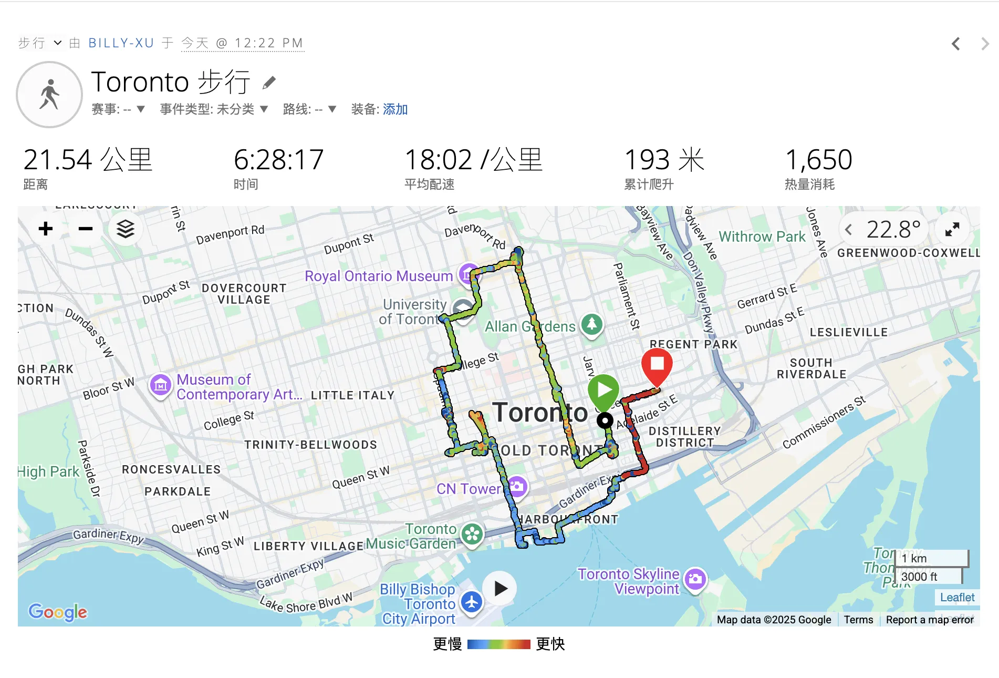
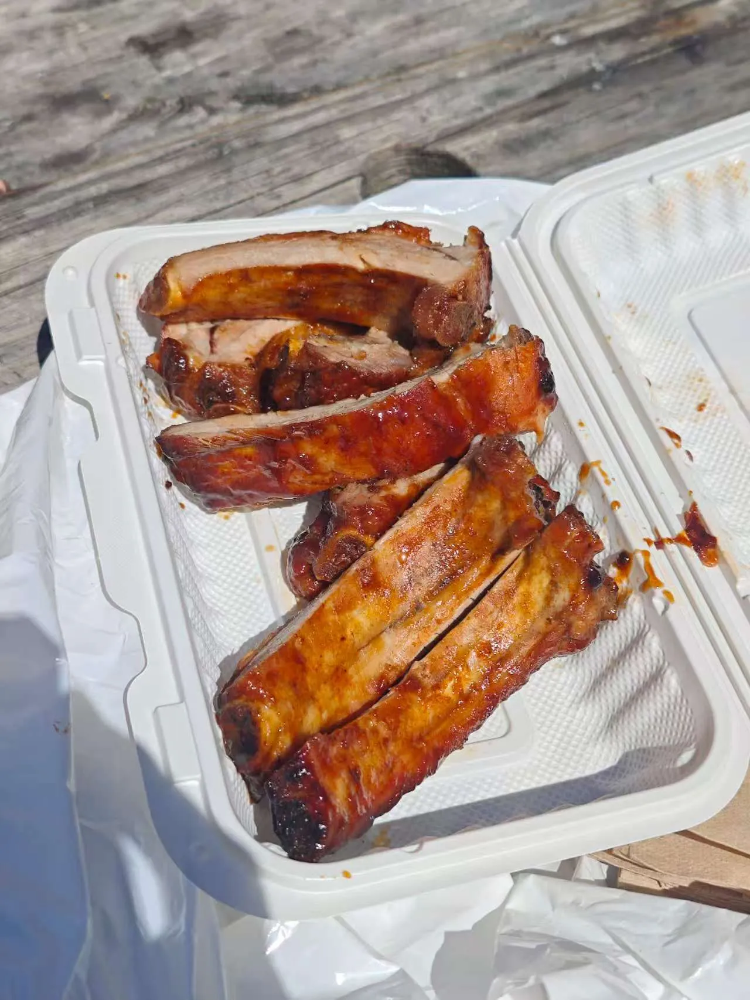
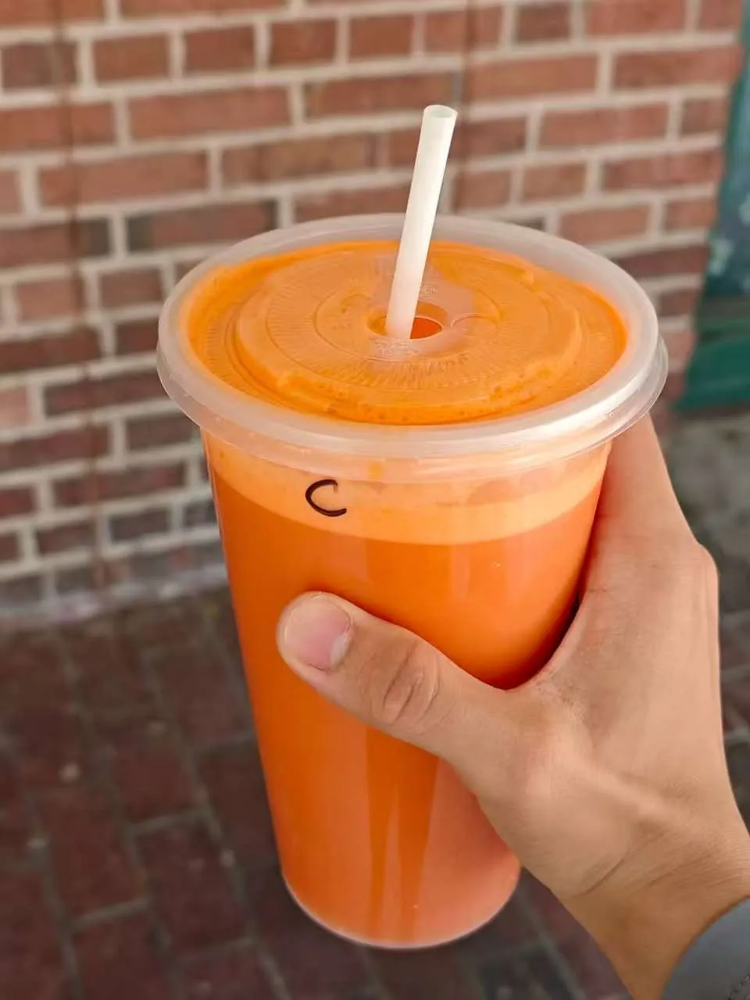
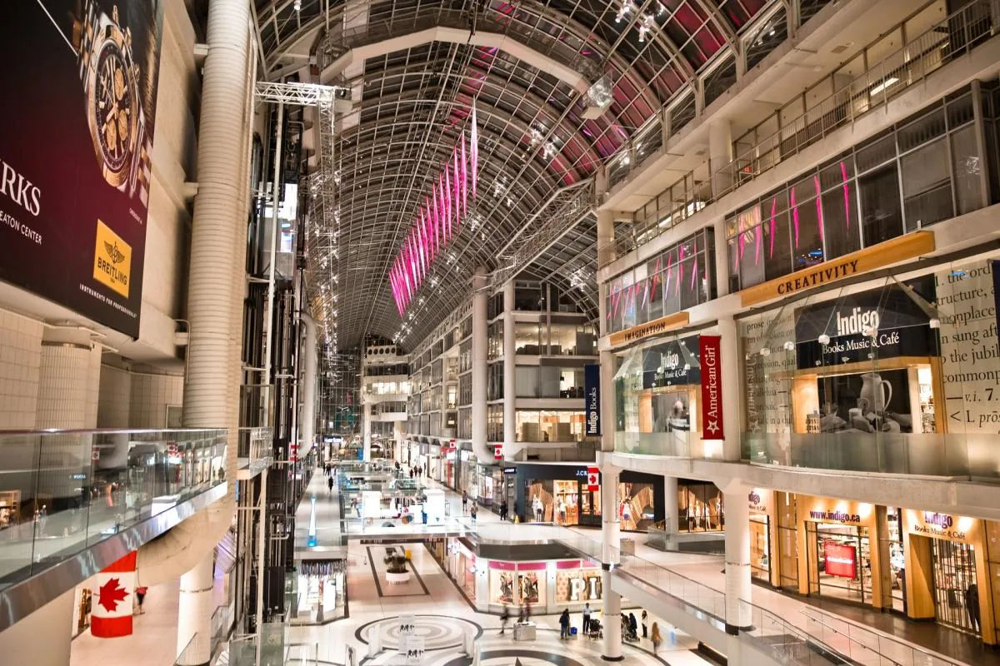
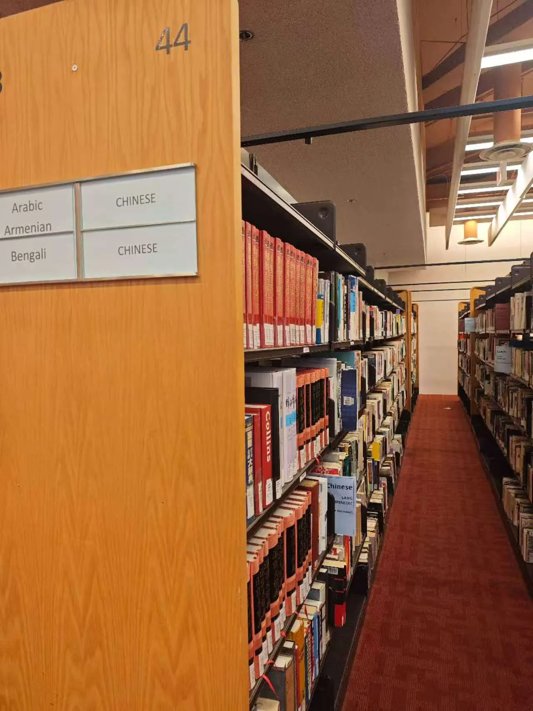
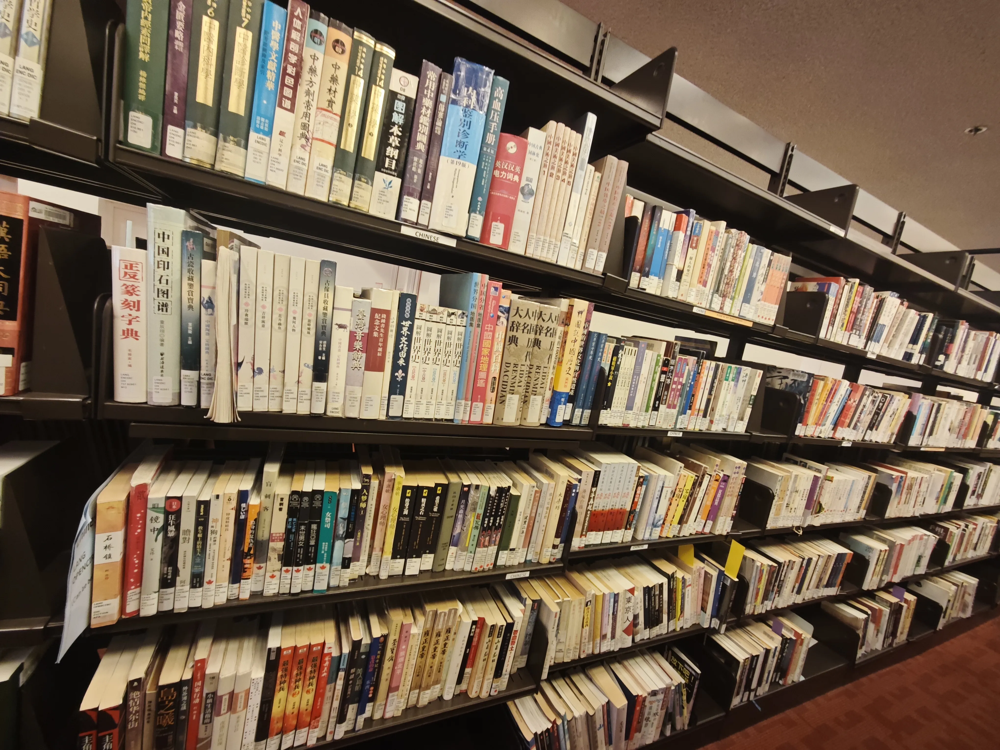

> 城市不只是一系列地标的集合，更是一张可以靠双脚去探索的地图。从圣劳伦斯市场的烟火气，到多大校园的宁静；从伊顿中心的现代喧嚣，到安大略湖畔的开阔。有些地方擦肩而过，有些地方驻足品尝，有些地方则干脆留给未来的自己。
> 

一条线路把大多数景点全部看了一遍，当然复刻的时候可以坐公交车，不必要也走22km。

可以点击链接复刻路线：[https://maps.app.goo.gl/go5BUVcxMP6tDgrH8](https://maps.app.goo.gl/go5BUVcxMP6tDgrH8)

# 图解（总路程约22km）

.webp)

1. 圣劳伦斯市场 (St. Lawrence Market)
2. 多伦多伊顿中心 (CF Toronto Eaton Centre)
3. 宜家 (IKEA Toronto Downtown)
4. 多伦多公共图书馆-多伦多参考图书馆 (Toronto Public Library - Toronto Reference Library)
5. OISE 图书馆 (OISE Library)
6. 多伦多大学+多伦多大学Bookstore (University of Toronto Bookstore)
7. 肯辛顿市场 (Kensington Market)
8. 购物中心 (Chinatown Centre)
9. 安大略美术馆 (Art Gallery of Ontario - AGO)
10. 加拿大国家电视塔 (CN Tower)
11. 水族馆
12. 湖边散步（有兴趣可以去湖心岛）

# 简略的景点介绍

## 1.圣劳伦斯市场 (St. Lawrence Market)

一个历史悠久的大型市场，内有超过100个摊贩，是品尝本地美食和购买新鲜食材的好去处。

猪肋排（15加元）

好吃，好吃，好吃）

1L现榨胡萝卜汁（10加元）

## 2.多伦多伊顿中心 (CF Toronto Eaton Centre)

多伦多市中心最大的购物中心，拥有玻璃拱顶设计，汇集了众多国际品牌和餐饮选择。

个人不喜欢逛商场，随便看看就走了。地下有很多餐厅可以吃饭。

## 3.宜家 (IKEA Toronto Downtown)

位于市中心的宜家分店，方便在城市核心区域购物。

这个不用介绍了罢

## 4.多伦多公共图书馆-多伦多参考图书馆 (Toronto Public Library - Toronto Reference Library)

多伦多最大的公共参考图书馆，建筑设计独特，是学习和阅读的理想之地。

里面有自习室，当然也有很多的书籍。（甚至有中文书）

## 5.OISE 图书馆 (OISE Library)

需要Tcard进入，不是多伦多大学的学生就进不去了。

当然里面没啥可看的，对比上一个图书馆书太少了。

## 6.多伦多大学+多伦多大学Bookstore (University of Toronto Bookstore)

Bookstore周末不开，嗯是的，就周末不开。

我周末去的

## 7.肯辛顿市场 (Kensington Market)

一个充满活力的多元文化社区，遍布着独立精品店、古着店、各国美食和新鲜食品市场。

忘记去了.jpg

## 8.购物中心 (Chinatown Centre)

名字好听，实际上没啥可去的。特别老的建筑了。

## 9.安大略美术馆 (Art Gallery of Ontario - AGO)

加拿大最著名的美术馆之一，收藏了大量加拿大及世界各地的艺术品，建筑本身也极具特色。

没兴趣，也没去

## 10.加拿大国家电视塔 (CN Tower)

多伦多的标志性建筑，可以登塔俯瞰整个城市和安大略湖的壮丽景色。

没兴趣，票巨贵（70加元）。就没上去。

## 11.水族馆

宽敞的现代水族馆，展出许多物种和栖息地，提供 各种活动和课程。

票50加币，但是我也没去。

## 12.湖边散步（有兴趣可以去湖心岛）

湖边.jpg

随便走走