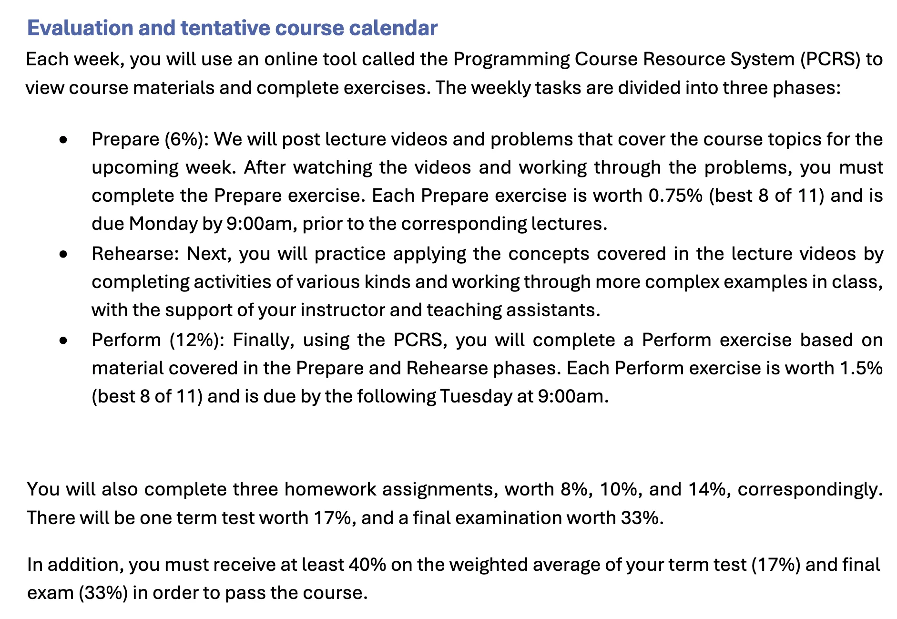
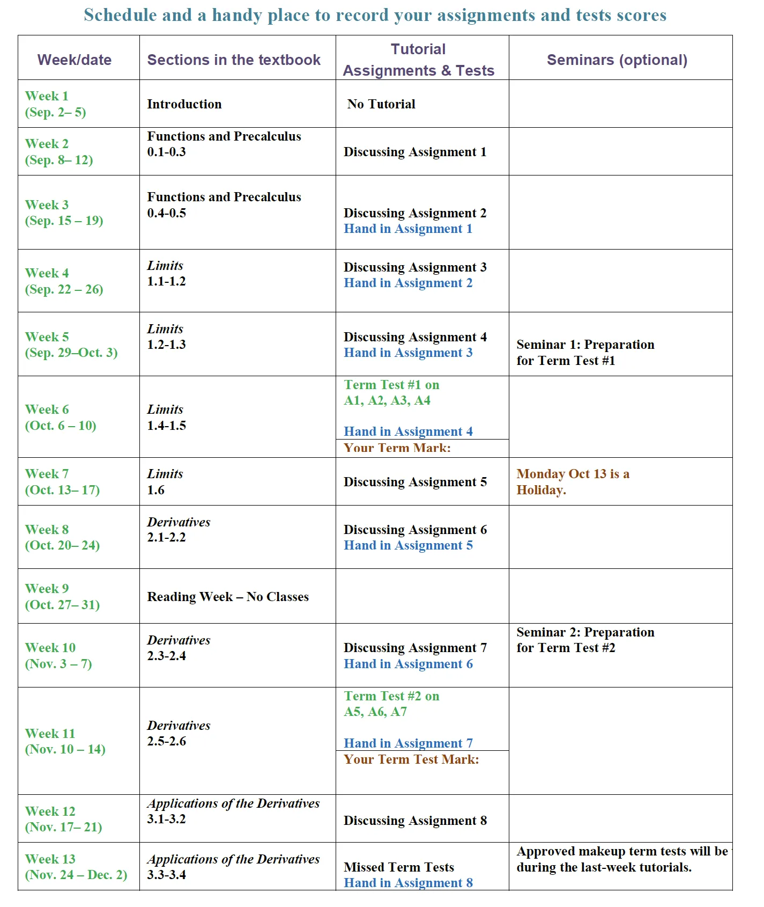

>导读：
>第一部分是时间线版本，列出来了每周任务/无DDL任务
>第二部分是课程版本，包含更详细的作业权重以及考试占比，同时附上了来源。
>第三部分是碎碎念
>保命声明：阅读时需谨慎，请再次核对。
>可以全部加入代办清单啦（

# 1.Timeline-2025年秋季学期课业时间线

---

## 每周任务

| 截止日 | 时间 | 课程 | 任务 | 平台/备注 |
| --- | --- | --- | --- | --- |
| **每周一** | 上午 9:00 | **CSCA08H3** | 每周预习 (Prepare) | [PCRS](https://cms-pcrs.utsc.utoronto.ca/csca08f25/) |
| **每周二** | 上午 9:00 | **CSCA08H3** | 每周复习 (Perform) | [PCRS](https://cms-pcrs.utsc.utoronto.ca/csca08f25/) |
| **每周日** | (全天) | **LINA01** | Top Hat 阅读与章节问题 | [Top Hat](https://app-ca.tophat.com/e/649412) |
| **每周Tutorial** | (上课时) | **MATA31H3** | 8次作业 (取最好的6次) | [Quercus](https://q.utoronto.ca/courses/405798/assignments) |
| **每周Tutorial** | (上课时) | **CSCA67** | Tutorial 练习 | [课程官网](https://www.utsc.utoronto.ca/~atafliovich/csca67/content.html) |

---

## 其他一次性作业与任务

### CSCA08H3 - 计算机科学导论I

| 类型 | 任务/作业 | 截止日期 | 提交平台 | 权重 |
| --- | --- | --- | --- | --- |
| 大作业 | 作业 1 | *待定 (TBD)* | [Markus](https://markus2.utsc.utoronto.ca/) | 8% |
| 大作业 | 作业 2 | *待定 (TBD)* | [Markus](https://markus2.utsc.utoronto.ca/) | 10% |
| 大作业 | 作业 3 | *待定 (TBD)* | [Markus](https://markus2.utsc.utoronto.ca/) | 14% |

### CSCA67 - 离散数学

| 类型 | 任务/作业 | 截止日期 | 提交平台 | 权重 |
| --- | --- | --- | --- | --- |
| 大作业 | 家庭作业 1 - 4 | *待定 (TBD)* | [课程官网](https://www.utsc.utoronto.ca/~atafliovich/csca67/assignments.html) | 各 6% |

### LINA01 - 语言学导论

| 类型 | 任务/作业 | 提交平台 | 开始日期 | 截止日期 | 权重 |
| --- | --- | --- | --- | --- | --- |
| **必修模块** | 学术诚信模块 | Quercus | 已开放 | **9月14日** | 2% |
| **小作业** | Quercus 作业 1 | Quercus | 9月7日 | **9月21日** | 2% |
| **小作业** | Quercus 作业 2 | Quercus | 9月21日 | **9月28日** | 2% |
| **大作业** | 大作业 1 | Quercus | 10月3日 | **10月10日** | 10% |
| **小作业** | Quercus 作业 3 | Quercus | 10月19日 | **10月26日** | 2% |
| **大作业** | 大作业 2 | Quercus | 10月24日 | **11月7日** | 10% |
| **小作业** | Quercus 作业 4 | Quercus | 11月9日 | **11月16日** | 2% |
| **大作业** | 大作业 3 | Quercus | 11月21日 | **11月28日** | 10% |
| **小作业** | Quercus 作业 5 | Quercus | 11月16日 | **11月30日** | 2% |
| **实验参与** | SONA 实验/替代作业 | Quercus/SONA | 9月15日 | **12月1日** | 2% |
| **调查问卷** | 学期调查 (共3次) | Quercus Assignments | *待定 (TBD)* | *待定 (TBD)* | 1% |

# 2.课程分数构成总结（非时间线版本）

---

## CSCA08H3 - 计算机科学导论I

- **每周练习**: 18% (Prepare 6% + Perform 12%)
    - 作业地址：[https://cms-pcrs.utsc.utoronto.ca/csca08f25/](https://cms-pcrs.utsc.utoronto.ca/csca08f25/)
    - Prepare DDL：每周一上午 9:00。
    - Perform DDL：**次**周二上午 9:00。
- **三次作业**: 32% (8% + 10% + 14%)
    - 作业地址：[https://markus2.utsc.utoronto.ca/](https://markus2.utsc.utoronto.ca/)
- **考试**: 50% (期中17% + 期末33%)

来源：

[https://q.utoronto.ca/courses/405064/files/38833126/download?download_frd=1](https://q.utoronto.ca/courses/405064/files/38833126/download?download_frd=1)

- Evaluation and tentative course calendar
  
    
    

---

## MATA31H3 - 数学科学微积分I

- **作业**: 24% (8次作业，取最好6次)
    - 作业地址：[https://q.utoronto.ca/courses/405798/assignments](https://q.utoronto.ca/courses/405798/assignments)
    - DDL：On Tutorial
- **期中考试**: 26% (2次，各13%)
- **期末考试**: 50%
- 课程安排日历（点开查看）
  
    Link：[https://q.utoronto.ca/courses/405798/pages/course-schedule?module_item_id=6893702](https://q.utoronto.ca/courses/405798/pages/course-schedule?module_item_id=6893702)
    
    
    

来源：

[https://q.utoronto.ca/courses/405798/pages/course-assessment](https://q.utoronto.ca/courses/405798/pages/course-assessment)

- MARKING：
  
  
    | **MARKING:** |  |
    | --- | --- |
    | Assignments | 24% |
    | Term Tests | 26% |
    | Final Exam | 50% |
    

---

## CSCA67 - 离散数学

- **Tutorial练习**: 4%
    - 作业地址：https://www.utsc.utoronto.ca/~atafliovich/csca67/content.html
- **家庭作业**: 24% (4次，各6%)
    - 作业地址：https://www.utsc.utoronto.ca/~atafliovich/csca67/assignments.html
- **期中考试**: 37% (7% + 15% + 15%)
- **期末考试**: 35%

来源：

[CSC/MAT A67 — Discrete Mathematics: Fall 2025](https://www.utsc.utoronto.ca/~atafliovich/csca67/)

- You will also complete……
  
    You will also complete four [homework assignments](https://www.utsc.utoronto.ca/~atafliovich/csca67/assignments.html), worth 6% each. Do not leave these to the last minute: they are substantially more work than the weekly exercises, and we expect that you will work on them for several hours each week.
    
    Finally, there will be three term tests (worth 7%, 15%, and 15%) and a final examination (worth 35%). You must get at least 40 out of 100 on the final examination to pass the course; otherwise, your final course grade will be no higher than 47%.
    

---

## LINA01 - 语言学导论

- **SONA实验/替代作业**: 2%
    - 作业地址：[https://q.utoronto.ca/courses/405731/pages/sona-experiment-participation-slash-alternative-assignment?wrap=1](https://q.utoronto.ca/courses/405731/pages/sona-experiment-participation-slash-alternative-assignment?wrap=1)
    - DDL：9.15开放，12月1日截止
- **学术诚信模块**: 2%
    - 作业地址：[https://q.utoronto.ca/courses/405731/assignments/1581243](https://q.utoronto.ca/courses/405731/assignments/1581243)
    - DDL：9.14
- **学期调查**: 1% (3次共1%)
    - 作业地址（在[assignments](https://q.utoronto.ca/courses/405731/assignments)里面找）：[https://q.utoronto.ca/courses/405731/assignments](https://q.utoronto.ca/courses/405731/assignments)
- **作业**: 30% (3次，各10%)
    - 提交平台：Quercus
      
      
        | 评估项目 | 发布时间 | 提交截止日期 |
        | --- | --- | --- |
        | 大作业 1 (占10%) | 10月3日 (中午12点) | 10月10日 (晚上11:59) |
        | 大作业 2 (占10%) | 10月24日 (中午12点) | 11月7日 (晚上11:59) |
        | 大作业 3 (占10%) | 11月21日 (中午12点) | 11月28日 (晚上11:59) |
- **Top Hat阅读与章节问题**: 10%
    - 提交平台：[https://app-ca.tophat.com/e/649412](https://app-ca.tophat.com/e/649412)
    - DDL：开始于每周一，截止为**每周日**
- **Quercus家庭作业**: 10% (5次，各2%)
    - 提交平台：Quercus
    
    | 评估项目 | 发布时间 | 提交截止日期 |
    | --- | --- | --- |
    | Quercus 作业 1 (占2%) | 9月7日 (中午12点) | 9月21日 (晚上11:59) |
    | Quercus 作业 2 (占2%) | 9月21日 (中午12点) | 9月28日 (晚上11:59) |
    | Quercus 作业 3 (占2%) | 10月19日 (中午12点) | 10月26日 (晚上11:59) |
    | Quercus 作业 4 (占2%) | 11月9日 (中午12点) | 11月16日 (晚上11:59) |
    | Quercus 作业 5 (占2%) | 11月16日 (中午12点) | 11月30日 (晚上11:59) |
- **期末考试**: 45%

来源：

[https://q.utoronto.ca/courses/405731/pages/grade-distribution?wrap=1](https://q.utoronto.ca/courses/405731/pages/grade-distribution?wrap=1)

- Grade Distribution
  
    
    

---

# 3.碎碎念

- MATA31
    - 预备微积分、极限、导数。然后没了……？
- CSCA67
    - 什么是离散数学？哦原来是大杂烩
    - 逻辑命题、计数原理、概率
- CSCA08
    - 还在用wing101？还在用wing101？
    - 没用过VSCode说是，或者PyCharm也行。也没指望用emacs。
    - 跟隔壁UCB的[CS61A](https://cs61a.org/)比比，比的了吗？
    
    [CS 61A Fall 2025](https://cs61a.org/)
    
- LINA01
    - 谁说的水课，DDL这么多麻烦死了。好在一键加入代办清单.jpg
    - 为啥还要额外买书？我交了6000加币的学费啊！