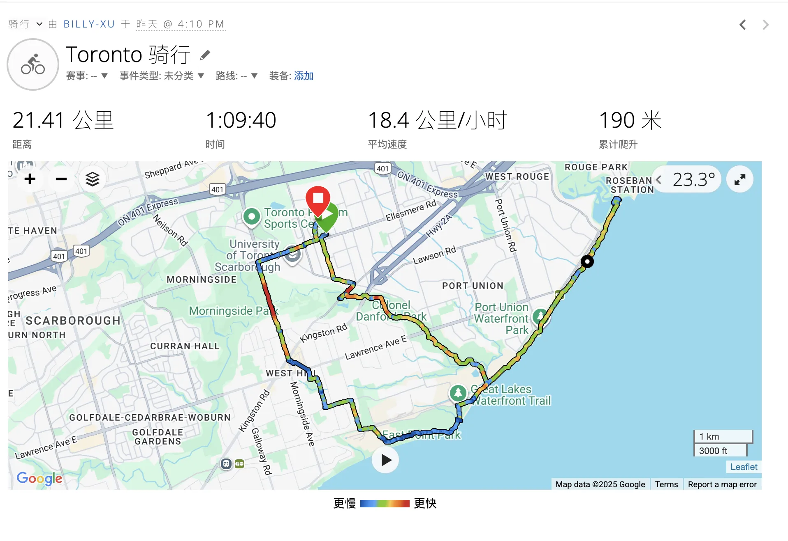
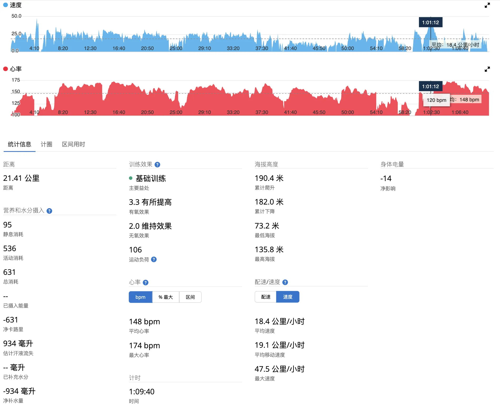
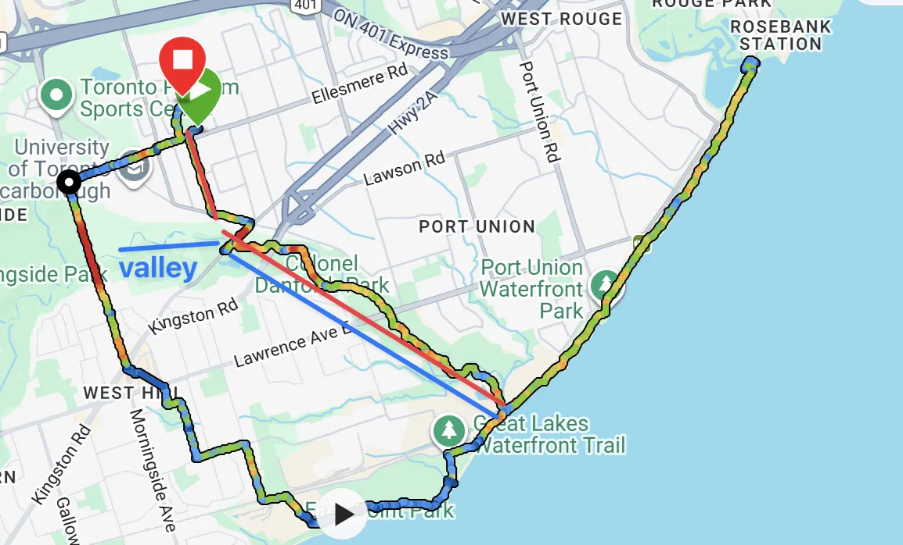
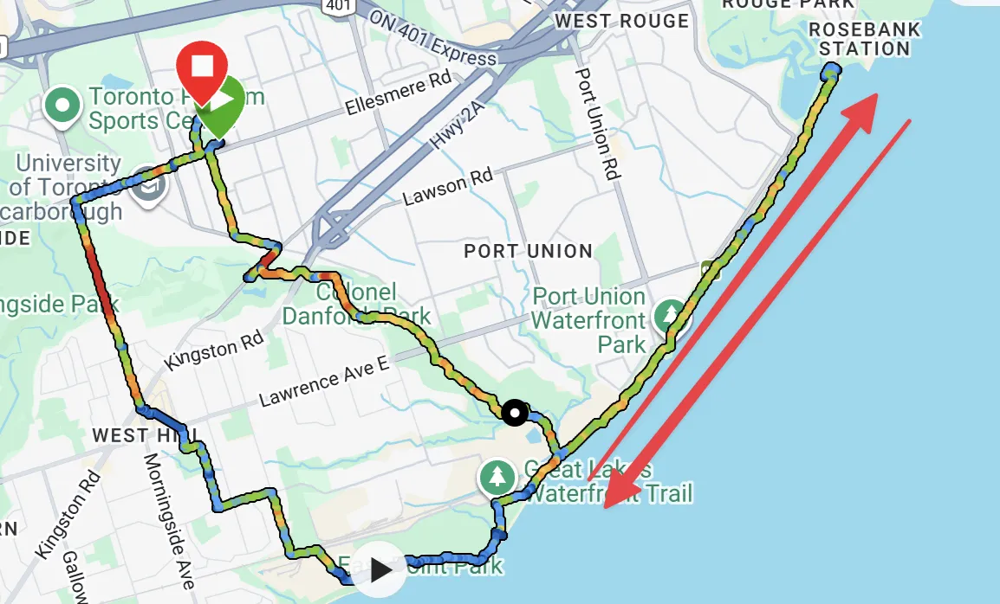
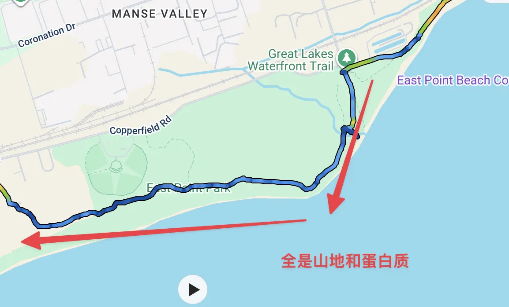
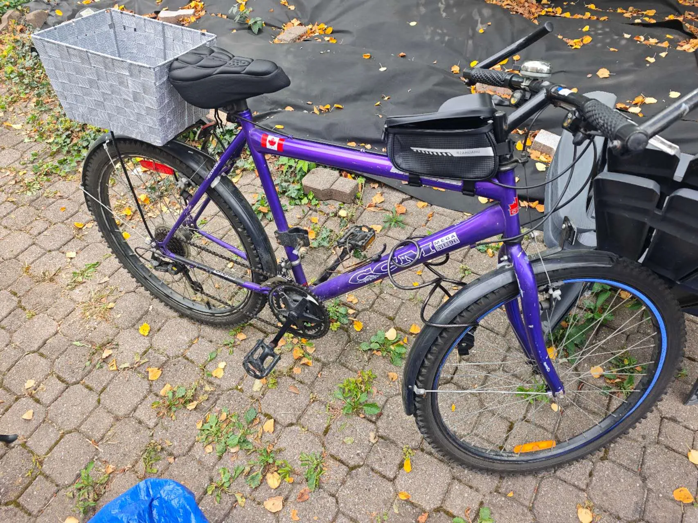
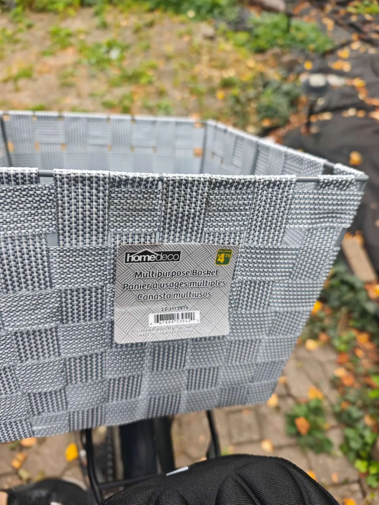
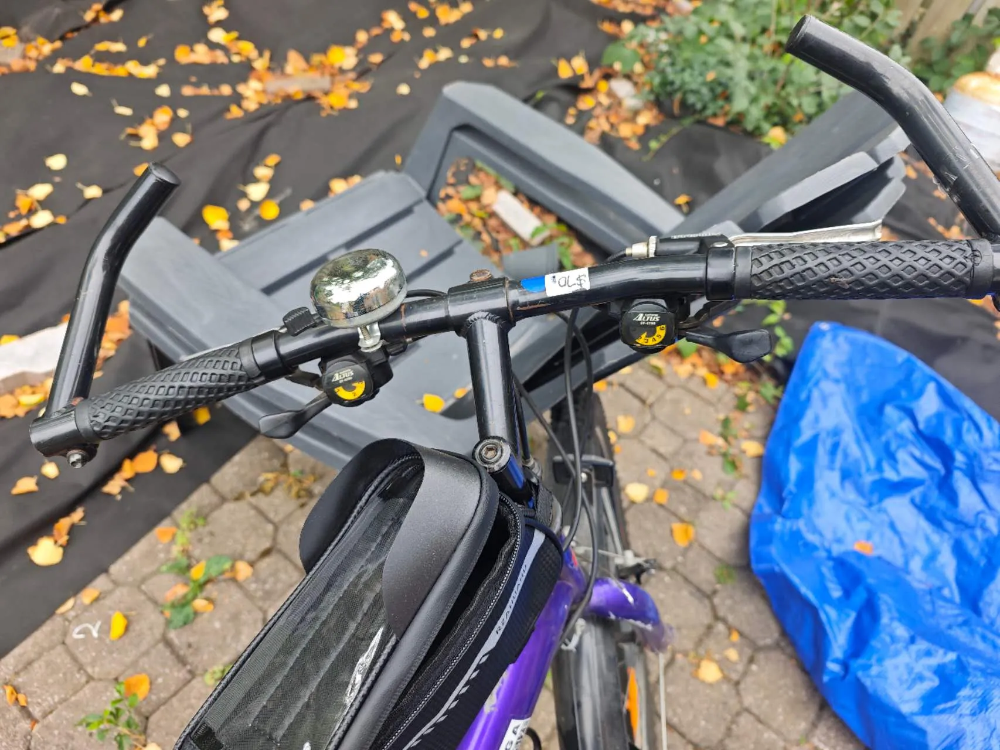

由于是骑行，所以没拍照片。

还得多练，不过山地车这个速度很难骑更快了。

# 上个身体情况

心率比跑步动不动180低多了，也就148。

# 关于路线：

到湖边之前可以从公园穿过去（也可以从Valley开始穿行），坡度不大。

到湖边后有专门的骑行道，限速20km/h。我应该是超速了，在那个骑行道上骑了25km/h。

不过骑行道很短，几公里就结束了，于是从ROSEBAN STATION折返回来。

最后去East Point Park骑的，就是一段山地路线。速度降到10km/h以下了，也是第一次知道更短的齿轮的作用。

# 关于自行车：

自行车是在二手自行车店买的，税前70刀，含有14天的保修：

[The Up-Cycle (Bicycle Repair & Bicycle Recycling) · 520 Coronation Dr #13, Scarborough, ON M1E 5C7, Canada](https://maps.app.goo.gl/ueLMQr7FbyYLacuy8)

是一辆山地自行车，附赠挡泥板，后座架，水杯架。

后框是Dollarama随便花钱买的框，并不是专用的自行车筐。

变速坏了一个，从3*6变成2*6了。

这辆车骑公路最快能骑到30码，然后就是全空转了。看着别人公路车动不动40-50码的还是挺羡慕的。