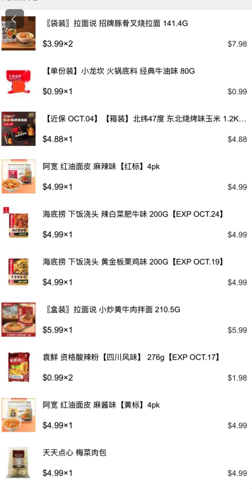
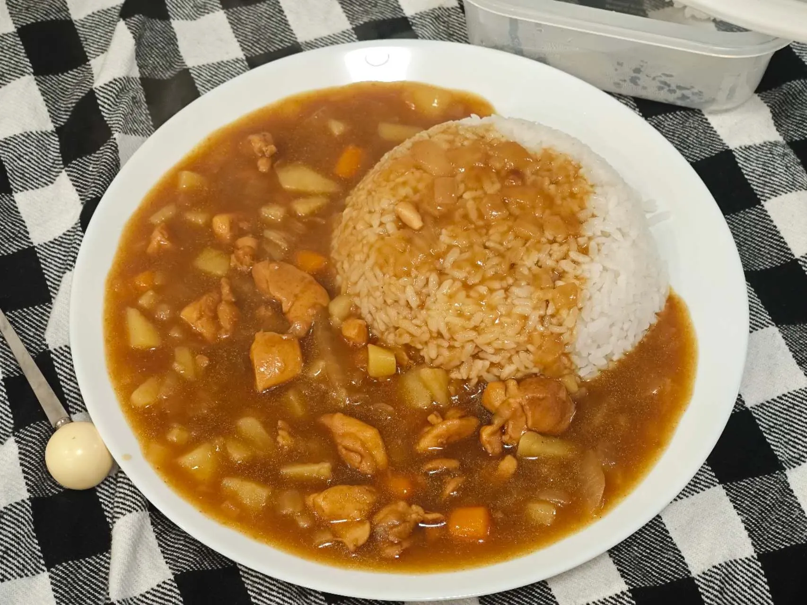
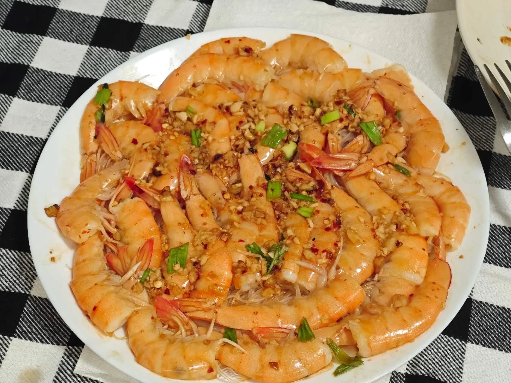
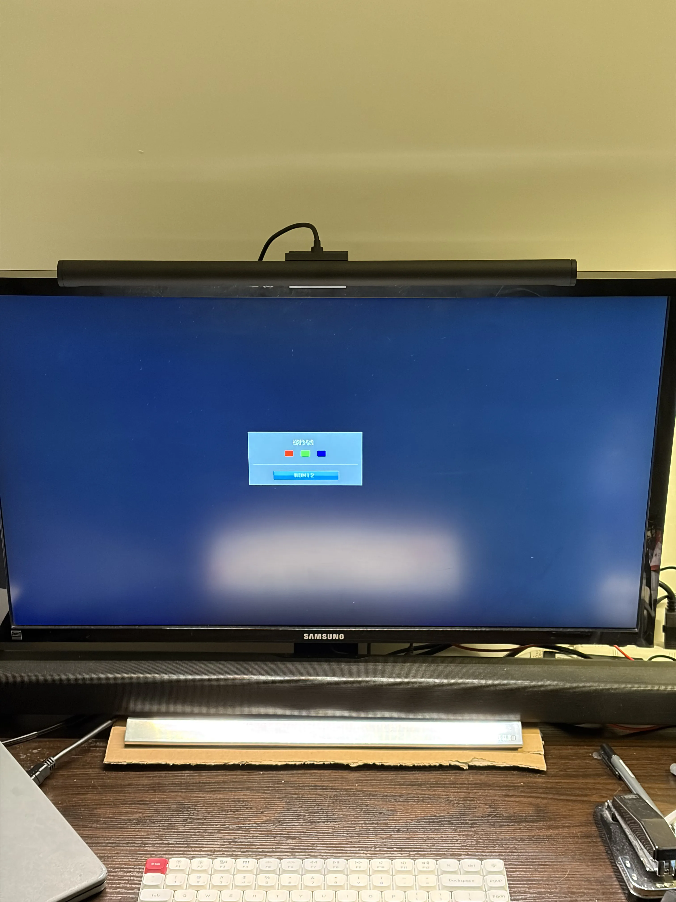
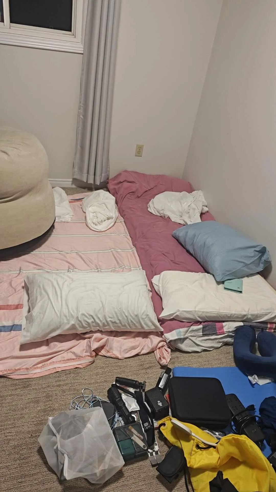

>等待后续账单周期更新后，文章会一同更新。

>目前记账计划执行的有点失败。

# 一：每月固定支出（含租房）： (约 $1505 - $1655/月)

### **1.居住成本：$1205/月**

校外租房，具体可以参考：

[UTSC学生校外租房不完全指南 | TechLeaf Blog](https://techleaf.xyz/article/UTSCRenthouse)

- **房租：** $1100/月
- **水电费：** $80/月 (人均)
- **网络费：** $25/月 (人均)
    - （300Mbps+100Mbps，运营商赠送了一个不错的路由器，总费用税前$65/月，分摊后个人支出很低。）

## 2.饮食成本：$300 - $350/月

在食物上开销比较省，基本上是什么特价我吃啥。常去的商店有foodbasic、沃尔玛、嘉禾超市+线上的嘟嘟买菜和foodbasic。

某张英文小票（已汉化）：

- 精选罐装汤 (SELECT.CAN.SOUP): $1.27
- 牛后腰肉 (SIRLOIN TIP ROAS): $14.96 (节省 $15.03)
- 清真牛后腰肉 (HALAL SIRL.TIP R): $9.09 (节省 $9.13)
- 卢氏烧烤排骨 (LOU S BBQ): $7.99 (节省 $5.00)
- 罗马生菜 (ROMAINE HEARTS): $3.98 (节省 $1.00)
- **小计：$37.29**
  
    
    

物价大概就是如此，折合后我每个月只需在食品上有大约300-350刀的开销。（根据住房后的开销计算）。偶尔会做菜，其余时间吃一些冷冻食品与预制菜。

做的咖喱/蒸虾

## **3. 浮动与娱乐开销：约 $100/月**

当然，每个月都会买点奇奇怪怪的小玩意（主要位于二手超市），加上骑行饮料等支出，大概会多出100刀左右。

**每月固定支出总计：$1205 (居住) + $350 (饮食) + $100 (浮动) ≈ $1655**

# 二、 一次性投资($277)

# 行（春夏秋、冬季待定）：

一辆自行车即可胜任，详见：

[跑步/出行专栏（持续更新中） | TechLeaf Blog](https://techleaf.xyz)

## 1.出行装备：$110

在多伦多的春夏秋三季，一辆自行车几乎能满足我所有的出行需求。

- 二手自行车： $70
- 配件 (打气筒、新脚踏、后筐等)： $40

## 2.衣物采购：$90

二手市场能买到很多便宜的大牌衣服。

羽绒服均价在30-40刀左右

硬壳软壳均价在10-30刀左右

速干衣均价在5-15刀左右

裤子均价在5-15刀左右

花钱买了三件裤子、三件外套。似乎是足以过冬了。

大概90刀。

（不买时尚品牌，就买户外专注性能的款式）

## 3. 工作间配置：$77

去二手市场用40刀的价格买了一台三星10年前的显示器。好在是4k60的，缺点是又让我用13刀买了一个电源适配器。

音响也是三星的一款，只需要24刀（赠电源适配器）。

键盘和显示器挂灯是自己带来的.jpg

## 4.休息间：$0

学校的过渡项目结束后可以带走送的床单和毯子，我就带出来了很多。在此化作床垫：

要说床垫，方案是用几个毯子垫底下，然后打地铺即可。（目前已更换为他人剩下的床垫）

桌子也是上一个房东剩下的。沙发是在过渡项目结束后捡的。

# 三：支出结算

## 每月固定支出

---

- **住房成本：**
    - 租房：$1100/月
    - 水电费：$80/月（人均）
    - 网络费：$25/月（人均）
- **食物成本：**
    - 每月食品开销：$300 - $350
- 二手市场淘宝成本$100

大头开销就是租房，如果不算那昂贵又没必要的学费的话。

所以说每月总开销大概能维持在**$1605 - $1655** 之间。

## 一次性/非固定支出

---

- **出行成本：**
    - 自行车：$70
    - 自行车配件（打气筒、新脚踏等）：$40
    - **小计：$110**
- **衣物成本：**
    - 三条裤子、三件外套：约 $90
    - **小计：$90**
- **工作间设备成本：**
    - 二手显示器：$40
    - 电源适配器：$13
    - 音响：$24
    - **小计：$77**

一次性/非固定支出约为 **$277**。

# 更多信息…

当然，如果想的话租房的价格完全可以更低，压到700刀/月也有可能。并且食物上可以更省。