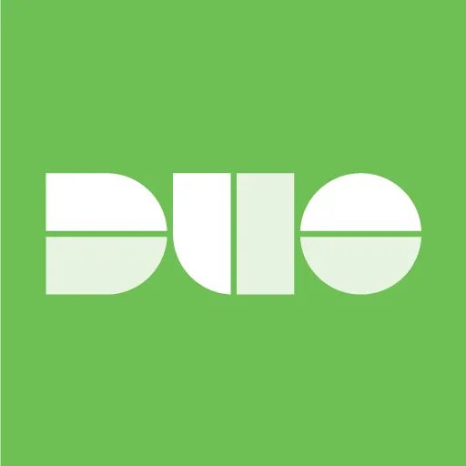
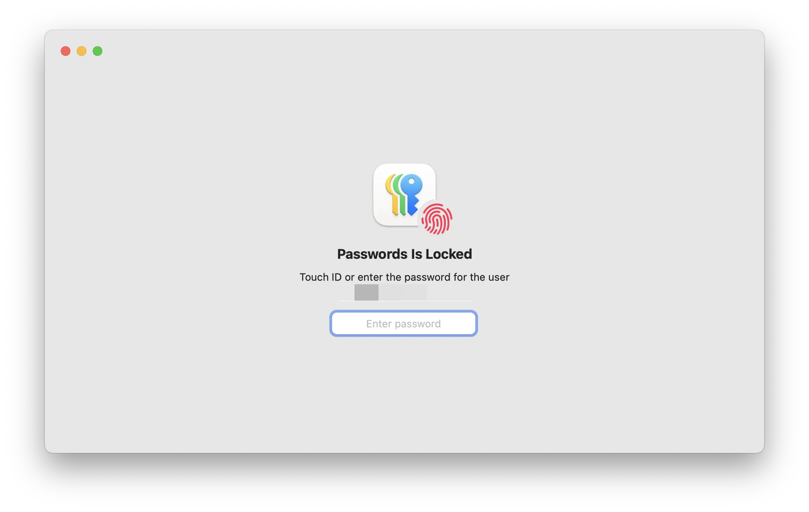
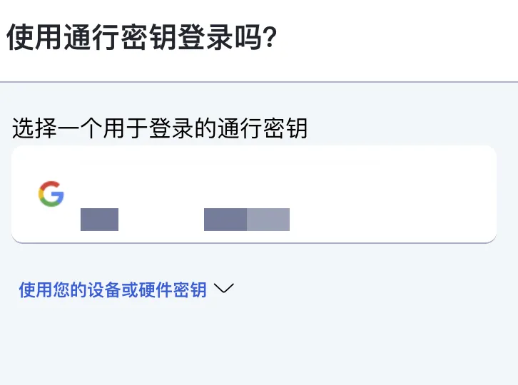
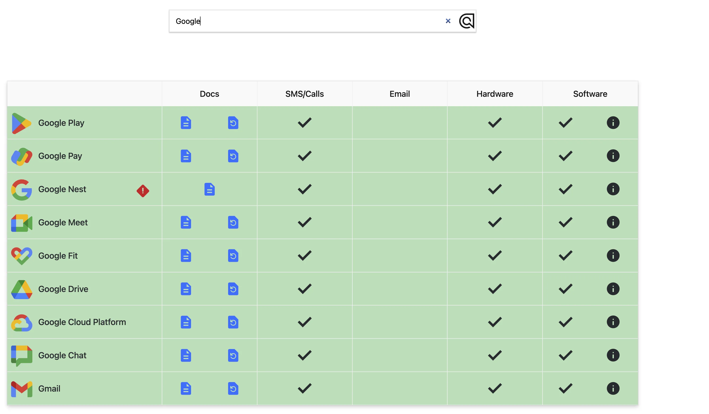

## **1.1 从密码到无密码：我们为何需要其他因素辅助认证？**

密码，作为一种历史悠久的身份验证凭证，长期以来在数字世界中扮演着“守门人”的角色。它是用户访问各类在线账户、服务和系统的第一道，也往往是唯一一道防线。但用户出于便利性的需求和记忆负担的考量，往往会选择牺牲安全性，使用简单和重复的密码。仅仅依靠宣传和教育，并不足以从根本上解决密码安全问题。技术手段的介入，如强制密码策略的实施、密码管理器的推广，以及向更安全的身份验证方式（如两步验证、通行密钥等无密码方案）迁移，已成为行业发展的必然趋势。

## **1.2 两步验证（2SV/2FA）：现代的验证机制**

面对传统密码的固有缺陷，两步验证（2-Step Verification, 2SV），也被称为双因素身份验证（Two-Factor Authentication, 2FA），作为一种显著增强账户安全的机制应运而生并得到广泛应用。其核心理念在于，用户在访问账户时，除了提供他们“知道的”信息（通常是密码）之外，**还必须提供第二种不同形式的身份证明**。

### **1.2.1 工作原理与因素分类（见右图Google提供的方式）**

两步验证的工作原理基于多因素认证的思想。这些“因素”通常可以归为三类：

**-所知因素 (Something you know)：** 例如密码、PIN码、安全问题答案。

**-所拥有的因素 (Something you have)：** 例如接收短信验证码的手机、生成动态代码的身份验证器应用、物理安全密钥。

**-所是你的因素 (Something you are)：** 例如指纹、面部识别、虹膜扫描等生物特征。

一个典型的两步验证流程会结合至少两种不同类别的因素，最常见的是“密码”（所知因素）加上发送到用户手机的一次性验证码（所拥有的因素）。

### **1.2.2 2SV 与 MFA 的区别**

虽然两步验证（2SV/2FA）和多因素身份验证（Multi-Factor Authentication, MFA）经常被互换使用，但严格来说它们之间存在细微差别。2FA特指使用两种不同类型的验证因素。而MFA则是一个更广义的概念，可以指使用两种或更多种验证因素。

在明确了“两步验证”这一机制后，我们接下来要了解**现实中，那第二验证因素到底有哪些选择？** 它们从短信验证码到硬件安全密钥，形式多样、体验各异、风险与成本也相差甚远。下面，就让我们逐一拆解几种主流的两步验证方式。

---

## **2.1 电话号码：验证方式及其演变**

将用户的电话号码作为两步验证的一个因素，是最早普及也是最广为人知的一种2SV实现方式。其基本工作流程是：当用户在输入正确的账户密码后，系统会向用户预先注册的电话号码发送一条包含一次性验证码（通常是4到8位数字）的短信。用户接收到后，需要在登录界面输入它，以完成第二步身份验证。

正是凭借部署难度低、用户操作熟悉的特点，短信验证码曾一度成为银行、邮箱、社交媒体的默认二步验证选项。然而，**同一份便利也为攻击者提供了可乘之机**：攻击者可以通过社会工程学手段（如冒充用户、贿赂运营商员工等）欺骗移动运营商，将受害者的电话号码转移到攻击者自己控制的SIM卡上。一旦成功，攻击者就能拦截所有发送到该号码的短信和电话。鉴于上述风险，许多大型服务提供商，鼓励用户转用身份验证器、通行密钥或硬件安全密钥等更为可靠和安全的验证方法。

## **2.2 身份验证器应用（Authenticator Apps）：动态代码的守护者**

身份验证器应用是一种安装在用户智能手机或其他个人设备上的应用程序，其核心功能是生成一次性密码（One-Time Passwords, OTPs）。这些OTP通常作为两步验证（2SV）或多因素身份验证（MFA）中的第二重验证因素，用以增强账户登录的安全性。

目前市面上绝大多数身份验证器应用采用的是基于时间的一次性密码（Time-based One-Time Password, TOTP）算法。其工作原理如下：

当你第一次用手机验证器（比如 DUO、Google Authenticator）绑定账号时，网站（比如学校或公司系统）会给你一个 **专属的“密钥”**。它通常藏在一个二维码里。手机扫完后，这个“密钥”就保存在手机里，网站也会保存一份。**此时只有你和网站知道这个密钥！**

后续登录就会要求你输入基于刚才那个密钥 + 当前时间，一起通过一个“公式”来算出一个临时验证码（比如 6 位数字），一般来说每 30 秒变一次。手机和网站算出来的验证码，在同一个时间点是一样的，故可以如此验证。

## **2.3 通行密钥（Passkeys）与安全密钥（Security Keys）：无密码未来**

随着对传统密码安全性局限性的认识不断加深，以及用户对更便捷登录体验的追求，身份验证领域正朝着“无密码”的方向快速演进。在这一趋势中，通行密钥（Passkeys）和硬件安全密钥（Security Keys）是两项备受瞩目的核心技术。它们都基于FIDO（Fast IDentity Online）联盟制定的开放标准，旨在提供比传统密码更安全、更易用的身份验证解决方案。

PS：下面的讲解简化了公钥私钥的概念

### **2.3.1 通行密钥（Passkeys）**

如指纹识别、面部扫描、设备PIN码或解锁图案

通行密钥是一种创新的数字身份验证凭证，它允许用户彻底告别传统密码，转而使用他们日常解锁设备的方式（例如指纹识别、面部扫描、设备PIN码或解锁图案）来登录各种应用程序和网站。对应的钥匙始终安全地保留在用户的个人设备（如智能手机、电脑或硬件安全密钥）上，绝不离开该设备。

当用户尝试登录时，他们首先向服务表明身份。服务方会向用户的设备发送一个登录信息。用户的设备会提示用户通过其常规的设备解锁方式（如指纹、面容ID、PIN码）进行授权，从而确认了用户的身份，准予登录。

### **2.3.2 安全密钥（Security Keys）**

一种物理硬件设备，插入设备后才能解锁使用。原理上类似车钥匙，外观上类似U盘。

安全密钥作为一种“你拥有的”验证因素，用于在用户登录在线账户或服务时，提供一层额外的、基于硬件的强身份验证。由于攻击者极难远程复制或窃取一个物理存在的硬件设备，安全密钥被广泛认为是实现两步验证或多因素身份验证中最安全的方法之一。

当用户尝试登录或需要进行身份验证时，系统会提示用户插入（USB类型）或轻触（NFC类型）其已注册的安全密钥。插入并且发送给服务器信息后，通常会要求用户继续进行一个物理操作，例如触摸密钥上的按钮或金属触点，或者（对于支持PIN的安全密钥）输入一个PIN码，以激活密钥并授权操作。

该类设备旨在为面临较高针对性攻击风险的用户（如记者、活动家、政治人士等）提供最高级别的安全防护。

还挺贵的……

## **2.4 备用验证码：最后防线**

备用验证码（Backup Codes），特指在启用了两步验证（2SV）的账户中，由系统生成的一组（对于Google账户，通常是10个）一次性使用的数字验证码（Google提供的是8位数字码，其他服务可能位数不同）。

它们的核心用途在于，当用户由于种种原因无法通过其常规设置的两步验证方法（例如身份验证器应用丢失或故障、硬件安全密钥损坏或遗失）获取动态验证码时，可以使用这些预先生成并妥善保管的备用验证码中的一个，作为完成登录过程中的第二步验证。

- 用户通常在成功开启账户的两步验证功能后，可以在其账户的安全设置页面找到生成和查看备用验证码的选项
- 每个备用验证码都设计为只能成功使用一次。一旦某个备用验证码被用于登录，它便会立即失效，不能再次使用

---

## **3 “尽可能跳过密码输入步骤”：迈向无缝登录体验**

“尽可能跳过密码输入步骤”这一表述，反映了当前身份验证领域的一个重要趋势：努力摆脱对传统密码的过度依赖，朝着更安全、更便捷的无密码或少密码登录体验迈进。传统密码输入过程不仅繁琐、容易出错，而且密码本身固有的多种安全风险（如易被猜测、易被钓鱼、密码重用等）已使其成为网络安全中的薄弱环节。因此，行业内的服务提供商和技术标准制定者都在积极探索和推广能够减少甚至消除用户直接输入传统密码的身份验证方法。

**最后附上一张图：**

**主要身份验证方法对比**

| **特性** | **密码** | **短信/语音 OTP** | **身份验证器 App** | **通行密钥** | **硬件安全密钥** |
| --- | --- | --- | --- | --- | --- |
| **安全强度** | 低 | 中低 | 中高 | 高 | 非常高 |
| **防钓鱼能力** | 非常低 | 低 | 中 (应用本身不防) | 非常高 | 非常高 |
| **用户体验** | 差 (需记忆/输入) | 中 (需接收/输入) | 中 (需打开 App/输入) | 非常好 (设备解锁) | 中 (需插入/轻触/输 PIN) |
| **依赖性** | 无 | 手机信号/运营商 | 智能手机 App | 注册设备/云同步 | 物理密钥 |
| **成本** | 无 | 可能有短信费 | 无 (App 免费) | 无 (设备内置) | 需购买硬件 |
| **主要风险** | 易猜/重用/泄露/钓鱼 | SIM 交换/短信劫持 | 共享密钥泄露/设备丢失 | 设备丢失/云账户被黑 | 物理丢失/损坏 |

## 一些支持MFA的平台

- **Google 账户**（Gmail、YouTube、Google Drive 等）
- **Apple ID**（iCloud、App Store、iMessage 等）
- **Microsoft 账户**（Outlook、OneDrive、Office 365 等）
- **Facebook / Instagram**
- **Twitter / X**

更多可以去下面这个网站进行查看

[2FA Directory](https://2fa.directory/nl/)

