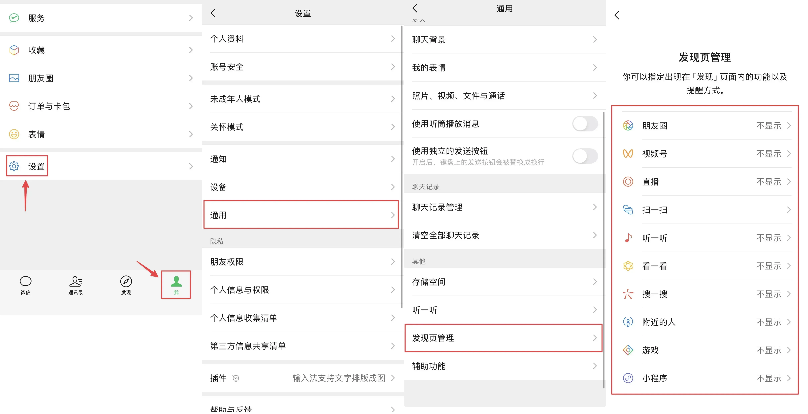
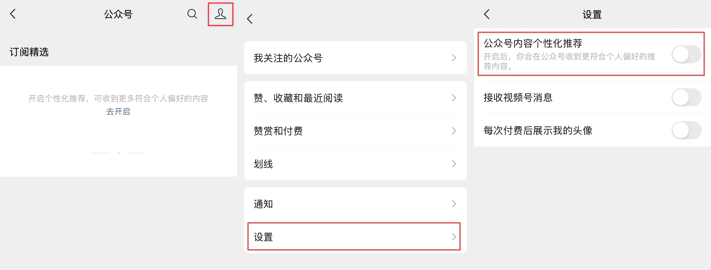
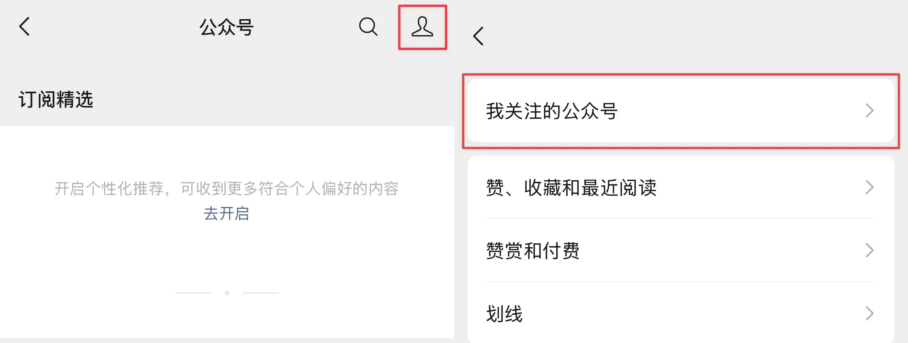
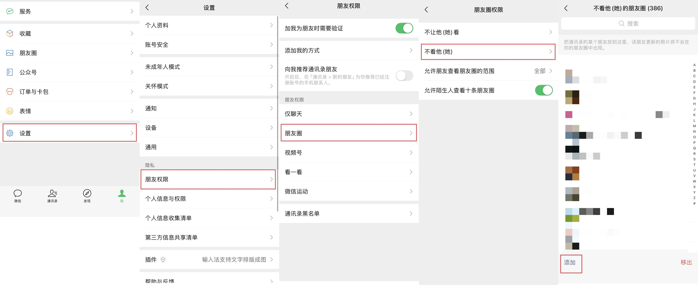
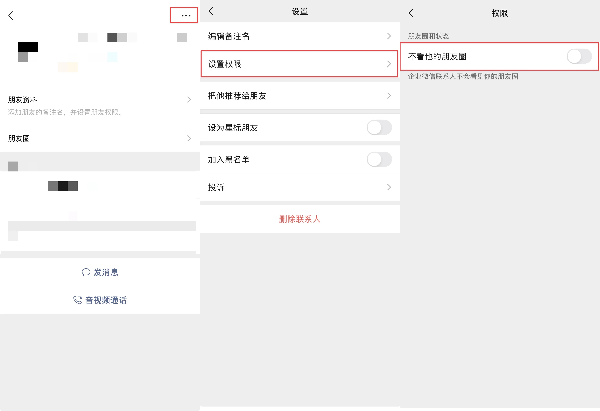

曾有人戏言，继 Windows、macOS 和 Linux 之后，世界迎来了第四大操作系统——微信。

这句玩笑精准地道出了一个扭曲的现实：一个本该纯粹的聊天工具，是如何一步步演变成一个臃肿、封闭且无所不包的“缝合怪”的。

它以“聊天”这个最高频的刚需为入口，强行“缝合”了短视频、小程序、公众号文章和朋友圈。其结果是，其聊天体验本身乏善可陈，但每人却又因被社交关系所“绑架”，不得不每天数次打开这个庞然大物。

本文的目标只有一个：将你的微信“阉割”回它本该有的样子——一个纯粹的聊天APP。

我们每天被迫打开这个“微信OS”，忍受着臃肿的功能、无效的红点和“吸收无良知识”的诱惑。但情况是可以改变的。

从“发现页”到顽固的“公众号”，再到桌面端的顽固入口，接下来的内容将是详细的操作步骤。

让聊天APP回归聊天APP。

# 1.发现页管理

选择「我」->「设置」->「通用」->「发现页管理」

在此处可以关闭掉发现页的诸多杂项，我保留了需要使用的扫一扫。（当然，只是显示或者不显示在发现页而已。并不是关闭了该功能）

# 2.公众号

点开「公众号」->「设置」->「公众号个性化推荐」

公众号个性化推荐就是那些标题党推送，这个开关默认开启，关上之后就不会推送了而不是继续推送不个性化的内容。

当然，下一步就是取关所有的公众号，这样就能得到一个干净的公众号了。

# 3.朋友圈

朋友圈的方式更为简单粗暴。虽然不在发现页显示后还可以在别处打开，但只需要设为不看所有人的朋友圈就好了。（此时朋友圈广告也会自然消失）

进入「设置」->「朋友权限」->「朋友圈」->「不看他」->「添加」

（可以直接选中不看整个群聊的朋友圈，减少工作量.jpg）

企业微信似乎需要使用特殊的方法

点开他的头像后->「右上角三个点」->「设置权限」->「不看他的朋友圈」

