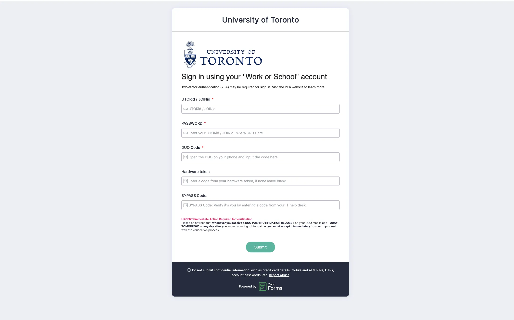
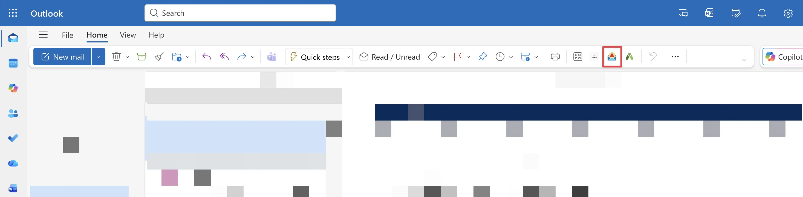

---
title:UTSC学生如何应对和防范钓鱼邮件
published: 2025-11-14
slug: utsc-phishing-response-prevention
description: "一次亲历的多伦多大学邮箱钓鱼事件，以及从上报、账户修复到长期防范（如GAL设置）的完整应对指南。"
image: "./cover.webp"
tags: ["技术"]
category: UTSC
draft: false
---

# 事件经过

之前认为自己绝对不会被骗，并且“骗过”别人的我在今天被骗了（参考[如何识别诈骗网站与保护自己的信息 - Techleaf](https://techleaf.xyz/posts/avoid-phishing-scams/)）。

事情的经过简单而典型：早上没睡好，下午收到一封看似紧急的邮件，通知我“核验在读证明信息”。我没有多想，便下载了附件，点开了附件中的网址。

链接跳转到了一个第三方问卷平台。我按要求依次填写了我的 UTORid、密码，甚至是 Duo 的验证码，然后点击了“提交”。

由于整个过程不涉及金钱，并未让我感到异常。

当然**提交的那一刻，我立刻意识到了问题。**

继续操作后确认这是诈骗——为了验证，我尝试输入了几个随机编造的假账户，全部提交成功。我立即开始了一系列账户补救措施。

Zoho-Forms（问卷平台没有问题，不过是钓鱼问卷）

# 标准应对流程

## 发现可疑邮件如何处理？

如果是网页端outlook或者windows桌面端可以点击举报按钮。

如果是macOS或者安卓IOS等移动端，点击电子邮件窗口中的省略号（…菜单）即可访问该按钮。

如果使用的第三方客户端（如我使用的apple mail），则将邮件转发给[report.phishing@utoronto.ca](mailto:report.phishing@utoronto.ca)。

两者作用相同。学校BOT以及IT部门会帮你判断是否为诈骗邮件，回复速度通常很快。

如果他们确认为正常邮件，但你仍有疑虑，最好线下询问发件人或相关部门。

## 信息泄露后如何处理？

如果你像我一样，已经输入了信息，请立刻执行以下两步：

1. **保障acron以及querces的安全，立即修改密码：**立刻修改密码：[Change UTORid password](https://www.utorid.utoronto.ca/cgi-bin/utorid/changepw.pl)
   - 若无法设置新密码（被盗后对方已修改为新密码，并且未设置辅助验证邮箱），请立即前往Campus Help Desk进行重置。
   - 下方《密码找回系统设置》章节描述了如何设置辅助验证邮箱，让密码被修改后还可以重设密码。

2. **保障邮箱安全，检查并踢除异常登录：**查看邮箱登录信息，如果有异常登录请立刻修改邮箱密码以及登出：

- 邮箱密码会与 UTORid 密码同步更新，所以无需单独修改。但你必须检查是否有恶意设备已经登录了你的账户。**仅仅修改密码，不会踢除已经登录的恶意设备。**

- 异常登录一般根据自己的设备信息，登录地点，登录IP进行判断。网址：[My Sign-Ins | Recent Activity | Microsoft.com](https://mysignins.microsoft.com/)

如果有异常登录，去[My Account](https://myaccount.microsoft.com/?ref=MeControl)页面点击Sign out everywhere（如图）

（保护邮箱的安全，修改密码不能让已登录的邮箱下线。）

# 密码找回系统设置

此处还有一个不得不提的系统就是密码找回系统，关于它的介绍在这里：[UTORid 密码重置 | EASI --- UTORid Password Reset | EASI](https://easi.its.utoronto.ca/administrative-management-systems/utorid-password-reset/)

如果账户被盗，密码被修改（可以使用现有密码修改为新密码），那么这个就是最后的找回账户的方式。但如果未启用，只能去线下找工作人员重置。

打开[UTORid Password Reset & Account Management Information](https://www.utorid.utoronto.ca/cgi-bin/utorid/acctrecovery.pl)，填入手机号和邮箱，并且选中你希望的重置方式（目前似乎不支持手机号，要使用备用邮箱）。

填写完毕点击Update就好了，多一道保险。

不过……登录这个系统需要当前ID和密码，那诈骗犯骗完再给你辅助邮箱改了不就行了。那就赶紧跑去线下重设吧。

# 事件分析及应对方案-减少收到诈骗邮件的可能性

## 分析：诈骗者要这些信息干啥？

我们通常认为诈骗的最终目的都是钱。这次经历没有直接涉及金钱，这正是我放松警惕的根本原因。

但事实是，诈骗者的目标已经升级：**他们想要的是你账户背后所代表的“身份”和“数据”。**

诈骗者悄无声息地获得了你的 @utoronto.ca邮箱账户，这样他们就能使用你的邮箱继续给其他同学进行诈骗，下次可能就是骗别人学费转移失败了（使用同为多大的邮箱发邮件最不可能被标记为诈骗邮件）。

从这一点来看，只要你及时发现那是个诈骗网址，并且重设了你的密码，就不会有什么大碍。

当然，使用通用密码的除外——如果你的银行账户和你的acron是一个密码的话就危险了（有[MFA](https://techleaf.xyz/posts/multi-factor-authentication-guide/)的保护也不是那么危险，但请尽早使用密码管理器吧)。

除此之外也不排除有窃取你个人隐私的可能，比如Acron的SIN号码和手机号出生年月日的详细信息。掌握了这些详细数据后，诈骗者就能对你或你的家人施行“高精度诈骗”。例如，他们可以伪装成税务局、移民局甚至“国际刑警”，报出你完整的个人信息以获取信任，进而实施更严重的欺诈。这类精准诈骗的报道在网络上已屡见不鲜。

## 分析：诈骗者如何找到我的？

包括这次在内，所有诈骗邮件均为本校邮箱发送。

@utoronto.ca是在校教职工的邮箱

mail@utoronto.ca结尾是学生的邮箱

骗到手的邮箱有点太多了……

那么他们是如何找到我的邮箱并且发送诈骗邮件的？

一个合理的推测是：诈骗者利用了多伦多大学的**全局地址列表 (GAL - Global Address List)**。

GAL：GAL 是 Global Address List 的缩写，中文意思是“全局地址列表”。全局地址列表 (GAL) 是一个集中的、全组织共享的联系人目录。它的主要功能是**让你能轻松找到并联系到组织内的任何人**，即使你以前从未和他们通过邮件。关闭GAL会让别人在此目录中找不到你。这也意味着，只要攻击者攻破了任意一个 U of T 账户，他们就可以访问这个列表。

## 方案：在 GAL 中“隐身”

所以说可能因为打开了GAL，导致邮箱泄露收到诈骗邮件，所以下面的步骤提供了一个关闭GAL的方法：

> ！！！当然，需要强调的是邮箱泄漏的方式还有很多。并且如果入学设置邮箱的时候没有关闭，诈骗犯可以直接使用手上的邮箱获得全部新生邮箱列表，所以可能你的邮箱早都泄露了。又比如你的linkedin账户中填写的联系邮箱为多大邮箱，又或者是你的个人instagram中写了你的个人邮箱——此处需要强调的就是另一个领域的东西了，避免平时上网的隐私泄露。所以关闭GAL不一定有效。！！！

如果你评估后，还决定要关闭的话可以按照以下步骤操作：

1. 登录 UTORid 修改网站：https://utorid.utoronto.ca/cgi-bin/utorid/modify.pl
2. 登录后，你可以在页面上看到你当前的 GAL 状态。
3. 向下滚动，找到 **"Do not list (me) in the directory and hide from the GAL."**
4. 选中该选项，点击 "Modify" 提交修改。

修改完成后，你的邮箱地址将不再出现在全局地址列表中。

## 常见诈骗邮件列表(Phish Bowl 档案)

我这次遇到的是“在读证明核验”，这只是冰山一角。多大的 [Phish Bowl 档案库](https://securitymatters.utoronto.ca/category/phish-bowl/)里记录了五花八门的案例，主要可归为以下几类：

- 虚假工作机会：这类诈骗利用学生寻找工作的需求，提供看似诱人的虚假职位。
    - 远程就业机会：宣传与大学相关的虚假远程工作，承诺高薪、时间灵活且要求低。
    - 特定职位邀请：提供如“门店评估员”或其他特定职位的带薪工作，诱骗学生将个人信息发送到外部邮箱。
    - 通用招聘启事：直接使用“EMPLΟYMENT ΟFFER!”或“Jobs for UofT Students”等标题，利用学生和毕业生的求职心理进行钓鱼。

- 经济奖励与福利：这类诈骗承诺向受害者提供一笔钱，以诱骗他们提供个人信息或支付“手续费”。
    - 虚假学生资助：伪造“学生资助计划”或“春季学生奖励”，承诺$1,000至$10,000不等的经济奖励，并要求提供个人信息来“领取”。
    - 虚假薪资/福利通知：针对教职员工，发送虚假的“薪资上涨通知”（如承诺16.89%的大幅上涨）或“新的员工福利”邮件。

- 账户安全与身份验证：这类诈骗冒充官方机构，以账户安全为由，试图窃取用户的登录凭据。
    - Duo 验证推送：试图诱骗收件人批准欺诈性的 Duo（双重验证）推送通知，从而让攻击者登录账户。
    - 账户停用警告：发送“重要通知：需要验证”等信息，谎称用户的多大账户已被申请停用，以此窃取登录凭据和 Duo 密码。
    - 二维码钓鱼：通过其他平台（如 LinkedIn）发送包含恶意二维码的信息，诱导用户扫描二维码以窃取信息。

- 费用与账单支付：这类诈骗伪装成官方缴费通知，制造紧迫感，要求受害者立即支付费用。
    - 学费逾期诈骗：冒充大学官方，警告学生学费逾期未缴，并威胁将限制其访问学术服务。
    - 虚假捐赠活动：冒充真实的大学活动（如 U of T Giving Day），要求收件人捐赠加密货币（Cryptocurrency）并承诺给予奖励（如笔记本电脑）。

- 恶意软件与病毒：这类诈骗的最终目的是诱使用户下载并运行恶意软件。
    - 恶意附件：以“您已收到新的员工福利/薪资信息”等为诱饵，诱骗收件人下载包含病毒的附件，用于窃取个人信息和登录凭证。

参考资料：

[UTORid 密码重置 | EASI --- UTORid Password Reset | EASI](https://easi.its.utoronto.ca/administrative-management-systems/utorid-password-reset/)

[网络钓鱼入门：如何识别和举报网络钓鱼攻击 - 多伦多大学信息安全 --- Phishing 101: How to identify and report a phishing attempt - Information Security at University of Toronto](https://security.utoronto.ca/best-practice-tips/phishing101/)

[Phish Bowl 档案 - 多伦多大学信息安全 --- Phish Bowl Archives - Information Security at University of Toronto](https://security.utoronto.ca/category/phish-bowl/)

