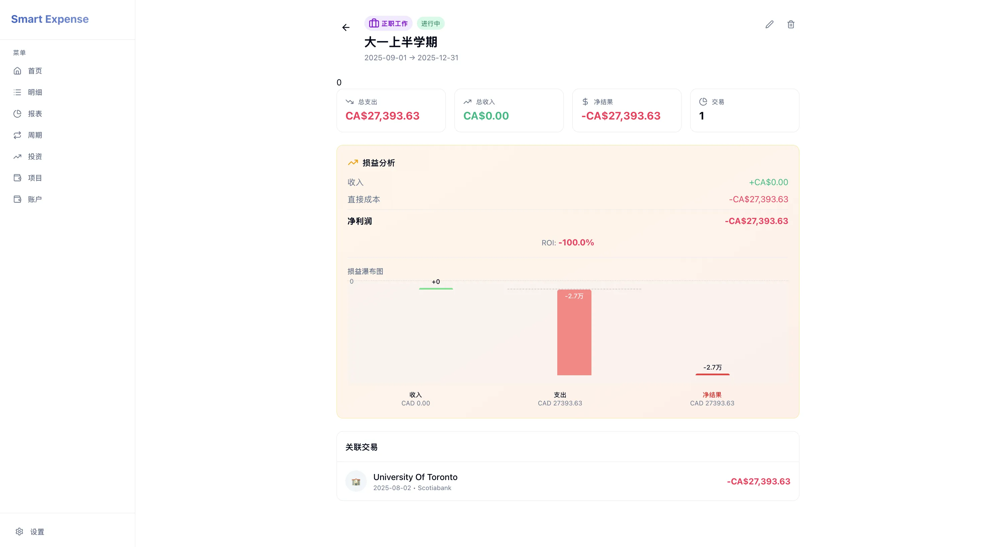

`APP已进入最后的测试阶段，但目前还不存在使用渠道。`

# 为什么市面上的记账 APP 都不懂我？

还记得最开始，我只是想找一款心仪的记账 APP。作为一个独立开发者，我对工具的要求其实并不算苛刻，只有三点：

1.  **支持 AI 扫描小票**（拒绝手动输数字的痛苦）。
2.  **跨平台支持**（iOS + Mac/Web，我需要在电脑前复盘）。

然而，当我翻遍了 App Store 和 GitHub，却发现这种APP不存在。

最先尝试了**一木记账**，功能确实丰富，但它不支持 AI 识别（只能文字输入），且没有 Mac 端，只有移动端，这对习惯在桌面端管理数据的我来说是硬伤。

后来找到了**钱迹**，号称全平台支持，简洁纯粹。但遗憾的是，它也没有接入 AI 识别能力，在这个 LLM 爆发的时代显得有些掉队。

还有朋友推荐的**貔貅记账**，功能逻辑很强，但那个 Mac 端的界面实在有点过于“复古”，且同样缺乏 AI 的加持。

找了一圈，本以为会用上心仪的APP，实际却让我的需求清单从两条默默增加到了三条：

1.  **AI 驱动**：扫描、语音、自然语言记账。
2.  **全平台**：iOS + Mac/Web 数据同步。
3.  **现代 UI**：看着舒心。

既然市面上没有，但妥协是不可能妥协的。那就自己造一个吧。

# 初步开发

最开始，我的构想非常简单粗暴：**做一个带 AI 功能的流水账工具就好了。** 

那时候我认为，记账不就是 `收入 - 支出 = 结余` 吗？

 我很快搓出了第一版原型，它能跑，能记，也能看图表。

但当我试图记录两笔真实的消费时，我发现我的“流水账”逻辑彻底崩塌了：

1.  **iPhone：** 我买了一台 1100 加元的 iPhone 17。
    * 在旧逻辑里，我当天的消费额暴涨，导致我 11 月的报表显示“严重赤字”。
    * 但我的直觉告诉我这种记账方法逻辑不对：**我并没有乱花钱。** 这台手机是要用 3 年的，它不应该毁掉我这个月的报表。
2.  **学费冲击：** 我在 UTSC 一学期要交 3w 加币（约 15w 人民币）的学费。
    * 在旧逻辑里，交学费那个月的柱状图冲破天际，导致其他日子的饭钱在图表上几乎缩成了一条线。
    * **这更不对了！** 这笔钱是管未来 4 个月的，怎么能算作那一天的“亏损”？

**光是记“流水”，不仅无法反映真实的生活，反而制造了巨大的数据噪音，让我看不清真正该省钱的地方。**

---

# 重新定义记账：Me Inc.

为了解决这个问题，我引入了 **会计** 的核心逻辑-资产负债表-现金流量表-利润表。

然后设计了 **双轨制视图** 来解决这个矛盾：

## 1. 生存视图—— 现金流
**“我还能活多久？”**——一个公司不盈利还能活一会，若没有现金流那只能当场清算。

在这里，买手机、交学费就是实打实的现金流出。

右上角的月份指的是按照我近期消费水平，我的现金流还能让我活几个月。

## 2. 生活视图—— 经营损益
**“我的日子过得奢侈吗？”**

在这里，我引入了 **摊销** 和 **折旧** 的概念。

* **固定资产折旧：** 买 iPhone 的 1100 刀不会计入当天支出，而是自动生成一个“资产”，按 3 年折旧（折旧=掉价）。每天掉价只有不到 **$1**（最后还能出售，有残值=剩余价值）。
* **项目费用均摊：** 3w 刀的学费被扔进一个 **Project（项目）** 容器，平摊到学期的 120 天里。

结果就是下面这张图：即使交了巨额学费，我的柱状图依然是平滑的，底部垫高了一层“学费成本”，上面是我每天真实的饭钱。

---

# 功能模块

## 资产
普通的记账 APP 把买电脑算作“消费”，而我把它算作“投资”。
在资产页面，我可以看到所有设备的 **当前残值 (Book Value)**——现在卖掉多少钱。

## 智能利润表
即使本月现金流是负的（因为买了资产），但只要 `收入 > (日常支出 + 资产折旧)`，**智能利润表** 依然会显示本月盈利。

当然，这个表就像财报一样具有一定的欺骗性。

## Project：不只是工作
后来引入了 **Project (项目)** 的概念，它有两个用途：
1. **消费型项目：** 如出门旅游。它将预付的机票钱、住宿费“挪”到旅行的那几天，然后将旅行期间的支出平摊到那几天。

2. **经营型项目：** 如副业接单。它可以计算 `副业收入 - 副业支出如(打车费 + 软件费用)` 后的 **真实净利润**，帮我计算副业的回报率。

---

# 移动端适配
当然，肯定有移动端适配的。

