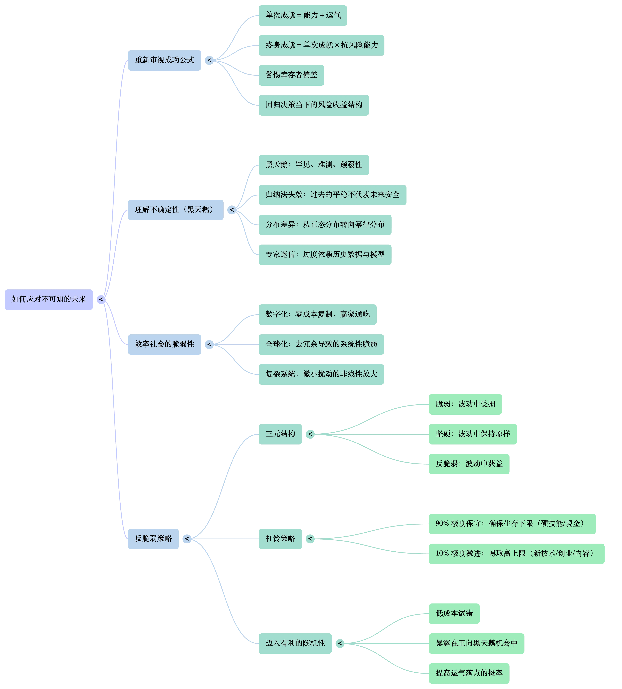

import GameToggle from './_inter/GameToggle.astro';
import zuolun from './pic/左轮.webp';
import DistributionChart from './_inter/DistributionChart.astro';
import PowerLawIllustration from './_inter/PowerLawIllustration.astro';
import SurvivorBiasSim from './_inter/SurvivorBiasSim.astro';
import RussianRouletteSim from './_inter/RussianRouletteSim.astro';
import TurkeySim from './_inter/TurkeySim.astro';
import jixiang from './pic/吉祥三傻.webp';
import quanqiuhua from './pic/全球化.webp';

> 总有人以为只要足够勤勉，就能换来确定的结果。但世界更像一个包含噪声、断点与级联反应的复杂系统：同样的选择，在不同时间线里可能走向完全相反的结局。于是，一个更关键的问题出现了——当未来并不可知时，我们到底该用什么标准做决策？这篇文章尝试给出一个答案：不追求一次运气导致的大富大贵，而是追求在多数未来里都能安稳存活，甚至在少数未来里反而受益。

——真正危险的从来不是风险，而是不知道自己正在冒险。
:::note
注：文内有多个互动小游戏，若不想看到，可以点击该按钮屏蔽。
:::
<GameToggle />

# 0. 通过能力获得成就

> 错误的公式：单次成就 = 能力
>
> 我们获得的成就，其实 **夹杂了大量运气成分** ，但当事人往往很难承认这一点。

好作品一定有人欣赏，好软件一定有人使用，好产品一定会被人发现。我们似乎在默认努力等于收获，技能决定高度。我们像做题一样规划人生——考上好的大学，学习热门专业，掌握复杂的代码或财务模型，然后取得成就。

在这个理念里，“运气”被视为无关紧要的噪点。我们坚信：只要在确定的世界里精进技艺，就能获得确定性的回报。

然而，这种确定性的安全感很大程度上是错觉——生活实际上充满随机性。

------

无论你是否承认“能力重要，运气不重要”，你总是会在现实里不断看到：有人凭一次大运翻身，被歌颂为天才；也会看到走同样路径的运气欠佳者被嘲笑为笑话。 **这并不是因为世界不公平，而是因为我们常常用“已发生的结局”替代“当时的决策质量”。** 要理解这一点，我们先从随机性如何塑造命运的叙事说起。

# 1. 被随机性戏弄的命运

> 我们所经历的历史，不过是无数随机分支中的其中一条。
> 因此，评价一个人的选择，不能只站在结果已发生的未来回望，而应回到当下——在结局尚未揭晓时——看它的风险与收益结构。

## 1.1 那些被命运眷顾一次的人

设想有这样一段历史：一位富豪举办赌局——一把左轮手枪有 6 个膛室，他在其中装入 <strong>5 发子弹</strong>，转动弹巢后让你把枪口对准自己扣下扳机。

如果你侥幸活下来，富豪就当场给你100万美元。

<RussianRouletteSim />

在历史的剧本里，结果只有两个，并通往完全不同的舆论终点：

- 有**16.67% 的概率**媒体争相报道一个“商业奇才”，歌颂他如何用过人的胆识赚取第一桶金，将其塑造成敢于梭哈、把握机遇的“孤勇者”。
- 剩下**83.33% 的概率**：社会新闻刊登一条令人唏嘘的消息，嘲讽一个愚蠢而贪婪的投机者，为了虚幻的财富在富豪面前自寻死路。

可历史只会经历其中一个端点，这条新闻最终只会落在一处。如果只看幸存者的结局，我们就可能会把“运气”误认为“能力”。

## 1.2 过程与结果的错位评价

后人的评价往往具有 **后验性** ：他们根据已发生的既定事实去回溯动机，却忽视了在扣动扳机的那一刻，所谓“英雄”和所谓“疯子”在本质上是同一个人。如果此时剥离结果的干扰，从 **未定历史** 的角度审视这个行为。我们会发现参与者的期望收益并非 100 万美元，而是：

$$E = \frac{1}{6} \times \text{\$}1,000,000 + \frac{5}{6} \times (\text{生命代价})$$

从概率分布来看，他获得的其实是 **16.67 万美元的纸面富贵** 与 **欠下死神的 5/6 条命**。很明显这不是一个诱人的赌局。

理性的观察者不会接受这种赌局，因为即便他赢了，其决策过程仍是糟糕的。他们所追求的是：无论落在哪条时间线，都能赚到钱，或至少不会输到不可承受。代价是赚取的上限可能被压低，但换来的是在多数时间线里稳定生存。

不过你也许会说：左轮赌局太极端，现实里我绝不会这么做。问题是， **多数随机性陷阱并不会以“自杀式豪赌”的形式出现** ，它们往往披着“连续正确”的外衣，让你在不知不觉中把判断权交给运气。

## 1.3 幸存者并不等于聪明人

还有一种更隐蔽、也更常见的“幸运”，发生在连续的随机事件中。

假设你连续 6 个月收到匿名邮件，每一封都精准预测了股市涨跌。在连续 6 次“神预言”之后，对方发来一个全新的股票，并且确信这只股票会大涨。此时的你如果不懂概率，大概率会确信屏幕对面坐着一位金融先知，于是在下一封信到来之后梭哈全部积蓄。最终，钱财如泥牛入海。事后与好友聊天提到此事，你发现你的好友也受到了这种信件，但是很可惜，他的信件中第二次便预测错了，他也没有收到第三封信。

想来在事后复盘时不难猜到骗子的做法，即大范围的投送预测，最终总会有几个是全对的。这就是经典的“二元预测骗局”。骗子无需任何金融知识，只需要足够的样本量。假设起始样本是 10000 人。第一个月，向其中 5000 人喊涨、5000 人喊跌；第二个月，只对上一轮“预测正确”的 5000 人继续对半分组预测……六轮之后，必然有$10000 \times (1/2)^6 \approx 156$ 人，连续收到了 6 次全对的预测。

这里存在一个视角错位：

- 作为接收者，你看到的是 $P(\text{连续6次正确}) \approx 1.56\%$ 的小概率“奇迹”，于是认为这必有缘由；
- 作为发送者，骗子看到的只是样本空间必然收敛的数学结果。他不在乎谁是幸存者，只知道：只要基数够大，总有人会成为深信不疑的“傻瓜”。

<SurvivorBiasSim />

两个故事看似不同：一个是瞬间豪赌，一个是持续误导；但它们利用的都是同一个效应—— **幸存者偏差** 。而这，正是我们需要重新定义“好决策”的原因。

## 1.4 从风险—收益结构开始

在幸存者偏差下，我们从未听见那 5/6 的死者与那 98% 以上被淘汰者——因为失败者是沉默的。

因此，我们应对那些唯结果论保持高度警惕。看到一个人的成功时，更多的去关注他所使用的策略，以及身处的时代。在剔除大量运气成分后，剩下的才是真才实学。至此也不难推测出更好的策略，是即使落在不利时间线，也不至于出局的策略；如果恰巧运气好，也能赚得一个还行的财富。这样的方式最大化了你生存的几率。

换句话说：在熟悉领域里，利用自身能力去做 **有限损失** 的事，把下限抬高。

于是我们总结出了一条取得单次成就的真实公式：

$$
\text{单次成就} = \text{能力} + \text{运气}
$$

------

那么问题来了：最大化能力，找一份下限不低的工作，这样就够了吗？

还远远不够。因为本章所讨论的更多是“可被估计的风险”，在这种情况下，你至少能写出概率，理解分布。但现实里还有一类更致命的风险， **你甚至不知道它会来，更不知道它会以什么方式来。** 它不止与我们可以想象的“随机性”属性相关，更与我们想象不到的“不可预测”属性有关——也就是接下来要说的黑天鹅事件。

# 2. 被黑天鹅玩弄的专家们

> 事情发生造成的影响往往并不服从正态分布，而更接近幂律分布。专家们却常常默认正态分布，因此在黑天鹅来临时倒下。
>
> 极端事件一旦发生，常会造成不可逆的损失，但它在平稳期被系统性忽视。

## 2.1 农场里的专家

为了理解所谓的“不可知”，我们讲另一个被讲述了无数次的故事—— **火鸡** 。

假设你是一只火鸡，有位友好的农场主每天上午 9 点准时带来食物。作为一只热爱科学的火鸡，你开始收集数据：

<TurkeySim />

根据这 1000 个样本点，你的统计模型得出一个置信度极高的结论：“农场主不仅爱我，而且我的生活将永远平稳延续。”甚至，随着样本数 $N$ 增加，你对该结论的信心在第 1000 天达到顶峰。

然而，第 1001 天是感恩节。
农场主手里拿的不是饲料，而是屠刀。

对火鸡而言，这一天是颠覆认知的黑天鹅；对农场主（观察者）而言，这只是计划内的流程。

注： **黑天鹅事件** 指 **极其罕见** ！ **无法预测** ！，但一旦发生就对世界或某领域造成巨大、颠覆性影响的突发事件。该概念常用来比喻那些打破常规、超出经验预期的事件。

如果说第一章的赌徒是少数的“明知可能死还要赌”的人，那么这只火鸡才更像现代社会的大多数人：我**们多数时间里表现出一定程度的基于历史数据的保守，当然，也导致基于历史数据表现产生的过度自信。**

这就是**归纳法的陷阱**：过去的平稳不仅无法保证未来安全，有时甚至是巨大风险累积的假象。我们在第一章里嘲笑赌徒不懂概率，但在这里更需要警惕的是： **即使你拥有完美历史数据、建立了完美模型，也可能在未来某一刻归零。** 因此必须重视风险管理，否则赌徒会嘲笑你还没他懂风险。

## 2.2 幂律分布

<table>
  <tr>
    <td style="vertical-align: top; border: none; padding-right: 20px;">
        
现代社会的专家与精英，常犯和火鸡一样的错误： <strong>过度依赖正态分布模型进行预测。</strong>

        
在身高、体重等自然领域，极端值的影响微乎其微——你找不到一个身高 30000 米的巨人来抬高全人类平均值，这也与正态分布6个标准差之内包含约 99.9999998% 的数据相符合。这样的世界里，身高相对平庸且可预测。

        
但在财富、金融危机、流行病、技术变革等领域，极端值的出现更接近 <strong>幂律分布</strong> ，也就是说谁也无法料到下一秒是否真的会出现一个30000米高的金融巨人或者财富巨人，这种领域中正态分布自然会失灵（按照正态分布的理论，亿万年出现一次的情况总是频繁出现）。我们只能换成概率衰减更弱的幂律曲线分布来进行预测。正因为这些领域真的会出现单一极端事件，足以摧毁此前累积的平稳收益。

    </td>
    <td style="width: 40%; min-width: 300px; vertical-align: middle; border: none;">
        <PowerLawIllustration />
    </td>
  </tr>
</table>

关于幂律分布的小故事：

- 假设人类殖民火星，并随机捕捉了 20 个火星土著。测量发现，他们的身高都在 1.8 米到 2.2 米之间，平均身高 2 米。

- 这时，一位地球来的资深统计学家自信地画出了一条 **正态分布曲线** 。他告诉指挥官：“放心吧，根据我的模型，遇到一个身高 5 米以上巨人的概率，比你连续中十次彩票头奖还低。火星人极其安全。”

- 第二天，第 21 个火星人走了出来。

- 他身高 20 米。

- 这一瞬间，之前所有的平均值、方差、置信区间全部作废。这位巨人仅仅出现了一次，就彻底摧毁了统计学家的模型。

下图对比了正态分布与 t 分布在大盘波动概率上的差异：

注：因幂律分布在初始阶段趋近于无限，较难体现概率分布，故此处更换为 t 分布。虽然 t 分布不是严格的幂律分布，但在尾部区域它**渐近地表现为幂律**。当 `|x| → ∞` 时，t 分布的概率密度函数近似于 `P(x) ∝ |x|^(-(ν+1))`。

<DistributionChart />

- **2008 年金融危机前**：华尔街许多风险模型（如 VaR）低估了尾部风险，给出近乎“极不可能崩盘”的错觉。直到雷曼兄弟倒下，模型在恐慌面前迅速失效。
- **2020 年的实体餐饮**：一位勤勉的老板，厨艺精湛（能力）、现金流健康（运气）。按教科书评估，他很“稳健”。但病毒不在乎商业计划书，一夜之间线下流量归零。
- **2023 年后的 AI 冲击**：无数学生投入数万小时磨练画技或代码语法。然而当大模型普及后，一些曾被视为“铁饭碗”的技能壁垒迅速变薄。
- **202x年的房地产冲击**：无数人资产高位套牢（当然，此次事件对于少数人来讲是完全可预见的。就像李嘉诚15年就高调跑路了。）

在黑天鹅面前，大多数人都是脆弱的。

于是出现一个现实困境：就算你不碰明显豪赌，就算你足够勤勉、足够专业、足够“稳健”，你仍可能被某次外部冲击清零。 **个人稳健不等于系统安全。** 我们只是生活在一个表面稳定的世界里。

## 2.3 黑天鹅到来之前的伪稳定

第一章的结论是：“依靠能力，找一份下限不低的工作。”这听起来明智，但如果环境本身发生变化呢？回望历史会发现：真正的风险不只是我们能预见并计算概率的“风险”，还包括 **完全无法预知的不确定性** ——而后者往往影响更大。而人们的思维总是高估第一种风险而忽视第二种风险。

注意：黑天鹅的定义之一就是“不可预知”。如果你能确定未来会发生某事，那么对你而言它就不再是黑天鹅，因为不确定性已被消除。

- “既然过去 5 年工资每年涨 10%，那 10 年后我将拥有……”
- “既然过去 30 年全球化一直推进，那供应链将永远稳定……”

这种思维让我们构建了极其 **高效但也极其脆弱** 的生活系统：为了效率零冗余，为了最大化收益而满仓押注单一技能。所以当你觉得岁月静好、一切尽在掌控，往往是因为你正处于长周期上升阶段。你以为那是能力带来的稳定，其实可能真的只是运气好，恰好生活在风平浪静的间隙。 **一旦危机袭来，你会发现自己没有任何抗风险能力，资产可能顷刻归零。**

于是我们的第二个公式出现：

$$
\text{终身成就} = \text{单次成就} \times \text{抗风险能力}
$$

------

到这里，我们得到一个个体层面的结论：想要终身成就，你不仅要提高单次成就，还要提高抗风险能力。那如今的黑天鹅究竟衍化到了什么程度，我们要多少抗风险能力才能有效应对，这就是后面两章我们要讨论的东西。

# 3. 效率社会的黑天鹅悖论

> 在全球化程度较低的时代，黑天鹅即便发生，其影响往往被限制在局部范围内。随着全球化与数字化加深，世界演变为复杂系统：内部高度耦合，影响被非线性放大。黑天鹅不再是边缘事件，而开始渗透进社会运行的各个层面，并呈现更高频率与更大影响尺度。
>
> 因此，在可预见的未来，黑天鹅会更频繁地出现，并与每个人息息相关。

从物理层面看，人类社会曾长期受天然约束——体力有限、时间有限、传播速度有限。这些因素使多数结果近似正态分布，导致极端事件难以主导整体格局。

但过去几十年里，世界的底层逻辑发生根本变化：各领域互联互通，使影响可以被非线性放大，各行各业的分布正在从正态转向幂律。

  

## 3.1 数字化：零成本复制，赢家通吃

数字化之前，能力的影响范围天然受限：如果你是村里最好的歌手，你的听众大约只有一百人；即便出现更好的歌手，也只是局部替代，不会对更大范围造成冲击。此时你失业的概率/赚取的收入在行业里符合正态分布，也就是大概率不会失业，也不会赚得和别人差太多。有句俗话说法是“地球少你一个照样转”。

互联网时代，数字技术以极低复制成本与近乎无限传播半径，打破地理与规模约束。一个略胜一筹的歌手，其作品能以接近零的边际成本在全球传播并被反复消费。“赢家通吃”的格局，压缩甚至消灭了其他参与者的生存空间。此时你赚取的收入就在行业里呈幂律分布，收入不少但与顶流相差甚远。赢家在顶楼狂欢，输家在温饱线挣扎

由此可见，世界的分布正在从正态变到幂律。如果此时还用正态分布进行计算，你会发现出现一个超级明星的收入（力压他人好几个阶级）的概率是趋近于0的，因为早就超出6个标准差了——很明显完全错误了。

（注：此处的“更好”与前文公式相关：单次成就 = 能力 + 运气，因此“更好”可能只是运气更好，并不必然具备长期优势。）

## 3.2 全球化：效率机制下的脆弱系统

在全球化之前，一个国家的动荡很难波及地球另一端的小镇，不同系统之间存在天然的隔离带。在这种情况下，整体风险大体符合正态分布：身边的小问题可能频发，但不太可能出现世界级的系统性崩溃。当你所在的小镇粮食歉收时，仍然可以步行前往其他小镇，通过区域内部的调剂来弥补粮食缺口。

但在全球化之后，灾难往往具有全球性特征。你的小镇出现歉收时，可能会发现周边大片区域都面临同样的问题。原因可能多种多样，例如某一年化肥产业的生产链出现问题，导致化肥有效成分不达标；或者发生蝗灾，而恰好杀虫剂失效。更为危险的是，现代社会对工业体系的依赖程度极高，一旦产业链中断，相当一部分年轻农民很可能已经不熟悉如何进行传统的人工施肥和人工收割。

当然，追求效率的不止有农业领域，如今各行各业的状况差不了多少。都为了追求极致效率，消灭了本该有的冗余与缓冲。如现代商业**即时生产**的策略，工厂不压货，库存只够用 3 天，意味着一旦出现三天以上的断供，就会导致存货不足。甚至订单量一大都有可能生产不过来。以及有着**全球供应链**的问题，我们的一部手机的零件来自 40 个国家，任何一个国家停摆就会导致手机无法产出（或者对应的材料价格上涨，质量无法担保等）。

原本的缓冲区消失后，导致现在的系统处处是故障点。比如：

- **2020 年初**，全球爆发“汽车芯片短缺危机”，起因是车企为了执行“即时生产”（Just-in-Time）策略以削减库存成本，在疫情初期误判形势取消了芯片订单，导致产能被消费电子抢占。当需求反弹时，车企无芯可用，最终导致全球汽车减产超 1000 万辆。

- **2021 年 3 月 23 日**，“长赐号”（Ever Given）在苏伊士运河搁浅并导致航道拥堵约 6 天，引发大规模航运延误，凸显关键节点阻塞对全球贸易的放大效应。

  

- **2024 年 7 月 19 日**，网络安全巨头 CrowdStrike 推送的一个微小更新错误引发全球 Windows 系统“蓝屏”，导致全球航空公司停飞、银行瘫痪、医院手术取消，波及约 850 万台设备。

- **Cloudflare**（大半个互联网基础）单是 **2025年** 就发生了：
  - **2025年3月21日：凭证轮换导致存储故障**（1H7min）|造成 **R2 存储服务** 全球性的写入失败和读取性能下降。 
  - **2025年6月12日：第三方云服务商故障**（2H28min）| Workers KV 服务不可用，进而影响了配置、身份验证及资产交付。
  - **2025年11月18日**：**机器人管理配置引发全球瘫痪**（约2H10min）|导致 **X（Twitter）、Spotify、Shopify** 等大量核心互联网服务停摆。
  - **2025年12月5日：WAF 规则错误**（25min）|导致全球约 **28%** 的网站出现 5xx 错误，受影响的服务包括 LinkedIn、Zoom 和 Discord。

我们发现，追求机制效率的全球化不仅让世界连接成一个整体，更让产业链变得无比脆弱。世界级的灾难从0逐渐变得有可能发生——此时便不能再用正态分布进行预测，必须使用幂律分布（身边影响不大的小问题可能频发，影响巨大的大问题也开始陆续出现)。甚至因为全球化加深，即便你身处传统行业（比如种地），也不可避免受到影响——化肥价格由全球能源市场决定，销路由期货与跨区域需求决定——而这些恰恰是黑天鹅频发的领域。

在此甚至可以大胆预言一下：灾难级的互联网故障迟早会发生。当然，根据上述推论，在可见的未来里各行各业亿万年发生一次的危机都会在近几年发生的。

## 3.3 复杂系统的非线性涌现

种种迹象表明，我们正身处一个高度复杂且缺少冗余的系统中。在该系统中风险不是线性累加，而是可能以指数方式爆发，任何微小的扰动（代码错误、港口拥堵）不再线性增加，而会沿高效网络被迅速放大。（熟悉编程里的算法复杂度这个概念应该很好理解.jpg）。并且多数实体产业有着持续“优化”和“去库存”在积累隐性压力。表面看似可控，一旦越过临界点，就触发雪崩式崩溃。

**这就是黑天鹅的温床：** 我们看到的是线性因果（A 导致 B），系统内部发生的却是非线性级联（A 触发 B，B 引爆 C，C 最终反噬 A）。在这种网络里，任何节点的震动都可能引发不可预测的风暴。

------

当黑天鹅变成“系统常态”，应对策略也必须升级。那么我们究竟应采用何种策略？这正是“反脆弱”要回答的。

# 4. 反脆弱——应对不可预知的未来

> 既如此，我们应该如何在这样的系统中存活？
> 脆弱的事物会在黑天鹅中受损，坚硬的事物会尽可能保持原样，唯有反脆弱的事物能在黑天鹅中受益。

既然黑天鹅并非偶然，而是当下环境的常态产物，我们就必须寻找可执行的应对策略。

## 4.1 脆弱、坚硬与反脆弱的根本区别

在讨论“反脆弱”之前，需要纠正一个常见误解：很多人以为世界中的物体只分脆弱与坚硬两种状态。

纳西姆·塔勒布在《反脆弱》中却提出了三元结构：

- **脆弱**：偏好稳定、厌恶波动；在混乱中受损。（如：精密瓷器、负债累累的赌徒、那只误以为生活永远平稳的火鸡）
- **坚硬**：对波动不敏感；在混乱中尽量保持原样。（如：石头、拥有稳定制度保障的人）
- **反脆弱**：需要波动与压力作为进化来源； **在混乱与黑天鹅中获益** 。（如：九头蛇——砍掉一个头，长出两个头）

在黑天鹅频发的世界里，单纯追求“坚硬”并不可靠。因为你无法预知下一次冲击是否会超过你的承受上限。更可取的方向，是让自己具备“反脆弱”特征： **把随机性变成增益来源。** —— 杀不死我的，会让我更加强大。

具体怎么做？可以抓住两条核心策略。

## 4.2 策略一：资产配置上的杠铃策略

回到公式里：

$$
\text{终身成就} = \text{单次成就} \times \text{抗风险能力}
$$

我们在已经累计了多次成就，有一定资产后，一定要对资产进行抗风险的配置，这是避免资产一夜归零的必要做法。而反脆弱的关键，是把资源配置在两个极端：一端极度保守，一端小比例极度激进。这样才能在黑天鹅事件中保证存活，并且用有限的损失获得黑天鹅潜在的无上限收益。

:::warning
本文不构成任何投资建议
:::

具体而言，可以采用如下资源配置方式：将约 **90% 的资源配置在安全区**，例如持有现金或国债。这一部分的核心目标不是追求收益，而是确保在任何“黑天鹅”事件发生时，你都不至于被系统性清零，从而保有持续参与的能力。

剩余约 **10% 的资源**，则用于进行高风险、高不确定性的尝试，例如小规模的风险投资。这部分配置的意义在于：一旦出现“黑天鹅”，你可以用**有限的成本**换取**理论上接近无上限的潜在收益**——正如火鸡场中，真正长期、稳定获益的始终是农场主，而非火鸡本身。

下面这段内容摘自《随机漫步的傻瓜》，就能很好的体现用黑天鹅赚取收益的情况，10%的资源或许能让你获得很大的收益：

    
有一次，有人请我发表对股市的看法。我说，我相信下个星期市场有很高的概率会略微上涨。有多高？“大概70%。”这显然是铿锵有力的意见。

    
接着有人插嘴说：“但是，纳西姆啊，你刚刚才吹嘘你大量卖空标准普尔500指数（SP 500）期货，赌市场会下跌。是什么原因使你改变想法？”

    
“我没有改变想法！我那么赌可是有很强的信心！（大家笑了起来）。其实，我现在还想多卖空一些！”

    
会议室内的其他人看起来丈二金刚摸不着头脑。战略家问我：“你到底是看涨（牛市），还是看跌（熊市）呢？”

    
我回答说，除了动物学上的意义，我不懂“牛市”或“熊市”的意思。就和前例中的事件A与事件B一样，我的意见是市场上涨的可能性比较高（我看好后市），但最好是卖空（我看坏结果），因为万一市场下跌，它可能跌很多。突然之间，会议室内总算有极少数交易员了解我的意思，并且开始发表类似的看法。下一次讨论时，他们果然没有再强迫我参加。

    
假使读者接受我的意见，也就是下个星期市场有70%的概率上涨，30%的概率下跌。但是再假设如果上涨，只会涨1%，下跌则可能跌10%。这么一来，读者要怎么做？是看好呢，还是看坏？

## 4.3 策略二：将时间迈入有利的随机性

4.2的策略是资产配置，而4.3所述的就是你的时间配置。即人究竟该去做点什么利用一下黑天鹅。——不难发现，当今世界里试错成本往往是线性的，但收益可能是幂律甚至指数级的。所以你可以用低成本反复试错，等待某次触发“黑天鹅”一飞冲天。

回到公式：

$$
\text{单次成就} = \text{能力} + \text{运气}
$$

低成本试错的本质，是用能力不断创造“可发生的机会”，让运气有更多落点。你无法控制运气何时爆棚，但可以提高它发生在你身上的概率。

许多人每天准时上班、按时完成工作，做得好也未必有额外奖励；准时上学、按时交作业，做得好也只是获得该领域知识。这更像“有限收益 + 隐性系统风险”。

而利用业余时间写代码做小工具、做自媒体发布内容、做产品化尝试、写写Blog：成本主要是时间；即使没人看，损失是锁定且可承受的；但若某个作品触发传播，它带来的流量与收益可能没有上限。

在复杂系统中，预测往往徒劳。更有效的策略是：尽可能让自己暴露在“有利的随机性”之中——多尝试、多迭代、多接触不同的人与信息源。只要你确信 **失败成本低、成功收益高** ，就应该去做。哪怕失败 99 次，只要第 100 次抓住那只黑天鹅，之前的成本都会被覆盖，甚至显得微不足道。

------

现在可以把前文线索收束起来：第一章提醒我们别被结果蒙蔽；第二章提醒我们别迷信模型；第三章解释黑天鹅为何更频繁；第四章给出可执行策略。 **最后，回到开头那把左轮手枪：同一个赌局，在不同价值体系下，会导向完全不同的人生设计。**

# 5. 结语：成为所有时间线的幸存者

回到开篇的左轮手枪赌局。

理性的观察者拒绝赌局，是因为那是脆弱的：赢了只是一次性的财富，输了却是生命终结。

理性的观察者警惕“专家迷信”，同样是因为脆弱：忽视尾部风险与不确定性，终会在黑天鹅中失去一切。

我们要构建的人生，应更像这样一场反脆弱的赌局：

- 最坏情况发生，我依然能安稳度过；
- 好运降临时，我能抓住机会实现跃迁。

这就是反脆弱的智慧，也是应对不可知未来的可行方案。
$$
\text{终身成就} = (\text{能力} + \text{运气}) \times \text{抗风险能力}
$$

------

参考资料：

- 随机漫步的傻瓜
- 黑天鹅
- 反脆弱

---

欢迎留下你的评论与建议，一起交流与成长！

