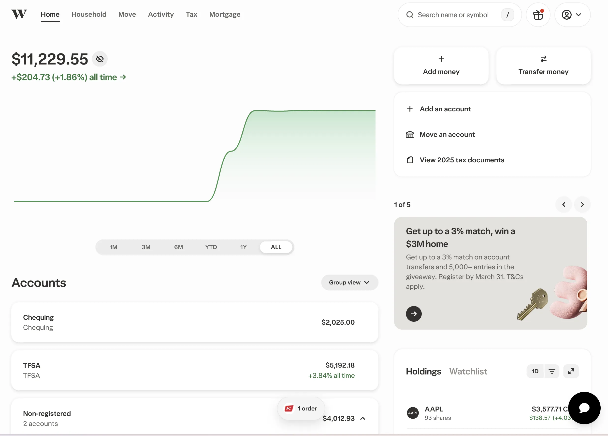
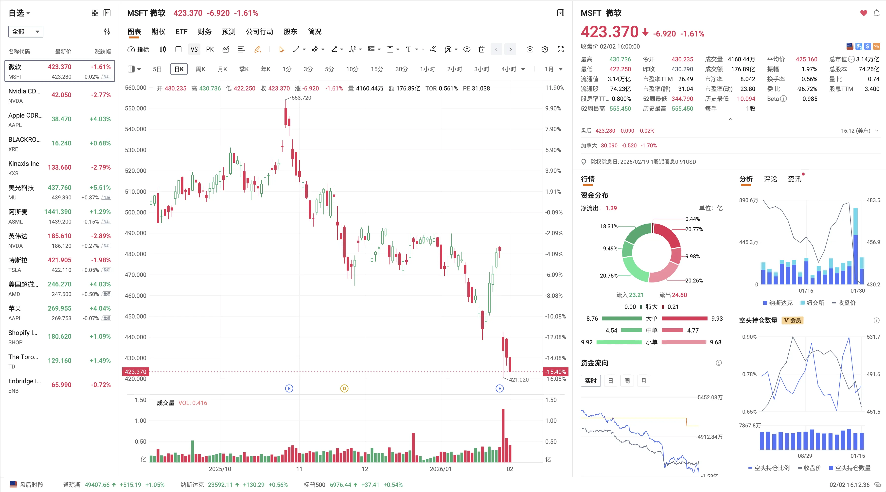
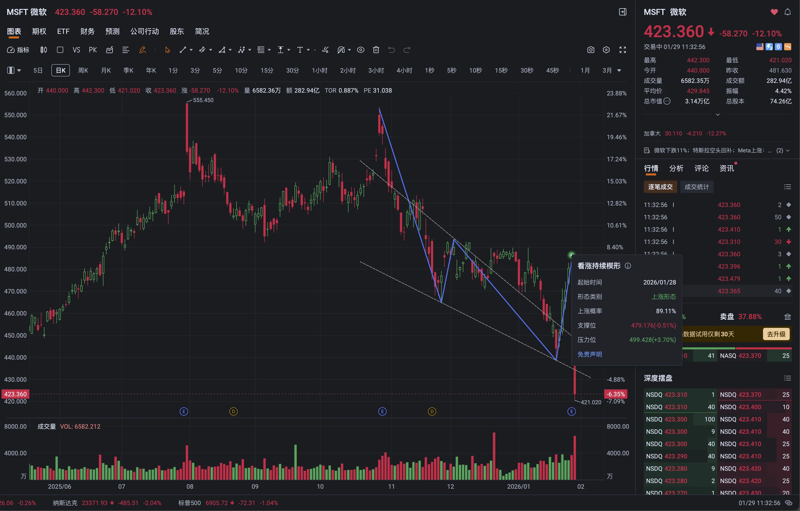
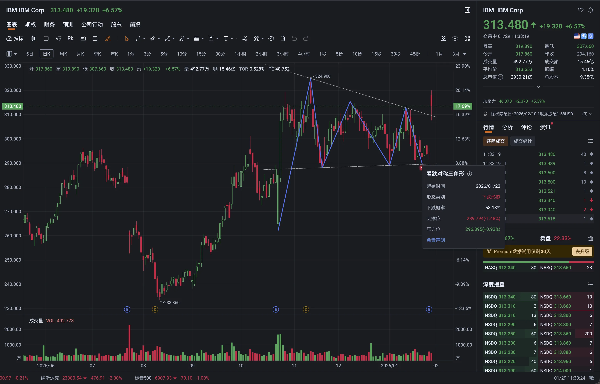

> 开户-往里转钱-投资股票

# 1.开户材料准备

- SIN（Social Insurance Number，社会保险号码）
  - 线下办理：带上证件前往 Service Canada 中心，线下几分钟即可办理。
  - 线上办理：通过 [Service Canada 官网](https://sin-nas.canada.ca/en/sin/) 提交申请，通常在 **5-15 个工作日**内收到邮寄的信。
  - Tips：学签/工签的SIN以9开头，如果后续换了新签证（如学签转工签）或身份变更，必须及时向 Service Canada 更新。

- 护照+学签（身份证明）

- 银行流水账单/电话费账单/水电账单/（几个可以证明身份地点的文件）……

- 电话号码

# 2.投资账户简介

有很多类型的账户，但一般来说用不到那么多，故只介绍最重要的几种。

目前我在wealthsimple里开设了TFSA和Non-registered两个账户。

1. Non-registered（非注册账户 / 普通投资账户）

   这是一个没有任何税务优惠的普通投资账户。在这个账户中，你的投资收益需要按照加拿大的税法进行纳税（学生等无收入人群大概10%-20%，具体税率取决于你的收入水平和收益类型，此处只是一个例子），例如资本利得税或股息税。它的主要优势在于没有任何供款限额，你可以随时存入任意金额进行投资，也不会像注册账户那样受到政府规定的额度限制。

2. Non-registered margin（非注册融资账户）

   这是一个允许使用杠杆的投资账户。除了使用自有资金投资外，你还可以以账户内已有的资产作为抵押，向券商借入资金来购买更多的证券。

   杠杆风险很大：10万的本金入场，用买入100万的股票，若跌幅超过10个点则直接爆仓（归零）——当然涨10个点就是翻倍了。

3. TFSA（Tax-Free Savings Account，免税储蓄账户）

   这是一个具有特定税务优势的注册账户。在这个账户内产生的任何投资收益，无论是资本增值、股息还是利息，都是完全免税的。当你从这个账户中取款时，也不需要缴纳任何税款。

   每人抵达时都会自动获得当年的额度，其次是每年1月1号时，都会累计额度。目前该额度为7000加币/年。

   ​	比如2025年8月抵达加拿大（成为税务居民），此时会获得7000额度。后续2026年开始时就有14,000的额度了

   查看TFSA额度最准确的方法是登录[加拿大税务局(CRA)官网](https://www.canada.ca/en/revenue-agency.html)的“My Account”（我的账户），但是第一次报税前无法查看。

   **从TFSA中取出的金额，要在下一年的1月1日之后才能重新作为空间使用。 超额供款将被罚款。**

   ​	比如7000的额度，1月存入7000，2月取出1000后，无法再次存入1000。新额度将在1月1日后统一结算（来年才可存）。

   **如果中途取出，TFSA损失的额度无法恢复，增加的额度永久增加**

   ​	7000加币炒股，亏损1000加币后取出6000，TFSA额度永久减少1000（6000）。赚1000加币后取出8000，TFSA额度永久增加1000（8000）。

3. RRSP（Registered Retirement Savings Plan，注册退休储蓄计划）

4. RESP / Joint RESP（Registered Education Savings Plan，注册教育储蓄计划）

6. ……

# 3.投资平台

常见平台大概分三类：银行系券商平台、独立券商平台、以及偏专业交易的平台。它们的差异在费用结构、换汇成本、数据与研究工具、以及账户功能上。

我目前在用 Wealthsimple 做主要下单，同时注册了 moomoo 用来补数据和看盘。（wealthsimple的APP和Web做的很精致，但是数据不足，于是配上了moomoo。）

## 3.1加拿大五大行

不是很推荐使用五大行的平台。首先是开户很麻烦，其次是在其它平台已经取消股票交易手续费和账户管理费的时候，依然收取股票交易手续费和账户管理费。

注：价格以官网为准，本文记录的是写作当日的页面信息

- TD Direct Investing

  标准交易佣金为每笔 **$9.99** CAD。如果您在三个月内进行 150 笔以上交易，费率可降至 **$7.00** CAD

  如果您的家庭总资产低于 $15,000 CAD，每个非注册账户每季度收取 $25 CAD 的维护费。注册账户（如 TFSA, RRSP）同样有类似的收费门槛，但可以通过设立定期定额供款（SIP）或每季度完成一定数量的交易来豁免。

- RBC Direct Investing

  标准交易佣金为每笔 **$9.95** CAD。活跃交易者（每季度 150 笔以上）费率降至 **$6.95** CAD。

  若所有账户总资产低于 $15,000 CAD，每季度收取 $25 CAD 维护费。设立预授权供款（Pre-Authorized Contribution）通常可以豁免此费用。

- Scotia iTRADE

  标准交易佣金为每笔 **$9.99** CAD。活跃交易者（每季度 150 笔以上）费率降至 **$4.99** CAD。

  注册账户若资产低于 $25,000 CAD 且未进行足够交易，通常每年收取 $100 CAD。非注册账户若资产不足也有相应收费

- BMO InvestorLine

  标准交易佣金为每笔 **$9.95** CAD。活跃交易者（每季度 150 笔以上）可以享受极低的 **$3.95** CAD 费率。

  非注册账户资产低于 $15,000 CAD 每季度收取 $25 CAD；注册账户资产低于 $25,000 CAD 每年收取 $100 CAD（RESP 为 $50）。

- CIBC Investor's Edge

  标准交易佣金为每笔 **$6.95** CAD。

  如果非注册账户或注册账户的总余额低于 $10,000 CAD，每年收取 $100 CAD。这比其他银行的 $15,000 或 $25,000 豁免门槛要低，更容易达标。

## 3.2券商平台

- Wealthsimple（偏轻量）

  Wealthsimple的加股交易佣金是 $0；如果你用 CAD 账户交易美股，每次成交会发生 CAD 与 USD 的换汇，并按其 corporate exchange rate 叠加 1.5% 的换汇费。如果你开了 USD 账户（10刀/月），用 USD 账户去交易美股时，交易本身不再触发换汇费；但把 CAD 现金换到 USD 现金这一步仍按其费表收取换汇费。

  如果存入100000加币，会升级为Premium用户，此时USD账户就是免费的了（当然换汇的时候还会收费），还会有一定的福利。

  使用邀请链接开户后存入1刀，双方都会收到25刀的奖励：

  www.wealthsimple.com/invite/JKUUI6

  或者使用推荐码：JKUUI6

  界面：

  

- Questrade（功能齐全）

  同样0佣金，但是换汇交易USD时收取 1.5% 的 currency conversion fee。有更深度的行情数据，Real-Time Streaming 标价为 CAD $9.95/月，Advanced Streaming 标价为 USD $44.95/月。

  注册链接：

  https://login.questrade.com/registration

  使用邀请码开户后存入1000刀，双方都会收到50刀的奖励。

  邀请码：525705641498822
  
- moomoo（支持中文，功能齐全）

  MooMoo 的加股和ETF 不是零佣金，当股票价格大于等于 1 加元时，合计费用按 CA$0.0149 每股计算，并且每笔最低 CA$1.49；当股票价格低于 1 加元时，合计费用按 CA$0.0015 每股计算，但每笔最低同样是 CA$1.49。

  总之开个户存1刀，白嫖数据就好了。

  注册链接：https://www.moomoo.com/ca/hans/

  界面：

  

- IBKR（专业交易）

  IBKR也不是零佣金，CAD 计价的加拿大股票与 ETF，Tiered 起始档是每股 0.008 加元，Fixed 是每股 0.01 加元，二者单笔最低都是 1 加元，并且单笔最高按成交金额的 0.5% 封顶。

  它是目前全球化程度最高、功能最强大的交易平台，支持几乎所有国家的市场，换汇汇率也是真正的实时市场汇率，成本极低。由于功能过于复杂，上手难度比较高，适合有经验的进阶投资者。（本人还未用过）

  注册链接：https://www.interactivebrokers.ca/Universal/Application

# 4.个人记录

我目前在Wealthsimple平台上开设了一个TFSA账户以及两个Non-registered账户。在这两个Non-registered当中，我把其中一个账户用于我自己进行的规划投资，而把另一个账户交给了Wealthsimple的AI系统来协助我自动进行投资。

目前刚刚开始炒股一周的时间，本周的收益大约在3.6%左右。这篇文章写于2026年2月2日，今天恰好赶上了Apple股价大涨，如果去掉今天的涨幅，我的收益其实只有1%多一点。

PS：不要相信技术分析（就是单看曲线走势来判断涨跌）

微软的看涨持续楔形，第二天下跌12%。

IBM的看跌对称三角形，第二天上涨6.57%

随便逛逛市场就会发现技术分析到底有多不靠谱，还是老老实实的去分析财报做价值投资一类的事务罢。

资产管理.jpg

做到稳定的年化30%是不是就可以辍学了（：

---

Tips：Wealthsimple的Chequing账户

Wealthsimple 除了投资账户，也提供 Chequing 账户。（Chequing 账户利息按档位计息，目前基础为 1.25% 年利率，满足条件可到 1.75% 或 2.25%。比放在五大行里划算很多）

Chequing 账户配套一张 Mastercard 预付卡（从账户余额扣款，使用体验接近借记卡），卡本身没有月费。

Chequing 账户没有月费，也没有最低余额要求，并且会报销使用该预付卡在 ATM 取现时由 ATM 机方收取的手续费，非常方便出境旅游。

信用卡是 Visa Infinite 信用卡，消费统一 2% 返现；如果不满足免除条件会收每月 20 加元费用，达到 10 万加元资产档位或每月 4,000 加元及以上合格直存可免除该费用；魁北克省的费用会以年费方式计入账单。