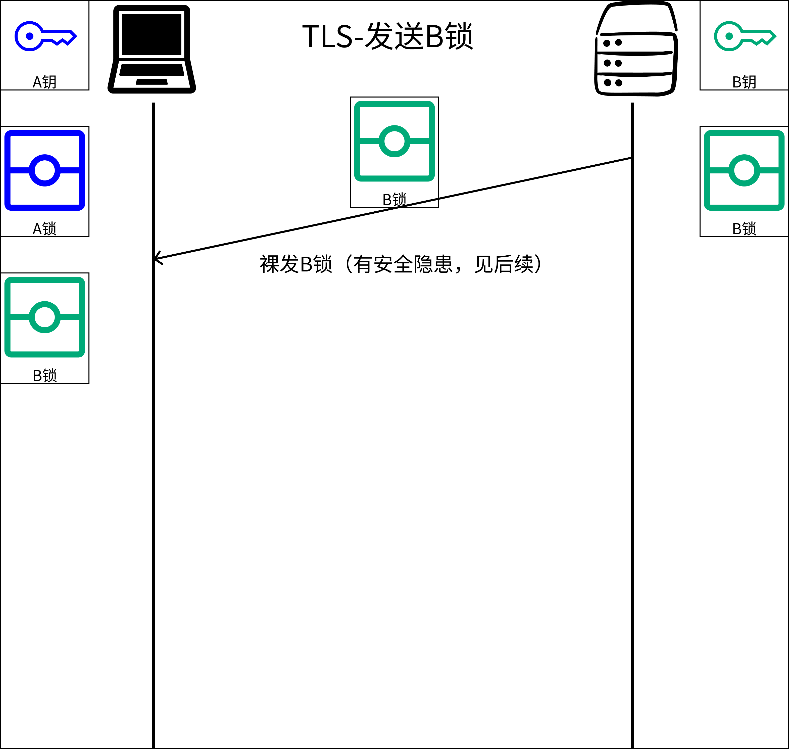
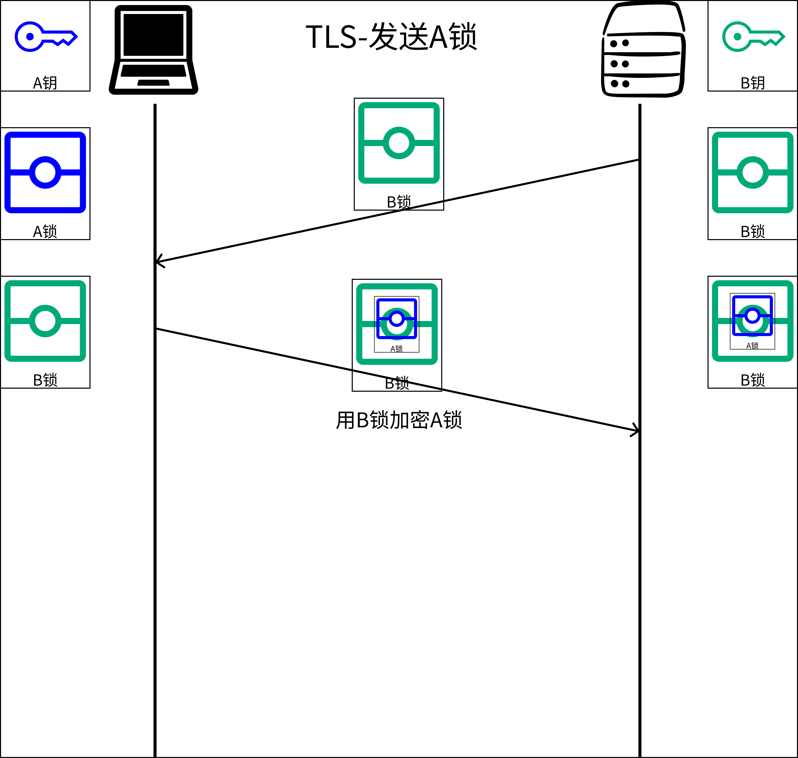
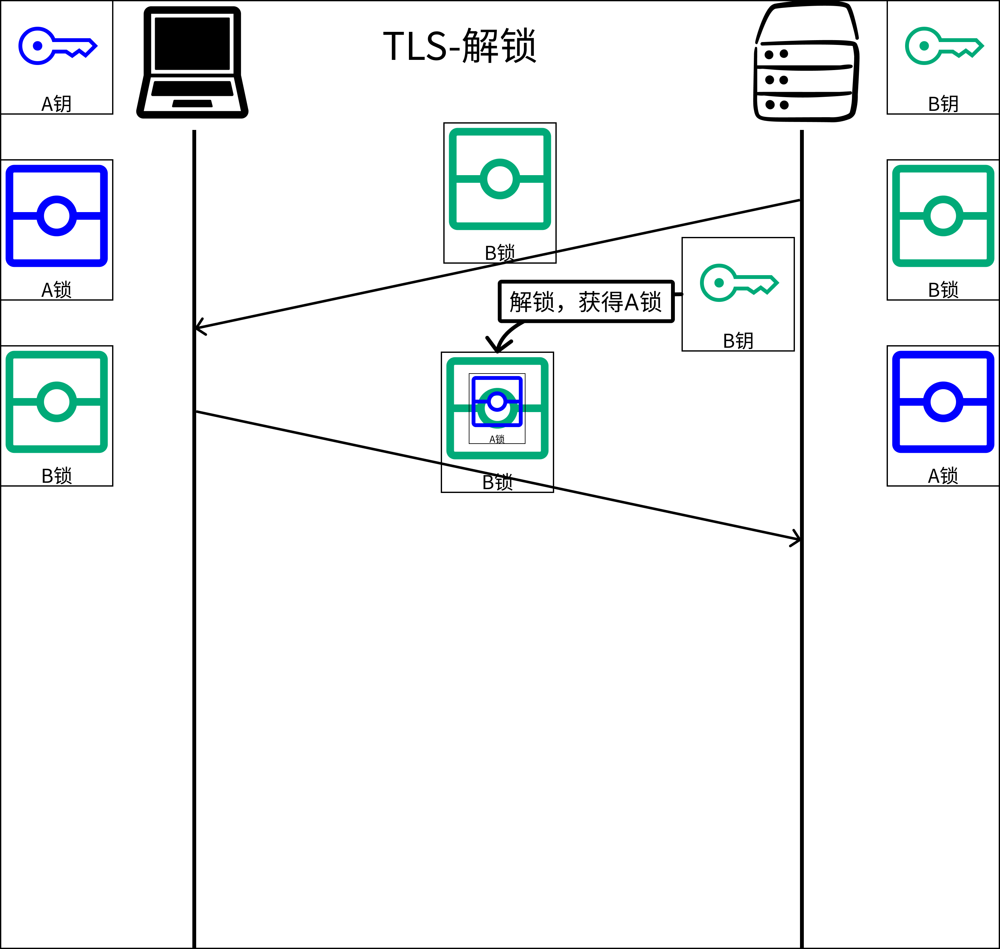
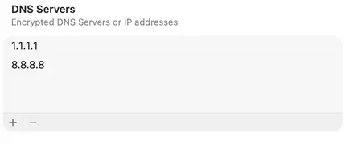

后续应该还会做修改，这是第一版。

> 理解“计算机”，先从互联网开始。

注：文中配图做了一定简化处理。

# 1.从接入一条宽带开始

装宽带那天，师傅上门拉来的那根网线，是你和互联网之间最真实的物理连接。

这根线接入了一家叫做 ISP（Internet Service Provider，互联网服务提供商）的公司的网络（假设是联通）。在中国，联通、电信、移动都是 ISP。你付给他们月租费，他们给你一条通往互联网的信道，你的一切流量都会通过 Wi-Fi 协议传给路由器，然后经由路由器转发至联通的网络。

从这一刻起，你的主机成为了互联网上一个可寻址的节点。

此时又来了一个叫 bilibili 的服务商，也接入了联通。此时不难想到，你可以通过联通的网络与 bilibili 进行通讯，获取 bilibili 的视频。


然后电信来了，他们也想加入互联网的建设中。但电信和联通是两张完全独立的网络——电信的机器不认识联通的路，联通的机器也不认识电信的路。要让两张网互通，就必须让联通和电信在网络边界处各自部署一台边界路由器，让这两台路由器运行BGP（Border Gateway Protocol，边界网关协议）、互相"握手"，然后开始交换路由信息——联通告诉电信"发往 A、B、C 这些地址段的包，交给我，我能送到"，电信也反过来告诉联通同样的事。这种声明在 BGP 术语里叫做**路由通告（route advertisement）**。

两边的边界路由器把对方通告的路由写进自己的转发表，从此联通和电信就完成了互联。


此时你不仅可以和联通下面的主机通讯，还可以和电信的主机通讯了。也就是说，此时京东如果接入了电信（如图所示），你的请求就会从联通，经过 BGP 通道，前往电信，再抵达京东的服务器，拿到数据后原路返回。

接下来，只需要这样的 ISP 多一点，大家两两建立 BGP 对等连接、互相通告路由，就形成了我们今天的互联网。**互联网，本质上就是把全球的机器连接到一起的网络。**

整个互联网就是这样构建起来的：无数个**自治系统（AS，Autonomous System）**——每一个 AS 就是一张由单一机构运营的独立网络，联通是一个 AS，电信是一个 AS——通过 BGP 向彼此通告"我能到达哪些 IP 地址段"，路由信息在全球 AS 之间传播，数据包就能沿着这张路由地图从任意一点抵达另一点。

- **AS4134** — 中国电信

- **AS4837** — 中国联通

- **AS9808** — 中国移动

- **AS7018** — AT&T（美国）

- **AS3356** — Lumen（美国）


全球目前有约 80,000 个 AS。当你访问一个海外网站时，你的数据包会经过你的家用路由器、ISP 接入网、对端 ISP，最终抵达目标服务器——整个过程可能经过十几跳（hop)，每一跳都是一台路由器根据 BGP 路由表做出的转发决策。

---

注：图中各服务商（京东、bilibili、腾讯视频、拼多多、美团、亚马逊、Netflix）的接入位置均为示意，实际由更复杂的服务器集群与多线机房构成（后续会提到）。

---

注：前文中，联通、电信这样的 ISP 一直以"云"的形状出现。这是一种刻意的抽象——云的内部，其实是成百上千台**骨干路由器**彼此互联组成的网状网络，如下图所示。


# 2. 两台主机如何通讯

从这一章开始，我们要建立第一个计算机网络的核心直觉：**层层封装，层层抽象**。

数据从你的程序出发，抵达另一台机器上的程序，中间要经过四层处理——每一层只关心自己那一小块事，把剩下的内容当作"货物"打包传下去。读完这一章，你会看到一个数据包是怎么一层一层被套上"信封"的。

（4层是按照乱序展开的emm，我觉得会符合直觉一点）

应用层-4.简谈应用层**（最上层）**

传输层-2.2端口+3.深入传输层

网络层2.1IP地址

链路层2.3 MAC地址**（最下层）**

最终得到这样一个数据包：

```
[ 链路层 [ 网络层[ 传输层 [ 应用层 ] ] ] ]
```

## 2.1 IP 地址

单单接入互联网还不足以进行通讯——互联网里有着几千万台设备，你的数据包进入这张网之后，怎么知道该送到哪里，目前的互联网好似一张空白地图，等待着我们往里面添加标记？至此，必须设计一种机制，给每台机器一个唯一的标识，构成最基础的地图——这就是**网络层**的**IP 地址**。

IP 是一套编址与转发的规则体系，全称**网际协议（Internet Protocol）**，是互联网最核心的协议之一。现行最广泛的版本是 **IPv4**：32 位整数，写成四段十进制数、每段 0–255，比如 `8.8.8.8`、`104.20.23.154`。路由器根据目标 IP 地址决定把数据包转发到哪里。

有了 IP，访问另一台机器就有了着落。你在浏览器输入 `104.20.23.154`，数据包带着这个目标地址出发，沿途每台路由器查自己的转发表，决定下一跳送往哪里，最终抵达那台机器。

Mac电脑查看IP地址：

- 打开“系统设置”（较旧系统为“系统偏好设置”）。

- 在左侧边栏中点击“网络”。然后点击详细信息/Details...

如图：我的机器目前被分配的IP是192.168.2.11，路由器是192.168.2.1。


Windows查看方式：

[Windows 中的基本网络设置和任务 - Microsoft 支持](https://support.microsoft.com/zh-cn/windows/windows-%E4%B8%AD%E7%9A%84%E5%9F%BA%E6%9C%AC%E7%BD%91%E7%BB%9C%E8%AE%BE%E7%BD%AE%E5%92%8C%E4%BB%BB%E5%8A%A1-f21a9bbc-c582-55cd-35e0-73431160a1b9)

IP 地址里有个特殊的保留地址值得记一下：

- `127.0.0.1`：本机回环地址，发往这个地址的包不会出网卡，直接在本机内部转一圈回来。开发时常见的 `localhost` 指的就是它。


图中的这个人尝试寻址，结果定位了127.0.0.1，实际上这是她自己家的地址。

---

小插曲：主机名

这就是最早期的互联网，基于IPv4协议，给每个上网的主机一个IP地址进行通讯。不过人类不擅长记数字——`104.20.23.154` 是 Cloudflare 某台服务器的地址，你能记住它吗？互联网上有数十亿台服务器，靠记 IP 地址上网从一开始就不现实。人需要的是名字，不是数字。

但这不是事后才意识到的问题。ARPANET 早期，Stanford Research Institute 就维护着一个叫 `hosts.txt` 的文本文件，给每台机器起一个人类可读的名字，记录它们到 IP 的映射：

```
10.0.0.1    mit-gw
10.0.0.2    stanford-ai
```

全网所有机器定期来下载这个文件，想连某台机器就查本地的表，不用记任何数字，**主机名会在发包的时候通过一次本地查询来转写成IP**。这套方案在规模小的时候工作得很好——但随着接入设备越来越多，它开始撑不住了。关于这个问题如何被解决，后面会细讲。

主机名的残影今天依然存在：你电脑上的 `/etc/hosts`（Linux/Mac）或 `C:\Windows\System32\drivers\etc\hosts`（Windows），格式和四十年前一模一样。`localhost` 指向 `127.0.0.1` 这条记录，几乎每台电脑上都有。

顺带一提，在终端输入 `hostname` 命令，可以查看本机的主机名。

过程图示：


如果包含数据取回，则如下图（多一个回传，回传路径不一定走来时的路径）：


---

此时，经过IP的加持，数据包有了第一层标识：

```
[ 源IP | 目标IP | [ 数据 ] ]
[ 192.168.2.10 | 8.8.8.8 | [ 请返回给我 google.com 的 首页 ] ]
```

## 2.2 端口

IP 地址定位的是一台机器，但一台机器上同时跑着几十个程序：浏览器在请求网页，游戏客户端在收发数据，邮件客户端在后台同步——如何区分是谁在发出数据包，数据包到了这台机器，操作系统怎么知道该把它交给谁？

并且在传输过程中，如果包丢了、顺序乱了，怎么处理？

这两个问题都属于**传输层**的职责。第一个问题由端口来解决，第二个问题由 TCP 和 UDP 来解决。

本节先讲端口，TCP 和 UDP 放到下一章展开。

答案是**端口（Port）**。端口是一个 0–65535（$2^{16}$）的数字，操作系统用它区分同一台机器上的不同进程。每个监听网络的程序都绑定一个端口，数据包到达时，操作系统看目标端口号，交给对应的程序。

如下图：192.168.2.10:51425就是chrome的一个窗口。


例如你在浏览器里打开 `https://google.com`，操作系统随机分配一个临时端口，比如 `51423`：

```
192.168.2.10 : 51423（本机）  →  142.250.80.46 : 443（Google服务器）
```

Google 的服务器收到请求，把响应原路发回：

```
142.250.80.46 : 443（Google服务器）  →  192.168.2.10 : 51423（本机）
```

操作系统收到返回包，看目标端口 `51423`，知道这是刚才那个浏览器标签页发出去的请求，把数据交给它。

此时如果你同时开着另一个标签页访问 `https://bilibili.com`，或者打开游戏，系统会再分配一个不同的临时端口，比如 `51424`，两路请求互不干扰。

故IP + 端口合在一起，才构成一个完整的通信端点，称为 **socket**。一次连接的完整描述是四元组：

```
源IP : 源端口  →  目标IP : 目标端口
```

端口分两类：

**知名端口（0–1023）**，由 IANA 统一分配，约定俗成，服务器在这些端口上等待连接：

- `80` — HTTP
- `443` — HTTPS
- `22` — SSH
- `53` — DNS
- ……

你在浏览器输入 `https://google.com`，不写端口，浏览器自动补上 443。服务器也可以把 HTTPS 跑在别的端口，比如 `8443`，但这时 URL 里就必须显式写明：`https://example.com:8443`。

**临时端口（1024–65535）**，由操作系统在客户端发起连接时随机分配，用完即释放。你的浏览器每打开一个新连接，系统随机给它分一个端口作为回信地址，连接断开后这个端口就还回去了。所以 Chrome 不"跑在"某个固定端口上——它连接的是服务器的 443，自己用的是系统随机分配的临时端口。

下图展示了一次完整的 IP + 端口通讯流程，以 Chrome 访问 bilibili.com 为例。浅蓝色路径为请求方向，深蓝色为响应方向，数字标注为数据包在各阶段的状态。


---

经过端口加持，数据包又多了一层：

```
[ 源IP | 目标IP | [ 源端口 | 目标端口 | [ 数据 ] ] ]
[ 192.168.2.10 | 8.8.8.8 | [ 51423 | 53 | [ 请返回给我 google.com 的 首页 ] ] ]
```

## 2.3 MAC地址

好了，至此我们已经将全部软件层面的数据补全了。但数据包真正在网络中传输时，还差一个关键问题没有解决。

想象你是一个从 A 发出的数据包，目标是 B 服务器。你手里只有 B 的 IP 地址，也就是有目的地，没有导航，无法导航——毕竟你怎么知道该往哪个方向跳？附近有几十台路由器，随便选一台跳过去，可能离目标越来越远。


解决这个问题的机制就是配置**路由表**。每台路由器都维护一张路由表，记录"发往某个 IP 段的包，应该从哪个接口转发给哪台设备"。路由表不是凭空产生的——路由器通过 BGP 和邻居持续交换路由信息，把邻居能到达的 IP 段写进自己的路由表，邻居的邻居的信息也会逐步传播过来，最终每台路由器都掌握了全球 IP 段的转发路径。 

如下图所示，每个路由都标记了自己的可达IP和相应路径，作为数据包，只需要根据规则跳转即可。到达一台路由器，路由器查路由表，找到目标 IP 对应的下一跳，转发过去。下一台路由器重复同样的过程，直到抵达目标服务器。

*每个路由都有路由表，并未画全。


在上图中，我们可以看出4.1.1.1到1.1.1.1的路径是本机-A-B-C-D-E-服务器。（服务器返回路径同理可得，反转跳转逻辑即可）

而这个A、B、C、D、E就分别是5个是MAC地址，可以理解为本机的名字，全球唯一，当然，本机和服务器也有属于自己的MAC地址。

- MAC 地址（Media Access Control Address）是网卡出厂时烧录的硬件地址，全球唯一，写成六组十六进制数，比如 `A4:83:E7:2B:1C:09`。每台有网卡的设备都有一个。

此时数据包又多了一层：

```
[ 源MAC | 目标MAC | [ 源IP | 目标IP | [ 源端口 | 目标端口 | [ 数据 ] ] ]]
```

不像IP和端口只在首位端有修改的需求，MAC地址每一跳都会修改一次（每次一的目标MAC都会变），改动的很频繁。数据包每经过一台路由器，路由器就剥掉旧的链路层头部，查 IP 路由表决定下一跳，再套上新的链路层头部——目标 MAC 换成下一台设备的 MAC。全程 IP 地址不变，MAC 地址逐跳替换。

例如：**本机 -> A -> B -> C -> D -> E -> 服务器**。

1. **本机 $\rightarrow$ 路由器 A：**

   `[ MAC: 本机MAC -> A | IP: 4.1.1.1 -> 1.1.1.1 | Port: 5201 -> 80 | Data: Hello ]`

2. **路由器 A $\rightarrow$ 路由器 B：**

   `[ MAC: A -> B | IP: 4.1.1.1 -> 1.1.1.1 | Port: 5201 -> 80 | Data: Hello ]`

3. **路由器 B $\rightarrow$ 路由器 C：**

   `[ MAC: B -> C | IP: 4.1.1.1 -> 1.1.1.1 | Port: 5201 -> 80 | Data: Hello ]`

4. **路由器 C $\rightarrow$ 路由器 D：**

   `[ MAC: C -> D | IP: 4.1.1.1 -> 1.1.1.1 | Port: 5201 -> 80 | Data: Hello ]`

5. **路由器 D $\rightarrow$ 路由器 E：**

   `[ MAC: D -> E | IP: 4.1.1.1 -> 1.1.1.1 | Port: 5201 -> 80 | Data: Hello ]`

6. **路由器 E $\rightarrow$ 服务器：**

   `[ MAC: E -> 服务器MAC | IP: 4.1.1.1 -> 1.1.1.1 | Port: 5201 -> 80 | Data: Hello ]`

## 2.4 层层封装，层层抽象

回头看走过的路，三层机制各司其职，解决的是三个层次完全不同的问题。

```
传输层  →  套上端口（51423 → 53）
网络层  →  套上 IP（1.2.3.4 → 8.8.8.8）
链路层  →  套上 MAC（AA → CC）
```

IP 解决的是**全局寻址**：互联网上有几十亿台设备，数据包必须有一个全局有效的坐标，让沿途每台路由器都能根据它做出转发决策。

端口解决的是**进程分发**：IP 只能定位到一台机器，但机器上同时跑着几十个程序，操作系统需要一个额外的数字来判断这个包该交给谁。

MAC 解决的是**相邻传递**：路由表告诉你"下一跳是某个 IP"，但数据包在物理链路上流动时，必须知道下一跳设备的硬件地址才能真正发出去——MAC 就是这个"当前这一跳的收件人"标签，每跳替换一次，全程不断更新。

这些机制合到一起，最终实现了一台主机访问另一台主机的壮举。

当然还差最后一层——**应用层**。传输层只管"把数据完整地送到对面的某个程序"，但送到之后，两端程序之间说什么、怎么说，是应用层自己定义的事。如HTTP、SSH、FTP 都是应用层协议，后面会讲到。

三层叠加的结果是一个嵌套结构：

```
[ 源MAC | 目标MAC | [ 源IP | 目标IP | [ 源端口 | 目标端口 | [ 数据 ] ] ] ]
```

实际的网络请求也是如此：

原始数据：

```
0000   a4 83 e7 2b 1c 0a a4 83 e7 2b 1c 09 08 00 45 00  ...+.....+..E.
0010   00 4b d3 f8 40 00 40 06 9a 3d 04 01 01 01 01 01  .K..@.@..=......
0020   01 01 cb 92 00 50 00 00 00 01 00 00 00 01 50 18  .....P........P.
0030   faf0 0e 1c 00 00 47 45 54 20 2f 20 48 54 54 50 2f  ......GET / HTTP/
0040   31 2e 31 0d 0a 48 6f 73 74 3a 20 31 2e 31 2e 31 2e  1.1..Host: 1.1.1.
0050   31 0d 0a 0d 0a                                   1....
```

翻译为人话（可以对应到原始数据）：

```
以太网帧头部 (MAC层)
----------------------------------------------------------------
目标 MAC: a4:83:e7:2b:1c:0a (路由器A)
源   MAC: a4:83:e7:2b:1c:09 (本机)
类型: 08 00 (IPv4)

IP 数据报头部 (网络层)
----------------------------------------------------------------
版本: 4
首部长度: 5 (20字节)
服务类型: 00
总长度: 00 4b (75字节)
标识: d3 f8
标志/分段偏移: 40 00 (不分片)
生存时间 (TTL): 40 (64)
协议: 06 (TCP)
头部校验和: 9a 3d
源   IP: 04.01.01.01 (4.1.1.1)
目标 IP: 01.01.01.01 (1.1.1.1)

TCP 段头部-可以暂时理解为端口 (传输层)
----------------------------------------------------------------
源 端口: cb 92 (52114)
目标端口: 00 50 (80)
序列号: 00 00 00 01
确认号: 00 00 00 01
首部长度/保留/控制位: 50 18 (20字节, PSH+ACK)
窗口大小: fa f0
校验和: 0e 1c
紧急指针: 00 00

HTTP 应用数据 (应用层)
----------------------------------------------------------------
请求行: GET / HTTP/1.1
头部字段: Host: 1.1.1.1
结束符: \r\n\r\n
```

---

层层封装还带来了一个特性，即每一层只读自己的头部，对内部内容完全不透明——路由器看 IP 做转发，不关心端口；操作系统看端口做分发，不关心数据内容；应用程序只拿到最里面的数据，感知不到外面套了几层皮。这种设计让每一层都可以独立演化：换一种物理传输介质（比如从以太网换成 Wi-Fi），只需要替换链路层，IP 和端口完全不动。这就是**层层封装**的核心价值——通过分层把复杂度隔离开来，每一层只对紧邻它的上下层负责。

分层还带来另一个好处：

！！**从现在起，我们可以把链路层和网络层放进"默认存在"的背景里，不再追踪 MAC 地址与IP协议。它一直在运作，但对其以上的逻辑完全不可见——我们讨论一次请求怎么从客户端到服务器，只需要关心传输层和应用层，链路层加上网络层自己会处理好数据包的部分传递。3,4两章节都如此。第五章节IP即网络层会再次回归，不过链路层应该是不会涉及到了。**

互联网图景（如图，可脑部模拟几次网络传输）：


---

:::flashcard{hint="三层机制各自的职责"}

Q: IP 地址、端口、MAC 地址在数据包转发过程中各自解决了什么层次的问题？

???

- **IP 地址**：解决**全局寻址**——给每台设备一个全局有效的坐标，让沿途路由器据此做转发决策。
- **端口**：解决**进程分发**——同一台机器上运行多个程序时，操作系统用端口号判断数据包该交给哪个进程。
- **MAC 地址**：解决**相邻传递**——标识当前这一跳链路上的实际收件人，每经过一台路由器就替换一次。

:::

:::flashcard{hint="逐跳传递中地址字段的变化规律"}

Q: 一个数据包从发送方经过多台路由器到达接收方的过程中，IP 地址和 MAC 地址各自如何变化？为什么会有这种差异？

???

- **IP 地址全程不变**：源 IP 和目标 IP 是端到端的坐标，沿途路由器只读取目标 IP 做转发决策，不修改它。
- **MAC 地址每跳替换**：MAC 只标识当前这段链路的发送方和接收方。路由器转发时剥掉旧的链路层头部，查路由表找到下一跳，套上新的 MAC 头——目标 MAC 换成下一台设备的地址，直到最后一跳才换成目标服务器的 MAC。

:::

:::flashcard

Q: 网络分层设计让每一层只读自己的头部、对内层内容不透明。这种设计带来了什么具体好处？

???

每一层可以独立演化，替换某一层的实现不会影响其他层。
例如：将物理传输介质从以太网换成 Wi-Fi，只需替换链路层，IP 地址、端口、应用数据完全不需要改动——这就是分层把复杂度隔离开来的核心价值。

:::

# 3. 深入传输层

你已经有了 IP、端口、要传输的数据。从第二章的视角看，一切似乎已经就绪——数据包知道去哪，操作系统知道交给谁。我们已经可以传输一个数据包到指定地点了。

但有一个问题被悄悄绕过去了：**你怎么知道数据传到了？你怎么确保数据没有缺失？**

互联网不是一根可靠的管道。你的数据包在经过十几台路由器的过程中，任何一跳都可能因为拥塞、硬件故障、线路抖动而悄无声息地把它丢掉。路由器不会给你发"对不起我把你的包扔了"的通知——它直接丢弃，然后继续处理下一个包。

假设你在下载一个 10GB 的文件，例如下载一个电影。文件被切成几十万个数据包分批发送，中途丢了一万个——你拿到的文件是一个残缺的、大概率无法解析的损坏文件。但你的操作系统对此一无所知，它只是把收到的数据照单全收，不知道少了什么。

对此情景，我们需要建立稳定的连接，明确丢失的包并且重传，这就是传输层要解决的第二个问题。

应用层-**传输层**-网络层-链路层

## 3.1 TCP协议

**TCP（Transmission Control Protocol，传输控制协议）** 的核心思路极其朴素：**收到了就回一个确认，没收到确认就重发。**

比如在传输中某个电影的数据包丢失了，接收端会重复返回某些应答报文，通知发送端重传，以确保接收文件的完整性。

整个TCP又可以分为3个部分

建立连接、传输数据、关闭连接。

- 建立连接

传数据之前，双方必须先协商好一些状态，这个过程叫**三次握手（Three-Way Handshake）**。

（说实话不是很需要在意这个具体的名词是啥，记住为啥需要三次握手才能安全的建立连接就好。）

有一些名词先解释一下：

SYN = Synchronize（同步）

ack = Acknowledgment（确认号）

Seq = Sequence Number（序列号）

---

::::row
:::col6
客户端第一次发送-SYN

客户端发送 SYN 报文，请求建立连接，并携带初始序号ack=x。

服务端第一次应答-SYN-ACK

服务器收到后，发送 SYN-ACK 报文，确认收到返回初始序号+1，即ack = x+1，并携带自己的初始序号Seq = y。

客户端第二次发送-ACK

客户端发送 ACK 报文，确认收到（ack = y+1），连接建立。
:::
:::col4

:::
::::

---

- 数据传输

连接建立之后，双方开始传数据。每一段数据都带着自己的序列号（seq） 出发，接收方收到后回一个 ACK，告诉对方"我期望下一个从哪里开始"。

要注意的是TCP 是全双工的，这意味着双方可以同时互相发数据，各自维护一套独立的 seq/ack，互不干扰

此外便是ACK 不需要单独占一个报文，可以顺路夹在数据包里一起发回去（称为 piggyback ACK），节省一次来回

len参数是数据的长度。

---

::::row
:::col6
客户端第一次发送 - Data 客户端发送数据报文，从序列号 seq=1 开始，携带 500 字节数据。

服务端应答并发送 - ACK + Data 服务端收到后，回复 ack=501 确认已收到前 500 字节；同时携带自己的数据，从 seq=1 开始发送 300 字节。

客户端应答并发送 - ACK + Data 客户端收到服务端数据，回复 ack=301 确认已收到；同时继续发送自己的数据，从 seq=501 开始再发 500 字节。

服务端应答并发送 - ACK + Data 服务端收到后，回复 ack=1001 确认已收到客户端全部 1000 字节；同时继续从 seq=301 发送下一段数据。
:::
:::col4

:::
::::

---

但是传输中，依然可能导致丢包，那么此时会发生什么？TCP如何保证不丢包？

ACK 的值是接收方期望收到的**下一个字节的序号**——这个设计很妙：一个 ACK 可以同时确认之前所有字节都已经收到，不需要对每一个包单独回一个确认。

---

::::row
:::col6

客户端第一次发送 - Data（seq=1）

客户端发出第一段数据，从 seq=1 开始，共 500 字节，服务端正常收到并回复 ack=501。

客户端第二次发送 - Data（seq=501）✗ 丢包

第二段发出去了，但中途丢失，服务端没有收到。

客户端第三次发送 - Data（seq=1001）

服务端收到，但发现 501-1000 还缺着，先暂存这段数据，回复 ack=501（重复 ACK 第 1 次）。

客户端第四次发送 - Data（seq=1501）

服务端同样暂存，继续回复 ack=501（重复 ACK 第 2 次）。

客户端第五次发送 - Data（seq=2001）

服务端继续暂存，再次回复 ack=501（重复 ACK 第 3 次）。

客户端触发快速重传 - Data（seq=501）

发送方收到 3 次重复 ACK，不等超时计时器，立刻补发 seq=501 那一段。

服务端补全确认 - ACK（ack=2501）

缺失数据补上后，之前暂存的三段一并确认，一个 ACK 直接推到 2501。

:::
:::col4


:::
::::

---

收到 3 次重复 ACK 会立即触发重传，不等超时——因为重复 ACK 是一个明确信号：中间有包丢了。

当然，还有一个处理方法是发送方还会维护一个**重传计时器**：每发出一个包，就启动倒计时；如果超时还没收到 ACK，就重发。

- 断开连接

数据传完，连接要关闭。TCP 用**四次挥手**来确保双方都把数据发完再断：

::::row
:::col6

**客户端发起关闭 - FIN** 客户端发送 FIN 报文，表示自己这边数据已经发完，请求关闭连接。

**服务端确认 - ACK** 服务端收到后回复 ACK，表示知道了；但服务端可能还有数据没发完，连接暂时只关了一半。

**服务端发起关闭 - FIN** 服务端数据全部发完，发送 FIN 报文，表示自己这边也发完了。

**客户端确认 - ACK** 客户端回复 ACK，连接正式关闭。
:::
:::col4


:::

::::

- 一个TCP数据包

```
[ 源MAC | 目标MAC | [ 源IP | 目标IP | [ 源端口 | 目标端口 | seq | ack | 窗口 | ... | [ 数据 ] ] ] ]
```

## 3.2 TCP 的代价

TCP 把不可靠的网络变成了可靠的字节流，而代价是**延迟和开销**。

每发一段数据，都要等 ACK 才能继续。丢包了还要等重传。握手本身就要消耗一个往返时间（RTT）才能开始传数据。

对于大多数应用，这些代价完全值得——你不会希望网页只加载了一半，或者下载的文件有几个字节被悄悄替换了。

但有些场景，TCP 的可靠性反而成了累赘。

------

想象你在打一款第一人称射击游戏，或者竞技类网游。你的操作数据每秒要发送 60 次乃至120次到服务器——每一帧你的位置、朝向、当前动作。这些数据的特点是：

**旧数据没有任何价值。**

如果第 30 帧的位置数据丢包了，TCP 会停下来等重传——而在等待重传的这段时间里，第 31、32、33 帧的数据都堵在发送缓冲区出不去。等重传成功，客户端才能收到一连串积压的数据，画面瞬间跳变，这就是**游戏里的"卡顿"**。

更荒谬的是：重传回来的第 30 帧数据，对你来说已经毫无用处——你现在关心的是第 33 帧，第 30 帧的位置早就过时了。TCP 为了一个没价值的包，把后面三帧全卡住了。

再想象视频通话也是一样的：你和朋友实时对话，语音数据每 20ms 打一个包发出去。某个包在网络里丢了——TCP 去重传，重传回来已经是 200ms 之后了。200ms 前的语音数据回来有什么意义？你朋友早就说到别的地方去了。正确的处理是跳过这 20ms、用静音或插值补上，而不是把整条对话流堵住去等一个过期的包。

因此场景，UDP协议顺应而生。（这边一共就这俩要介绍的TCP/UDP，没了）

## 3.3 UDP：把控制权还给应用层

**UDP（User Datagram Protocol，用户数据报协议）** 的设计哲学是：我什么都不保证。

没有握手，没有确认，没有重传，没有顺序。发出去就发出去了，丢了就丢了。

UDP 头部极其简洁：

```
[ 源端口 | 目标端口 | 长度 | 校验和 | 数据 ]
```

总共只有 8 个字节的头部开销（TCP 头部最少 20 字节）。没有连接状态，没有序列号，没有窗口，发完即忘。

---

::::row
:::col6

这带来了几个关键特性：

**零建连延迟。** TCP 需要一次往返的握手才能开始传数据。UDP 直接发，没有任何等待。

**没有队头阻塞。** TCP 的有序字节流意味着一个包丢了，后面所有的包都得等它重传。UDP 每个包完全独立，一个包丢了，后面的包照常到达、照常处理。

只管发包就好了，剩下的服务端会解决的.jpg
:::
:::col4

:::
::::

------

以游戏为例，基于 UDP 的自定义协议是这样工作的：

客户端每帧发送自己的状态，带上一个单调递增的帧序号。接收方收到新帧，**直接丢弃任何序号比它更小的包**——如果 33 号包比 30 号包先到，那 30 号包来了直接扔掉，因为游戏状态已经更新到 33 了，30 是过去式。

丢包了怎么办？**直接跳过。** 用上一帧的数据插值推算当前位置，或者显示一个轻微的卡顿，而不是把整条数据流堵住去等重传。

这套逻辑是由游戏的应用层代码实现的，TCP 无法提供这种"选择性丢弃旧数据"的能力，因为 TCP 的有序字节流是强制的、无法关闭的。

---

UDP 的使用场景归纳起来就是一类：**应用层比 TCP 更清楚如何处理丢包和乱序。**

对比一下TCP和UDP：


此时传输层的数据包结构，对于 TCP：

```
[ 源MAC | 目标MAC | [ 源IP | 目标IP | [ 源端口 | 目标端口 | seq | ack | 窗口 | ... | [ 数据 ] ] ] ]
```

对于 UDP：

```
[ 源MAC | 目标MAC | [ 源IP | 目标IP | [ 源端口 | 目标端口 | 长度 | 校验和 | [ 数据 ] ] ] ]
```

两者在网络层（IP）以下看起来没有任何区别——路由器照常转发，不关心里面跑的是 TCP 还是 UDP。可靠性与否，是传输层自己的事。

---

:::flashcard{hint="三次握手的必要性"}

Q: TCP 建立连接为什么需要三次握手，而不是两次？第三次握手解决了什么问题？

???

两次握手只能让服务端确认"客户端的发送链路通畅"，但客户端无法确认"服务端发回的数据能被自己收到"。
第三次握手（客户端发 ACK）让服务端知道自己的初始序号已被对方确认，双方的发送和接收链路都经过验证，连接才能安全建立。

:::

:::flashcard{hint="快速重传的触发条件与优势"}

Q: TCP 快速重传在什么条件下触发？相比等待超时计时器，它的优势是什么？

???

触发条件：发送方收到 **3 次重复 ACK**（同一个确认号被重复应答 3 次）。
优势：超时计时器等待时间通常为数百毫秒，而 3 次重复 ACK 是"中间有包丢失"的明确信号，发送方可以立即重传，大幅缩短恢复延迟，不必等计时器超时。

:::

:::flashcard{hint="UDP 适用场景的判断标准"}

Q: 文中给出了选用 UDP 而非 TCP 的判断标准是什么？游戏和视频通话为什么符合这个标准？

???

判断标准：**应用层比 TCP 更清楚如何处理丢包和乱序。**

- **游戏**：旧帧数据对当前游戏状态毫无价值，丢失时直接跳过并用插值补算，TCP 强制重传旧包反而会阻塞后续帧。
- **视频通话**：语音包延迟重传回来已无意义，正确处理是用静音或插值补上，而不是堵住整条数据流等一个过期包。

:::

# 4.简谈应用层

TCP 和 UDP 解决的是"怎么送"的问题——一个要求可靠有序，一个追求快速轻量。

但送到之后呢？两端的程序用什么语言对话、请求和响应长什么样、连接该维持多久——这些 TCP 和 UDP 完全不管，交给**应用层**去定义。

## 4.1 一个通用的骨架

在讲具体协议之前，先建立一个直觉。

应用层协议的内容千变万化，但它们一定建立在传输层之上——都是在 TCP 或 UDP 搭好的管道上工作，差别只在管道里说的内容。这意味着，大多数应用层协议的**结构**是可以预判的。

**基于 TCP 的协议，骨架几乎一致：**

① 三次握手（TCP 建立连接）

② 应用层通讯（这里才是各协议的个性）

③ 四次挥手（TCP 关闭连接）

应用层的HTTP、HTTPS、SSH、FTP、SMTP——全都是这个模式。三次握手和四次挥手是 TCP 固定的开销，协议设计者不需要自己实现这部分，TCP 帮你处理好了。他们只需要设计②——"连上之后说什么、怎么说"。

例如SSH（命令行里用于连接另一台机器的指令） 连上之后先做密钥交换和身份认证，因为 TCP 只给你一条裸管道，加密和验证身份得自己来。HTTP 则简单得多，连上就直接问答：客户端发一个请求（方法 + 路径 + 头），服务端回一个响应（状态码 + 头 + body），完事。

**基于 UDP 的协议，结构则简单得多：**

① 直接发包（无需建立连接）

② 可能有响应，可能没有（由应用层自己决定）

③ 没有正式的关闭流程，发完即结束

游戏（自定义协议即可）、视频通话（WebRTC）的实时数据是最典型的例子——发出去，不管了，有没有收到是应用层自己决定的事。

下面将简单分析HTTP 和 HTTPS为例子解析应用层，不对其它协议进行展开。

## 4.2 HTTP：一问一答

**HTTP（HyperText Transfer Protocol，超文本传输协议）** 是互联网上用得最广的应用层协议。

TCP 三次握手建立连接之后，HTTP 的通讯模式极其简单——**客户端发一个请求（Request），服务器回一个响应（Response），完成一次交换。** 且默认都是纯文本，人类直接可读。

::::row
:::col6

一个 HTTP 请求有着极其严格的**四部分结构**：

```
POST /api/login HTTP/1.1
Host: www.bilibili.com
Content-Type: application/json
Content-Length: 47

{"username": "bilibili_user", "password": "123456"}
```

1. **请求行（Request Line）**：第一行（`POST /api/login HTTP/1.1`），目标路径是登录接口 `/api/login`，协议版本1.1。
2. **请求头（Headers）**：`Content-Type` 告诉服务器 Body 的数据格式是 JSON；`Content-Length` 告诉服务器 Body 有多少字节，方便它知道读到哪里算结束。
3. **空行（Blank Line）**：分隔头部与正文。
4. **请求体（Body）**：`POST` 请求的核心，这里放着实际要提交的数据——一段 JSON，包含用户名和密码。

:::
::::col4


:::
::::

服务器处理完毕后，返回的响应也遵循完全对称的四部分结构：

::::row
:::col6

```text
HTTP/1.1 200 OK
Content-Type: application/json
Content-Length: 52
Set-Cookie: session_id=abc123; HttpOnly

{"code": 0, "message": "登录成功", "uid": 12345}
```

1. **状态行（Status Line）**：第一行，`200 OK` 是状态码，代表成功（常见的还有 `404` 资源不存在、`500` 服务器内部错误）。
2. **响应头（Headers）**：同请求头，描述返回数据的属性
3. **空行（Blank Line）**：同样用于分隔头部和主体。
4. **响应体（Body）**：真正返回的数据内容（此处为成功登录的信息）。

:::
::::col6


:::
::::

---


我们要了解HTTP的结构，还要了解HTTP 还有一个极其重要的核心设计决定：**它是无状态的（Stateless）**。

这意味着，每一次请求对服务器来说都是全新的——服务器不记得你上一次发过什么。每次请求都是全新的一次请求，服务器不知道你刚才在首页、不知道你是谁。

这样的设计可以让服务器可以极度简单：不管之前的任何事情，只管处理当前这一个请求，处理完就忘。但代价是，登录状态无法保持，而为了解决持久化登录，又逐渐设计出了不少方案。这里只介绍最简单的一种，也是现在还在被使用中的最早的一种——Cookie。

让我们先思考一下，登录状态如何保持？或者说，**如何让服务器认出你？**

HTTP 本身无状态，所以认出你的责任只能落在请求本身——那就让每次请求必须自己携带能证明身份的信息。

那就在登录成功之后，服务器给你发一张"身份证"，你把它存起来，之后每次请求都带上它：

服务器会在第一次响应的 Header 里塞入一段真实数据：

```text
Set-Cookie: session_id=abc123

```

浏览器把它存下来，之后每次发请求都会自动在请求 Header 里带上这一行：

```text
Cookie: session_id=abc123

```

服务器看到这个 `session_id`，去自己的数据库查"abc123 是哪个用户"，于是"认出"了你。**无状态的协议，靠应用层自己补上了状态。**

---

此时，完整的数据包结构（以一次 HTTP 请求为例），像套娃一样拼齐了全貌：

```text
[ 源MAC | 目标MAC | [ 源IP | 目标IP | [ 源端口 | 目标端口 | seq | ack | ... | 
    [ GET /index.html HTTP/1.1\r\nHost: bilibili.com\r\n\r\n ]
] ] ]

```

这就是第 2.4 节那段 hex dump（十六进制抓包）里最内层的那行——`GET / HTTP/1.1\r\n...`（`\r\n\r\n` 就是那个关键的空行）——现在你完全知道它的结构边界和存在意义了。

---

小插曲：We use cookies!

Cookie 本来只是为了保持登录状态，但 Google 发现了它的另一种用法——追踪。

Google 在无数网站里嵌入了自己的 JS 脚本，悄悄种下自己的 Cookie：

```
你访问 A 新闻网站 → Google 种下 _ga=xyz
你访问 B 购物网站 → Google 读到同一个 _ga=xyz
你访问 C 视频网站 → Google 还是读到 _ga=xyz
```

这和登录毫无关系，纯粹是跨站追踪你的浏览轨迹，用来精准投放广告。

2018 年欧盟 GDPR 立法，规定追踪用户数据必须明确征得同意——于是全球网站开始弹出那个横幅：**"We use cookies!"**


## 4.3 HTTPS：安全层

让我们回到那个网络概括图，再次用学到的知识还原一次完整的通信（隐去MAC地址）：

IP 负责定位，TCP 负责可靠传输，HTTP 规范请求格式——传输层面，似乎没什么问题了。


但安全呢？

如果我在路由路径中插入一台机器（或者你在餐馆连接了不知名WiFi），复制所有经过的数据包，逐层解包，你与服务器之间的全部通信就完全暴露了。如果那几台服务器是银行网站，攻击者就能直接读到你的账号和密码。这就是监听攻击。

更隐蔽的攻击是 Cookie 劫持：不需要知道你的密码，只需要从数据包里偷出你的 `session_id`，然后把它塞进自己的请求头——服务器看到合法的 Cookie，会以为就是你本人在操作。

```
Cookie: session_id=abc123   ← 攻击者拿着你的通行证，冒充你借贷、转账
```

这是 HTTP 作为明文协议的致命缺陷。


解法就是在 HTTP 下面加一层加密——HTTPS（**HTTPS = HTTP + TLS**）

TLS（Transport Layer Security，传输层安全协议）在 TCP 和 HTTP 之间插入一层，负责把 HTTP 的内容加密再发出去，让中间路由器只能看到密文。

TLS 的工作分两步：

---

**1.TLS握手**

TCP 三次握手完成后，TLS 握手开始，目的只有一个：让客户端和服务器协商出一个不怕被中间人截获的密钥，用此密钥进行通讯。

TLS 的解法是**非对称加密**（该方法很复杂，此处只简单讲述）：

我们先引入一个概念——锁和钥匙。锁可以加密钥匙，钥匙可以解密锁。但是锁不能用来解锁，钥匙不能用来上锁。

服务器持有一对密钥：A锁（只能加密）+ A钥匙（只能解密锁加密的内容）

客户端也有：B锁（只能加密）+ B钥匙（只能解密锁加密的内容）

通讯时，服务器把A锁给你，然后你用A锁加密把自己的B锁传给服务器，服务器用A钥匙解开A锁加密的数据包，得到你的B锁。

::::row
:::col1

:::
:::col1

:::
:::col1

:::
::::

---

::::row
:::col6
此时服务器有了：A锁+ A钥匙+B锁

客户端有了：B锁+ B钥匙+A锁

之后通讯服务器使用A锁加密自己的内容，客户端使用B锁加密自己的内容。
:::
:::col4

:::
::::

---

嗯，大概是上面这个结构了。不过还有最后一层隐患——最开始服务器把 A锁 发过来的时候是明文的。如果第三方截获了这个 A锁，换成自己的锁发给你，你以为在和服务器通讯，实际上全程在和攻击者通讯（攻击者自己可以解开自己的锁），数据全部泄露了——这就是**中间人攻击**。

在这里，我们无法继续改进架构了，只能引入一个第三方，来确保你收到的锁确实是服务器的锁，而不是被人调包过的。这就是**证书颁发机构（CA，Certificate Authority）**。

CA 是全球公认的可信机构（比如 DigiCert、Let's Encrypt），浏览器出厂时就内置了几百个可信 CA 的信息。服务器在上线之前，需要向 CA 提交申请，证明自己确实是 bilibili.com 的所有者，CA 验证通过后会签发一张**数字证书**——证书里包含了服务器的锁（公钥）、域名、有效期，以及 CA 用自己的钥匙盖上的签名。

之后每次握手，服务器首先发过来这张带签名的证书。客户端收到证书，用内置的 CA 信息验证签名，确认一起发过来的这把锁确实属于通讯的服务器，才会继续进行后续步骤。如果确认失败，就会立刻终止握手（提示不安全）。

是的，谁都能看出来，这里有个很大的安全隐患——只要有一家机构在颁发证书的时候失误（比如给错误的人颁发了证书），就会导致该通讯过程的安全系统瘫痪。

以上内容，把所有的锁换成公钥，钥匙换成私钥，就是计算机网络里的术语了。

回看整个握手过程，除了第一次服务器下发公钥，会话密钥的原材料从未明文出现在网络上，中间路由器即使记录了全程流量也无法还原出密钥，而下发锁的行为通过第三方一定程度上保证了不会出错。

**2.加密传输**

握手完成后，HTTP 的通讯照常进行，只是所有内容在发出前经过 TLS 加密，到达对方后再解密。大概是这样：

[ 源MAC | 目标MAC | [ 源IP | 目标IP | [ 源端口 | 目标端口 | seq | ack | ... | 加密数据] ] ]

路由器能看到 IP 和端口（转发所必需的），但最内层的 HTTP 数据已经是密文，它解不开。

访问 http:// 的网站——中间每一台路由器都能看到你在请求什么、服务器回了什么。

访问 https:// 的网站——中间只能看到"这台机器在和某个 IP 的 443 端口通讯"，内容全程加密，无从窃取。

（在这套加密系统下，谁都无法得知你到底在获取什么数据。一般能查到的，只有你在访问什么网站。比如你在看bilibili，但是看的哪个视频不可能被知道。）

---

HTTP 和 HTTPS 是应用层协议里设计得最典型的一对——HTTP 定义了通讯方式，TLS注重安全防护，两者叠加构成了现代 Web 的通信基础。

回看整个设计过程：每一层只解决自己的问题，缺什么补什么。TCP 不够安全，加 TLS；HTTP 无状态，加 Cookie；明文不安全，加密。这种**层层封装、层层抽象**（且按需叠加）的思路，贯穿了整个计算机网络的设计哲学。

其它应用层协议——SSH、FTP、SMTP——遵循的是同一套逻辑，只是根据自身需求在②阶段做了不同的定义。理解了 HTTP/HTTPS 的来龙去脉，其它协议的设计动机大多可以举一反三。

---

:::flashcard{hint="无状态协议与状态持久化"}

Q: HTTP 是无状态协议，Cookie 是如何在不修改 HTTP 协议本身的情况下实现登录状态持久化的？

???

服务器在登录成功的响应头写入 `Set-Cookie: session_id=xxx`，浏览器将其存储。此后每次请求，浏览器自动在请求头附上 `Cookie: session_id=xxx`。服务器收到后查数据库，识别出对应用户。本质上是让客户端自己携带状态凭证，而非由服务器记忆上下文——用应用层的手段补上了无状态协议的缺口。

:::

:::flashcard{hint="中间人攻击与 CA 的具体作用"}

Q: 在 TLS 握手中，如果没有 CA，非对称加密会被什么具体攻击手段破解？CA 堵住了哪个环节的安全漏洞？

???

攻击手段：**中间人攻击**。攻击者在服务器首次发送公钥时截获，换上自己的公钥发给客户端；客户端以为在和真实服务器通信，实际数据全部流经攻击者。
CA 解决的环节：服务器下发公钥的第一步。CA 用自己的私钥对服务器公钥和域名进行签名，浏览器用内置的 CA 信息验证签名，确认收到的公钥确实属于目标服务器，排除调包的可能。

:::

# 5.不断壮大的互联网

前几章中，我们一步步搭建起了一个可以运行的互联网。但互联网并非一成不变——随着规模的扩张和需求的演进，各种各样的问题接踵而至。工程师们不断为它打补丁、做改良，才逐渐造就了我们今天所见的互联网。本章将介绍几个伴随互联网成长而诞生的重要补丁。

从这一章开始，我们要建立第二个计算机网络的核心直觉：**没有什么是加一个中间层解决不了的**。

互联网的规模从来没有停止增长。每一次增长都带来新的问题，而每一个问题的解决方案，几乎无一例外是在中间插入一层新的抽象——一个新的翻译、一个新的代理、一个新的目录。

## 5.1 域名与 DNS

细心的读者可能已经发现，前几章一直在用 `bilibili.com` 举例，却从未解释它是怎么变成 IP 地址的。这倒是刻意的编排——域名是大多数人每天都在接触的东西，大家对它可能处于一个熟悉但不了解的情况，用它举例比用裸 IP 更直观。HTTP 协议也因为与域名强相关，一并提前讲述了。现在到了正式解释它的时候。

---

在第 2.1 节，我们提到 `hosts.txt` 是 ARPANET 早期的全局名单——每台机器的名字和 IP 的对应关系都写在里面。

但这份文件不会自己更新。有人得负责维护它。

这个人是 Elizabeth Feinler，在斯坦福研究所（SRI）工作。她的团队是整个 ARPANET 的"命名中心"：某个机构想接入网络，就发请求给她们；她们审核、录入、把更新后的 `hosts.txt` 推出去；全网的机器定期来她们的服务器下载最新版本。

早期这套流程运转得不错。机器少，请求少，Feinler 的团队完全应付得来。

问题是 ARPANET 在增长。到了 1970 年代末，这个团队每天的工作基本上就是处理积压的更新请求和命名冲突——你想叫 `gateway`，另一个机构也想叫 `gateway`，她们得决定谁能用这个名字。与此同时，各地的机器每隔几天来同步一次，但同步永远赶不上变化：某台机器今天上线了，要等到下次同步，其他人才能找到它；某台机器改了 IP，旧记录还在别人的存储里继续传播。网络的"真实状态"和任何一台机器上存的 `hosts.txt` 之间，始终存在一个缺口。

这个缺口随着规模增长，只会越来越大。

更根本的问题是：整个系统依赖一个单点——一个团队、一台服务器、一份文件。这不是 Feinler 的团队不够努力，是这个架构在设计上就无法随规模扩展。你可以雇更多人、买更好的服务器，但只要所有命名决策都汇聚到一个地方，瓶颈就永远在那里。


把这段历史体现出hosts的缺点，概括成三句话，就是：

**同步跟不上。** 机器越多，更新越频繁，`hosts.txt` 在各地的版本就越不一致，而且没有任何机制告诉你"你手里的版本已经过期了"。

**命名没人管。** 命名权集中在一个团队手里，但这个团队没有任何权威依据来裁决冲突——最终只能靠人工判断，而人工判断无法扩展。

**单点撑不住。** 这不是优化能解决的，是设计缺陷——一张表管所有人的事，注定走不远。

------

1983 年，Paul Mockapetris 被要求综合当时所有的设计提案，看看能不能整合出一个解决方案。他看完所有提案之后，认为没有一个抓住了问题的根源。那些方案大多在想"怎么把中央服务器做得更强"，但 Mockapetris 的判断是：**问题不是中心化的实现方式不够好，而是中心化这个思路本身就错了**。

于是他重新设计了一个——这就是 **DNS（Domain Name System，域名系统）**。

核心思路是把这张大表**拆散**，按层级分权，每一层只管自己那一块。


树状结构，从右往左读。例如`www.bilibili.com` 里：

- `.com` 是**顶级域（TLD）**，由专门的机构维护，它知道所有 `.com` 下面的域名由谁管
- `bilibili` 是**二级域**，由哔哩哔哩注册购买，自己维护
- `www` 是**三级域（子域名）**，由哔哩哔哩随意创建，不需要向任何人申请

命名权被层层下放了。`.com` 下面有多少个二级域，`.com` 说了算；`bilibili.com` 下面有多少子域名，哔哩哔哩说了算。冲突从结构上消除——两家公司各自的 `api.example.com` 是不同的域名，因为 `example.com` 的所有权不同。不再有任何一个团队需要居中裁决。

但光把表拆散还不够，查询的方式也要跟着变。以前是"下载全表，本地查"；现在变成了**实时的线上查找**。这种情况下，你只需要记住DNS服务器的地址，就可以。甚至是让家里的路由器记住DNS，

下面用浏览器访问网站来举例——不过先说清楚一件事：DNS 诞生于 1983 年，比万维网早了八年，最初根本没有浏览器这回事。那时候域名的作用是代替主机名，让研究人员能在 ARPANET 上找到彼此的机器、去传文件、发邮件。域名变成"网站地址"是 1991 年之后的事。所以记住：域名本质上只是 IP 的别名，能指向任何一台机器，不只是网页服务器。浏览器只是今天最常见的使用场景。

那么，你在浏览器输入 `www.bilibili.com` 并按下回车……

**第一步：查本地文件。** 查本机的 `hosts`文件（以及一些别的存储文件），这个文件格式和四十年前的 `hosts.txt` 一模一样——它是 hosts.txt 的残影，只是现在只管你自己这台机器，不再试图管全球。如果任何一个文件内有对应IP，则直接拿到 IP，**后面全跳过，直接使用该IP去访问**。

如图，本地存有bilibili的IP，则直接访问服务器。


**第二步：向DNS发起IP查询请求。** 存储文件都没有的情况下，系统会把 DNS 查询发给配置好的 DNS 服务器，通常是你的路由器（路由器再转问 ISP），或者你手动设置的公共 DNS，比如 Google 的 `8.8.8.8`、Cloudflare 的 `1.1.1.1`。这台服务器叫做**递归解析器（Recursive Resolver）**，它代替你去完成后续所有工作，你只要等它回来。

---

注：DNS查询是一个跑在应用层的协议，基于UDP。

---

Mac用户在网络详细信息-DNS里即可看到。

Windows额，要不用cmd试试ipconfig /all命令？（网络里也能看到，不过我不知道详细步骤）




**第三步：递归解析器去找答案。** 递归解析器会代替你去逐级询问——从根服务器问到顶级域服务器，最终找到 `bilibili.com` 的**权威域名服务器**——记录由哔哩哔哩维护，最终拿到对应的真实 IP。


拿到 IP 之后，递归解析器把结果交还给你的电脑，你的电脑就可以用**HTTPS协议**去敲 bilibili 服务器的门了。


与此同时，这个 IP 会在本地暂存一段时间——这就是缓存，避免你下次访问又跑一遍同样的流程。缓存能存多久由 TTL（Time To Live） 决定，通常在 5 分钟到 24 小时之间。设太短，查询频繁；设太长，bilibili 换了 IP 你这边却还在用旧地址。

所以整个流程，首次访问需要几十到几百毫秒，之后几乎是零延迟。

------

现在回头看：DNS 是这里第一个典型的中间层——和 hosts 文件的功能类似，插在"人类输入的字符串"和"网络使用的 IP 地址"之间，承担翻译工作。不同的是，它用分布式的设计解决了 hosts 文件无法规模化的问题。

------

注：`/etc/hosts` 依然是最高优先级，高于所有 DNS 查询。如果里面写了 `1.2.3.4 www.google.com`，查询根本不会发出去，浏览器直接用 `1.2.3.4`——无论 DNS 怎么说。这就是为什么修改 hosts 文件是本地开发模拟域名、或者屏蔽某些站点的常见手段。

## 5.2 NAT—IPv4 的补丁-网络层出问题

如前文2.1章节所述，IPv4 地址是 32 位整数，总共能接入 2³² = 4,294,967,296 个——大约 43 亿个设备。

1981 年，这个数字看起来大得荒唐。那时 ARPANET 全球只有几百台机器，研究人员甚至懒得认真讨论"地址会不会用完"这个问题，因为答案显然是：不会。43 亿个地址，按当时的增速算，够用几百年。

没人预见到接下来的节奏。个人电脑在 1980 年代走出实验室，进了家庭和办公室；互联网在 1990 年代商业化，每家公司都需要一个地址，每台服务器也需要一个；2007 年 iPhone 发布，几年后，每个人的口袋里塞进了一台永远联网的设备。然后是路由器、摄像头、温控器、智能电视——物联网把"需要地址的东西"这个范畴扩展到了几乎所有插电的物体。

地址消耗的速度，每隔几年就上一个台阶。

2011 年 2 月，IANA 把最后一批 IPv4 地址分配了出去。距 IPv4 设计完成，不过三十年。

43 亿个地址，用完了。

这意味着我们必须新开发一种方式扩充我们的IP池了。

面对这个问题，工程师想到了两条路：一条是打补丁，一条是换协议。本小节注重于给IPv4的补丁——本质上也是设计了一个中间层去解决问题。

这个补丁叫**NAT（Network Address Translation，网络地址转换）** 。

---

让我们这么思考：一个家庭里有五台设备，不代表它们各自需要一个IP地址——它们只需要一个出口。这个出口（通常是路由器）持有唯一的公网 IP，对外代表整个家庭网络；家庭网络内部的设备想访问外部网络时，由路由器出面，把数据包"翻译"成自己的名义发出去，收到回包再转交给对应的家庭网络设备。

（此处家庭网络又被成为内网，外部网络成为外网。）

不过路由器收到回包时，还得知道该把数据转给哪台设备——对外它是整个内网的"代表"，对内它还得是一个分发器。

为此，我们把 IP 地址划分成两层：**内网 IP** 与**公网 IP**。家庭内部的五台设备各自分配一个内网 IP，用于在内网里互相识别和与路由器通讯；路由器持有一个公网 IP，用于在公网上与其它服务器通讯。两层地址各司其职，互不干扰。

而内网 IP 的关键性质在于：它只需要在这个内网里唯一，不需要在全球唯一。你家的笔记本可以是 `192.168.1.2`，你邻居家的笔记本也可以是 `192.168.1.2`——它们永远不会在公网上相遇，冲突根本不会发生。

这意味着内网 IP 地址可以被无数个家庭、企业、机构反复使用。原本 43 亿个公网地址撑不住全球几十亿台设备，但通过 NAT，几十亿台设备瞬间有了归属。

为此，IANA 专门保留了三段地址作为**私有地址（Private Address）**，这些地址不在公网上路由——公网路由器看到以这些地址为目标的包，一律不转发：

（之前身边很多人好奇，为啥我看内网IP看一眼就记住了，那是因为基本上大多数家庭使用的内网网段都是192.168.1.xxx，看多了之后会发现只需要记住最后三位数，就能记住内网IP）

```
192.168.0.0/16    （192.168.0.0 到 192.168.255.255）是家庭和小型办公室最常见的选择。
172.16.0.0/12     （172.16.0.0 到 172.31.255.255）中等规模，常见于企业内网和云服务商的内部网络。
10.0.0.0/8        （10.0.0.0 到 10.255.255.255）是最大的一块，能容纳 1600 多万个地址，通常用于大型企业、数据中心、或者需要划分很多子网的复杂网络环境。
```

你的家用路由器从 ISP 获得一个公网 IP，比如 `114.215.12.34`。家里的手机、电脑、平板各自被分配私有地址：`192.168.1.2`、`192.168.1.3`、`192.168.1.4`。对互联网来说，这些私有地址根本不存在——它们是"假的"地址，只在你家局域网内有效。


**出站：你发请求出去**

你的电脑（`192.168.1.10:5000`）要访问 bilibili 服务器（`119.3.70.188:443`）。数据包发到路由器，路由器发现源地址是私有 IP，执行 NAT 转换：

1. 把源地址从 `192.168.1.10:5000` 改写成自己的公网地址，比如 `114.215.12.34:41523`（端口号随机分配）
2. 在内部的 **NAT 映射表**里记下这条对应关系：`192.168.1.10:5000 ↔ 114.215.12.34:41523`
3. 把改写后的包发向公网

bilibili 的服务器收到包，看到的来源是 `114.215.12.34:41523`，把响应发回这个地址。

**入站：响应包回来**

路由器收到目标是 `114.215.12.34:41523` 的包，查 NAT 映射表，找到这个端口号对应的是 `192.168.1.2:5000`，于是：

1. 把目标地址从 `114.215.12.34:41523` 改写回 `192.168.1.10:5000`
2. 把包转发给你的手机

你的手机对这一切毫无感知。对它来说，包就这么从 bilibili 回来了，跟直接有公网 IP 没有任何区别。


---

既然NAT如此丝滑的接入了我们的互联网体系中，那我们是否可以玩的更花一些，让NAT去嵌套呢？

完全可以。你家路由器是一层 NAT；你家路由器连的是运营商的网络，而运营商自己也可能在做 NAT——你拿到的那个"公网 IP"，其实也是运营商内网里的一个私有地址，真正的公网 IP 在运营商那一侧。这叫 **CGN（Carrier-Grade NAT，运营商级 NAT）**。

NAT 的边界也不只是家庭。一家几千人的公司，所有员工的电脑、手机、打印机，可能共用寥寥几个公网 IP 出口——内部是一张巨大的私有网络，员工之间用内网 IP 互访，对外统一走公司的出口路由器。这张网络就是**公司内网**，逻辑上和你家局域网没有本质区别，只是规模大了几个数量级。

NAT还带来一个副产品：**外部流量默认进不来**。NAT 映射表里没有记录的入站包，路由器直接丢弃——没有内网设备主动发起连接，外部就找不到任何入口。公司内网因此天然形成了一道屏障，内部系统、数据库、办公工具对外部完全不可见。这个性质后来被当作一种安全机制来设计和利用，尽管 NAT 最初发明时根本没想着做防火墙。

所以 NAT 的实际形态是一棵树：最外层是运营商，往里是公司或家庭路由器，再往里可能还有子网。每一层都有自己的私有地址空间，每一层都只有出口对外可见。你发出去的每一个数据包，可能经过了两三次地址改写，才真正到达公网。

---

这就是"中间层"的典型形态：路由器在私有地址和公网地址之间承担翻译工作，对内呈现一个局域网，对外统一呈现一个公网 IP，两侧都感知不到对方的细节。

一个公网 IP 理论上有 $2^{16}$ = 65535 个可用端口——也就是说，一个公网 IP 可以同时为数万条内网连接做转换。NAT 把 IPv4 的实际可用容量放大了几个数量级，让 IPv4 在地址耗尽之后又撑到今天。

## 5.3 换协议：IPv6

IPv6 其实没啥可讲的，就是把v4的池子扩容了一下。32 位地址不够用，换成了 128 位。当然，对比与v4来说还有一堆细节上的优化。

$2^{128} \approx 3.4 \times 10^{38}$。

这个数大到什么程度——地球上所有沙粒的数量大约是 $10^{19}$，$2^{128}$ 比给地球上每一粒沙子分配一个 IP 还要多出约 $10^{19}$ 倍。地址耗尽的问题从根本上消失了。每台设备可以拥有一个全球唯一的公网 IPv6 地址，不再需要 NAT，端到端通讯的原始模型得以恢复。

IPv6 地址写成 8 组十六进制数，相邻的全零组可以压缩成 `::`，比如 `2001:db8::8a2e:370:7334`。

IPv6 早在 1998 年就已提出，但推进速度远低于预期。原因很简单：现有的NAT 太好用了，IPv4 + NAT 的组合在绝大多数场景下工作得足够好，没有人愿意为"彻底解决"这个小问题付出巨大的迁移成本。不过目前全球 IPv6 流量占比已超过 40%，国内三大运营商也在推进，但两套协议并行的局面短期内不会改变。

## 5.4 CDN、负载均衡

我们回顾一下这一章走过的路。主机名不够用了，我们加了一层域名；IPv4 地址不够了，我们加了一层 NAT。但规模增长带来的麻烦不止于此。就算每台设备都能找到对方，找到了又怎样？

某个周五晚上，《王者荣耀》新版本上线，几百万人同时打开 bilibili 看攻略视频。每个人都能找到 bilibili 的服务器——但"找到"之后，压力才真正开始。面对如此多的流量，服务器必定会超载。


仔细分析，这个压力来自**两个独立的维度**：

**地理距离**：bilibili 的服务器放在北京。坐在广州的用户，数据来回要跑 4000 公里，延迟高；坐在新疆，单程就超过 3000 公里。物理距离是绕不开的。

**单点容量**：一个 4K 视频码率大约 20 Mbps，100 万人同时播放就是 20 Tbps。单台服务器的网卡撑不住，单个机房的出口带宽也撑不住——哪怕地理问题解决了，流量本身就能把机房打垮。

这是两个独立的问题，解法也不同，我们一个一个来。

------

**地理问题：CDN 和全局调度**

先看静态内容。是指所有用户拿到的是同一份数据——bilibili 上的视频文件、图片、无论谁请求，服务器返回的字节是一样的。——既然如此，为什么要让全国用户都跑去北京（服务器所在地）取？

解法是把内容复制一份，放在离用户最近的地方。广州用户访问 bilibili，请求不去北京，而是被引导到广州或深圳的节点，从几十公里外拿数据。延迟从几十毫秒降到个位数，带宽压力也从中心机房分散到了全国几百个节点——这就是 **CDN（Content Delivery Network，内容分发网络）**。

就近引导靠的是 DNS：CDN 让 DNS 服务器根据用户的位置，返回离他最近的节点 IP，而不是唯一的中心服务器 IP。


但 bilibili 的首页是个性化推荐，你的关注列表和别人的不一样；你点了"一键三连"，这个操作必须与主服务器通讯，结果必须立刻反馈——这类**动态内容**没有"同一份"可言，CDN 缓存不了，必须打回真正的服务器处理。

动态请求 CDN 帮不上忙，但地理问题依然存在：总不能让广州用户的登录请求也跑去北京吧？所以大型服务通常在多个城市都建有机房，把动态请求引导到附近的机房即可。手段和 CDN 类似，还是 DNS：CND去问DNS，DNS 根据用户位置，返回最近机房的 IP。北京CDN解析到北京机房，广州CDN解析到广州机房。

表面上看，这和 CDN 的就近调度没什么区别——但内部复杂度差了好几个量级。CDN 节点存的是静态文件，内容不会变，各节点之间不需要协商，复制一份放着就行。多机房的动态服务不同：广州机房和北京机房存的是同一份数据库，你在广州点了关注，北京机房必须也能立刻看到这个变化，否则换个机房登录，数据就对不上了。怎么在物理上相隔几千公里的机房之间保持数据一致，同时还不能让用户感觉到很大延迟——这是分布式系统里最核心也最棘手的问题之一，往后展开讲能单独写一大章（额不过本文不会涉及，只是作为区分动态静态的逻辑在此写出）。


至此，地理问题基本解决：静态内容由 CDN 的边缘节点消化，动态请求由全局调度送到最近的机房。

---

**容量问题：机房内的负载均衡**

请求到了机房，还没完。

一台哪怕再强的机器，也很难扛住所有请求。所以说实际的 bilibili 服务器里面往往有着几百台普通服务器，然后这些服务器进行一定的策略配置，实现负载均衡。顾名思义，即收到请求，决定转发给后面哪台服务器，然后把响应原路带回来。


这里就列举几个简单，常见的，一般会根据业务场景选择实际应用的策略：

**轮询（Round Robin）**：最简单，请求一个一个轮流分给后面的服务器。第 1 个请求给服务器 A，第 2 个给 B，第 3 个给 C，第 4 个回到 A……不管谁忙谁闲，严格轮转。

**最少连接（Least Connections）**：分给当前活跃连接数最少的那台。有的请求处理快，有的慢——轮询会导致"慢请求"堆积在某台服务器上，最少连接能更均匀地摊开压力。

------

把这条链路串起来：

```
用户（静态请求）
 ↓
CDN 边缘节点
---
用户（动态请求）
 ↓
全局调度（DNS）← 选最近的机房
 ↓
机房内负载均衡器       ← 分发给某台服务器
 ↓
实际服务器   ← 处理请求，状态集中存储
```

每一层解决一个问题，又把新问题留给下一层。网络层的路由解决了大规模寻址，这一章解决的是大规模流量负载。

---

说回来，这一节的内容在日常开发中几乎用不上。CDN、多机房调度、集群负载均衡，这些是 bilibili、淘宝量级的工程问题，绝大多数项目一辈子也不会遇到。

事实上，现代框架的单节点能力已经相当可观。一个调优过的 Go 服务（Gin/Fiber）单机每秒能处理几十万次请求；Java Spring Boot 和 Node.js（Express）在普通云服务器上跑个每秒一两万次请求毫无压力；哪怕是以"慢"著称的 Python，用 FastAPI 加上异步也能轻松撑住每秒数千次并发。基本上是标明一台 4 核 8G 的云服务器，同时在线几万人通常完全没问题。

国内绝大多数创业公司、内部系统、工具产品，流量根本到不了需要引入集群的门槛——更常见的瓶颈是数据库查询没加索引，或者某个接口写了个 N+1 查询（别的地方导致的速度低）。把这些低垂的果实摘掉，往往比搭集群有效得多。

所以本章节的内容作为"互联网基础设施是怎么运作的"来理解就够了。

---

:::flashcard{hint="hosts.txt 的三个根本缺陷"}

Q: hosts.txt 体系在规模扩展中暴露出了哪三个根本性缺陷？DNS 从设计思路上如何针对性地解决了这些问题？

???

三个缺陷：
1. **同步跟不上**：更新频繁，各地版本不一致，且没有机制告知版本是否已过期。
2. **命名没人管**：命名权集中在单一团队，命名冲突无法以可扩展的方式裁决。
3. **单点撑不住**：一张表集中管理所有命名，架构上无法随规模增长。

DNS 的解法：将命名权按树状层级**分权下放**——顶级域、二级域、子域各自由不同机构维护；查询改为实时的分布式线上查找，而非下载全表——从结构上消除了单点瓶颈和版本同步问题。

:::

:::flashcard{hint="NAT 映射表的工作原理"}

Q: NAT 路由器是如何知道将入站的响应包转发给内网中的哪台设备的？具体机制是什么？

???

路由器在出站时为每条内网连接随机分配一个公网端口，并在 **NAT 映射表**中记录对应关系：
`内网IP:内网端口 ↔ 公网IP:公网端口`

响应包回来时，路由器查映射表，根据数据包的目标公网端口找到对应的内网地址，将目标 IP 和端口改写回内网值，再转发给对应设备。内网设备对地址改写过程完全无感知。

:::

:::flashcard{hint="CDN 就近调度的实现机制"}

Q: CDN 通过什么具体手段将用户请求引导到最近的节点，而不是中心服务器？

???

CDN 利用 **DNS 地理调度**实现就近引导：当用户查询域名时，CDN 控制的 DNS 服务器根据查询来源 IP 判断用户所在地区，返回离该用户最近的 CDN 节点 IP，而不是唯一的中心服务器 IP。用户后续的请求因此直接发往就近节点。

:::

# 6.解析一次完整的上网流程

现在把所有东西拼在一起，看一次完整的访问究竟发生了什么。

你坐在家里，打开浏览器，输入 `www.bilibili.com`，按下回车。

---

\* = 本跳相比上一跳发生变更的字段

---

==================== DNS 阶段 ====================


① DNS查询 · PC网卡 发出（内网）

| 层     | 源                  | 目标                |
|--------|---------------------|---------------------|
| Ether  | [PC网卡]            | [路由器内网网口]    |
| IP     | 192.168.1.10        | 119.29.29.29        |
| UDP    | sport: 54312        | dport: 53           |
| Data   | DNS Query: bilibili.com? |                |

---

② NAT改写 · 路由器 → 公网

| 层     | 源                  | 目标                |
|--------|---------------------|---------------------|
| Ether  | *[路由器公网网口]   | *[运营商路由器]     |
| IP     | *114.215.12.34      | 119.29.29.29        |
| UDP    | *sport: 41500       | dport: 53           |
| Data   | DNS Query: bilibili.com? |                |

---

③ 公网跳转（每经一台路由器重复一次）

| 层     | 源                  | 目标                          |
|--------|---------------------|-------------------------------|
| Ether  | *[公网中继路由器]   | *[下一跳] ← MAC逐跳换         |
| IP     | 114.215.12.34       | 119.29.29.29 ← 不变           |
| UDP    | sport: 41500        | dport: 53 ← 不变              |
| Data   | DNS Query: bilibili.com? ← 不变 |                    |

---

④ 最后一跳 · 抵达DNS服务器

| 层     | 源                  | 目标                |
|--------|---------------------|---------------------|
| Ether  | *[DNS末跳路由器]    | *[DNS]              |
| IP     | 114.215.12.34       | 119.29.29.29        |
| UDP    | sport: 41500        | dport: 53           |
| Data   | DNS Query: bilibili.com? |                |

↓ DNS根据来源IP判断地理位置，选出最近CDN节点 IP = 1.15.23.45

---


⑤ DNS响应 · 服务器发出（新包，方向反转）

| 层     | 源                  | 目标                |
|--------|---------------------|---------------------|
| Ether  | *[DNS]              | *[DNS末跳路由器]    |
| IP     | *119.29.29.29       | *114.215.12.34      |
| UDP    | *sport: 53          | *dport: 41500       |
| Data   | *DNS Response: 1.15.23.45 |             |

---

⑥ 公网回程跳转

| 层     | 源                  | 目标                          |
|--------|---------------------|-------------------------------|
| Ether  | *[公网中继路由器]   | *[下一跳] ← MAC逐跳换         |
| IP     | 119.29.29.29        | 114.215.12.34 ← 不变          |
| UDP    | sport: 53           | dport: 41500 ← 不变           |
| Data   | DNS Response: 1.15.23.45 ← 不变 |                   |

---

⑦ NAT还原 · 进内网，交给PC

| 层     | 源                  | 目标                |
|--------|---------------------|---------------------|
| Ether  | *[路由器内网网口]   | *[PC网卡]           |
| IP     | 119.29.29.29        | *192.168.1.10       |
| UDP    | sport: 53           | *dport: 54312       |
| Data   | DNS Response: 1.15.23.45 |               |

↓ 浏览器拿到CDN节点IP：1.15.23.45

==================== HTTP 阶段 ====================


⑧ HTTP请求 · PC 发出（内网）

| 层     | 源                  | 目标                |
|--------|---------------------|---------------------|
| Ether  | [PC]                | [路由器内网网口]    |
| IP     | 192.168.1.10        | 1.15.23.45          |
| TCP    | sport: 51423        | dport: 443          |
| Data   | GET / HTTP/1.1      |                     |

---

⑨ NAT改写 · 路由器 → 公网

| 层     | 源                  | 目标                |
|--------|---------------------|---------------------|
| Ether  | *[路由器公网网口]   | *[运营商路由器]     |
| IP     | *114.215.12.34      | 1.15.23.45          |
| TCP    | *sport: 41523       | dport: 443          |
| Data   | GET / HTTP/1.1      |                     |

---

⑩ 公网跳转

| 层     | 源                  | 目标                          |
|--------|---------------------|-------------------------------|
| Ether  | *[公网中继路由器]   | *[下一跳] ← MAC逐跳换         |
| IP     | 114.215.12.34       | 1.15.23.45 ← 不变             |
| TCP    | sport: 41523        | dport: 443 ← 不变             |
| Data   | GET / HTTP/1.1 ← 不变 |                             |

---

⑪ 最后一跳 · 抵达CDN节点

| 层    | 源               | 目标       |
| ----- | ---------------- | ---------- |
| Ether | *[CDN末跳路由器] | *[CDN]     |
| IP    | 114.215.12.34    | 1.15.23.45 |
| TCP   | sport: 41523     | dport: 443 |
| Data  | GET / HTTP/1.1   |            |

---


⑫-a 缓存未命中 · CDN向内部DNS请求回源地址

| 层     | 源                  | 目标                |
|--------|---------------------|---------------------|
| Ether  | [CDN]               | [内部DNS]           |
| IP     | 1.15.23.45          | 10.0.0.1            |
| UDP    | sport: 63211        | dport: 53           |
| Data   | DNS Query: bilibili.com (origin)?  |     |

↓ 内部DNS返回机房服务器IP = 10.20.30.40

---


⑬-b 缓存未命中 · CDN向机房回源拉取内容

| 层     | 源                  | 目标                |
|--------|---------------------|---------------------|
| Ether  | [CDN]               | [机房网关]          |
| IP     | 1.15.23.45          | 10.20.30.40         |
| TCP    | sport: 59800        | dport: 443          |
| Data   | GET / HTTP/1.1 (回源请求) |               |

↓ 机房响应后CDN缓存内容，再构造响应返回给用户

---


⑭ CDN响应 · 发出（新包，方向反转）

| 层     | 源                  | 目标                |
|--------|---------------------|---------------------|
| Ether  | *[CDN]              | *[CDN末跳路由器]   |
| IP     | *1.15.23.45         | *114.215.12.34      |
| TCP    | *sport: 443         | *dport: 41523       |
| Data   | *HTTP/1.1 200 OK [资源内容] |           |

---

⑮ 公网回程跳转

| 层     | 源                  | 目标                          |
|--------|---------------------|-------------------------------|
| Ether  | *[公网中继路由器]   | *[下一跳] ← MAC逐跳换         |
| IP     | 1.15.23.45          | 114.215.12.34 ← 不变          |
| TCP    | sport: 443          | dport: 41523 ← 不变           |
| Data   | HTTP/1.1 200 OK [资源内容] ← 不变 |              |

---

⑯ NAT还原 · 进内网，交给PC

| 层     | 源                  | 目标                |
|--------|---------------------|---------------------|
| Ether  | *[路由器内网网口]   | *[PC网卡]           |
| IP     | 1.15.23.45          | *192.168.1.10       |
| TCP    | sport: 443          | *dport: 51423       |
| Data   | HTTP/1.1 200 OK [资源内容] |             |

↓ 浏览器收到响应，渲染页面

---

最小的互联网——4层模型——TCP/UDP传输数据包——HTTP应用层设计——域名/NAT——逐渐变大的互联网——集群/CDN——最大的互联网

---

好了，结束。这是系列文章的第一篇，后面应该还会有编程方面的，硬件方面的，运维的，Web设计的。这篇文章后续也可能继续完善（

---

:::flashcard{hint="DNS 与 HTTP 的协议选择对比"}

Q: 在访问 bilibili 的完整流程中，DNS 查询和 HTTP 请求分别选用了哪种传输层协议？各自的理由是什么？

???

- **DNS 查询 → UDP**：DNS 是一问一答的短报文，对延迟敏感；UDP 无需握手、零建连开销，能更快拿到结果；单次查询丢失重试代价极低。
- **HTTP(S) 请求 → TCP**：网页内容完整性至关重要，数据丢失或乱序会导致页面损坏；TCP 的可靠有序传输保障了内容完整到达。

:::

:::flashcard{hint="NAT 出站与回程的字段改写"}

Q: 数据包从内网经过 NAT 路由器发往公网时，哪些头部字段被改写？响应包回来时又改写了哪些字段？

???

**出站改写：**
- 以太网头：源 MAC 换成路由器公网网口的 MAC。
- IP 层：源 IP 从私有地址（如 `192.168.1.10`）改写为公网 IP（如 `114.215.12.34`）。
- 传输层：源端口从内网端口改写为路由器随机分配的公网端口，并写入 NAT 映射表。

**回程还原：**
- IP 层：目标 IP 从公网 IP 改写回内网私有 IP。
- 传输层：目标端口从公网端口改写回内网端口。
- 以太网头：目标 MAC 换成内网目标设备的 MAC。

:::


